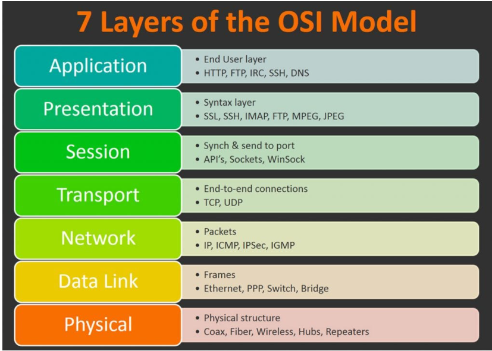
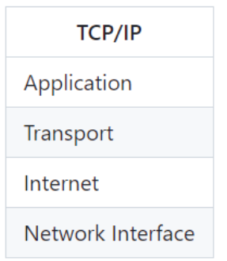
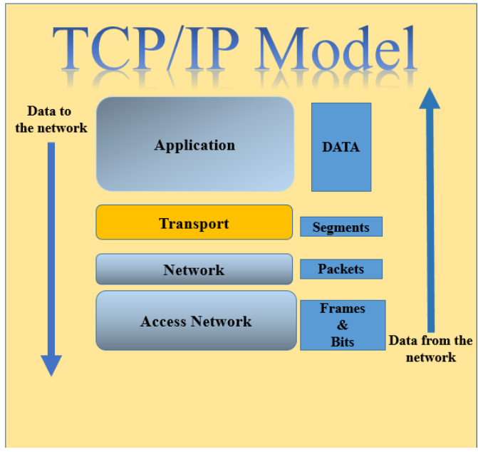

- [1. Khái niệm về mô hình OSI và mô hình TCP IPv4,IPv6](#1-khái-niệm-về-mô-hình-osi-và-mô-hình-tcp-ipv4ipv6)
  - [1.1. Mô hình OSI](#11-mô-hình-osi)
  - [1.2. 1.2 Mô hình TCP/IP](#12-12-mô-hình-tcpip)
  - [1.3. So sánh mô hình OSI và mô hình TCP/IP](#13-so-sánh-mô-hình-osi-và-mô-hình-tcpip)
  - [1.4. Địa chỉ IPV4 và IPV6](#14-địa-chỉ-ipv4-và-ipv6)
  - [1.5. Tìm hiểu IPv6](#15-tìm-hiểu-ipv6)

## 1. Khái niệm về mô hình OSI và mô hình TCP IPv4,IPv6
### 1.1. Mô hình OSI
**Định nghĩa**
Mô hình OSI (Open Systems Interconnection ) là mô hình tham chiếu để mô tả các thiết bị truyền thông mạng với nhau . Nó được phát triển bởi Tổ chức Tiêu chuẩn Hóa Quốc tế (ISO) vào năm 1984 và được sử dụng rộng rãi trong việc thiết kế, xây dựng và duy trì các mạng máy tính.
**Mô tả về mô hình OSI**
Trong mô hình OSI có bảy lớp, mỗi lớp mô tả một phần chức năng độc lập. Sự tách lớp của mô hình này mang lại những lợi ích sau:
Chia hoạt động thông tin mạng thành những phần nhỏ hơn, đơn giản hơn giúp chúng ta dễ khảo sát và tìm hiểu hơn.
Chuẩn hóa các thành phần mạng để cho phép phát triển mạng từ nhiều nhà cung cấp sản phẩm.
Ngăn chặn được tình trạng sự thay đổi của một lớp làm ảnh hưởng đến các lớp khác, như vậy giúp mỗi lớp có thể phát triển độc lập và nhanh chóng hơn.
Mô hình OSI gồm 7 tầng với những cấu trúc và chức năng riêng 




***Tầng physical*** : 


Bao gồm các thiết bị vật lý , thiết bị phần cứng . Dữ liệu được truyền ở ở tầng này dưới dạng 0 và 1
Thiết bị đặc trưng của tầng này : hubs, Repeaters
Giao thức đặc trưng : ethernet


***Tầng Data Link***:


- Tầng liên kết dữ liệu là tầng mạng có nhiệm vụ truyền dữ liệu giữa các nút mạng kề nhau trong một mạng diện rộng hoặc giữa các nút trong cùng một segment mạng cục bộ.
- Ngoài ra tầng data link còn kiểm soát lỗi đường truyền, thông lượng.
- Tầng này thực hiện việc đóng gói thông tin gửi thành các frame, gửi các frame một cách tuần tự đi trên mạng, xử lý các thông báo xác nhận (Acknowledgement frame) do bên nhận gửi về.
- Xác định ranh giới giữa các frame bằng cách ghi một số byte đặc biệt vào đầu và cuối frame.
- Các giao thức tiêu biểu tầng Data link sử dụng : Ethernet, Token ring, Frame, 802.11,WiFi, PPP.

Thiết bị đặc trưng của tầng này : switch
Giao thức đặc trưng : ARP(address Resolution Protocol),MAC,RARP(Reverse Address Resolution Protocol)


***Tầng Network*** :


- Vấn đề chủ chốt của tầng mạng là dẫn đường (định tuyến), định rõ các gói tin (packet) được truyền theo những con đường nào từ nguồn đến đích.
- Các con đường này có thể cố định, ít bị thay đổi,được thiết lập khi bắt đầu liên kết hay động (dynamic) thay đổi tuỳ theo trạng thái tải của mạng.
- Nếu có nhiều gói tin truyền trên mạng có thể xảy ra tình trạng tắc nghẽn, tầng mạng phải giải quyết vấn đề này.
- Các giao thức tiêu biểu tầng Network sử dụng :
  + IP (Internet Protocol)
  + ICMP(Internet Control Message Protocol)
  + IGMP(Internet Group Management Protocol)
  + IPX(Internetwork Packet Exchange)
  + BGP( Border Gateway Protocol)
  + OSPF (Open Shortest Path First)
  + RIP (Rest in peace)


***Tầng Transport***: 


- Tầng này chịu trách nhiệm thiết lập kết nối giữa hai thiết bị , nhận dữ liệu từ tầng phiên rồi xử lý để gửi xuống tầng dưới  cũng như nhận dữ liệu từ tầng dưới xử lý để chuyển lên tầng trên ,cung cấp các dịch vụ đảm bảo lưu lượng dữ liệu tin cậy, đúng thứ tự và không bị mất.
Giao thức đặc trưng của tầng này : UDP (user datagram protocol) ,TCP(Transmission control protocol)


***Tầng Session* (tầng phiên )** :


- Tầng này cho phép người sử dụng trên các máy khác nhau thiết lập, duy trì, huỷ bỏ, đồng bộ phiên truyền thông giữa họ.
- Cung cấp một số dịch vụ hữu ích cho người sử dụng như cho phép người dùng login vào hệ thống chia sẻ thời gian, truyền tệp giữa các máy tính.
- Quản lý token: cơ chế thẻ bài được tầng phiên cung cấp để tránh hiện tượng tranh chấp đường truyền trên mạng.
- Thực hiện đồng bộ (Synchronization): thực hiện đối với những dữ liệu lớn bằng cách thêm vào các thông tin kiểm tra, sửa lỗi.
- Các giao thức tiêu biểu tầng Session sử dụng : ASAP, TLS, ISO 8327 / CCITT X.225, RPC, NetBIOS, ASP.

***Tầng Presentation***


- Giải quyết vấn đề liên quan tới cú pháp và ngữ nghĩa của thông tin như chuyển đổi thông tin theo một chuẩn nào đó được cả hai bên sử dụng (mã ASCII - EBCDIC).
- Nén/giãn dữ liệu để giảm số lượng bit truyền trên mạng.
- Mã hoá dữ liệu để thực hiện quyền truy cập.
- Các giao thức tiêu biểu tầng Presentation sử dụng : XDR(Extreme Dynamic Range), ASN.1 (Abstract Syntax Notation One), SMB (Server Message Block), AFP (Alpha-fetoprotein), NCP (Network Control Protocol).

***Tầng Application***


-  Tầng ứng dụng cung cấp giao diện sử dụng cho người dùng (Chrome,mozilla firefox,...) và môi trường truyền tin.
-  Thực hiện chức năng chuyển file trong đó có giải quyết vấn đề không tương thích như cách đặt tên file hay các mã điều khiển trong một tệp văn bản...
-   Cung cấp các dịch vụ tiêu biểu cho người dùng: Web, Mail, DNS (phân giải tên miền ), DHCP(cấp phát IP  động), FTP (truyền file dữ liệu: hình ảnh,văn bản,v.v….).v.v….
-   Các giao thức tiêu biểu tầng Application sử dụng để đáp ứng dịch vụ : 
    + HTTP(Hypertext Transfer Protocol)
    + DNS (Domain Name System)
    + SMTP (S./anh/imple Mail Transfer Protocol)
    + SNMP (S./anh/imple Network Monitoring Protocol)
    + FTP (File Transfer Protocol)
    + NTP (Network T./anh/ime Protocol)
    + NFS (Network File System)
    + SSH (Secure Shell)
    + Telnet


**Ưu điểm trong mô hình OSI**

+ Mỗi tầng có 1 cấu trúc và chức năng nên dễ dàng xây dựng và sửa chữa
+ Có thể tích hợp nhiều mạng lưới khác nhau 
+ Hỗ trợ kết nối có liên kết và không liên kết


**Nhược điểm của mô hình OSI:**
+ Phức tạp
+ không phản ánh hoàn toàn thực tế của giao thức mạng hiện tại , các mạng hiện nay thường sử dụng các + giao thức mạng khác nhau và không theo chuẩn OSI đầy đủ
+ Chi phí cao

### 1.2. 1.2 Mô hình TCP/IP


**Mô hình TCP/IP**
- TCP/ IP (Transmission Control Protocol/ Internet Protocol - Giao thức điều khiển truyền nhận/ Giao thức liên mạng), là một bộ giao thức trao đổi thông tin được sử dụng để truyền tải và kết nối các thiết bị trong mạng Internet. TCP/IP được phát triển để mạng được tin cậy hơn cùng với khả năng phục hồi tự động.


**Cách thức hoạt động của mô hình TCP/IP**
- TCP/IP là sự kết hợp giữa 2 giao thức. Trong đó IP (Giao thức liên mạng) cho phép các gói tin được gửi đến đích đã định sẵn, bằng cách thêm các thông tin dẫn đường vào các gói tin để các gói tin được đến đúng đích đã định sẵn ban đầu. Và giao thức TCP đóng vai trò kiểm tra và đảm bảo sự an toàn cho mỗi gói tin khi đi qua mỗi trạm. Trong quá trình này, nếu giao thức TCP nhận thấy gói tin bị lỗi, một tín hiệu sẽ được truyền đi và yêu cầu hệ thống gửi lại một gói tin khác
- TCP/IP chỉ định cách dữ liệu được trao đổi qua internet. Nó thực hiện bằng cách cung cấp thông tin liên lạc đầu cuối. Từ đó xác định cách nó được chia thành các packet, xác định địa chỉ, truyền dẫn, định tuyến và nhận dữ liệu.
- TCP/IP được thiết kế để đảm bảo độ tin cậy, nó có khả năng khôi phục tự động khi gặp sự cố trong quá trình truyền dữ liệu

Giao thức TCP/IP được chia thành 4 tầng mạng : 





***Tầng ứng dụng***

  


- Phần lớn người sử dụng chỉ quan tâm tới các dịch vụ thông tin được cung cấp trên Internet. Tầng 4 có vai trò giao tiếp dữ liệu giữa 2 máy khác nhau.
Cung cấp cho các ứng dụng những trao đổi dữ liệu chuẩn hóa, giao tiếp dữ liệu giữa 2 máy khác nhau thông qua các dịch vụ mạng khác nhau.
- Các ứng dụng có sớm nhất của Internet là Telnet, FTP, SMTP, DNS ngoài ra ngày nay có hàng ngàn ứng dụng khác đang phát triển và ngày một nhiều : HTTP,HTTPS,Mail,


***Tầng giao vận*** 
- Tầng giao thức này nằm dưới tầng Ứng dụng , Tầng giao vận (Host-to-Host Transport Layer hay thường gọi là Transport Layer). 
- Hai giao thức quan trọng nhất của tầng này là Transmission Control Protocol (TCP) và User Datagram Protocol (UDP). 
- TCP cung cấp dịch vụ chuyển giao thông tin có kết nối (connection-oriented), nó bao gồm cả việc kiểm tra và sửa lỗi. 
- UDP cung cấp dịch vụ kém tin cậy hơn (unreliable) và không thiết lập liên kết trước (connectionless). 
Cả hai giao thức đều chuyển giao thông tin giữa tầng ứng dụng và tầng Internet. Chương trình ứng dụng có thể lựa chọn dịch vụ nào thích hợp với nó.

***Tầng mạng*** 
- Chức năng quan trọng nhất của tầng Internet chịu trách nhiệm định tuyến (dẫn đường) cho các gói tin và chọn lựa con đường tối ưu để truyền các gói tin từ trạm nguồn tới trạm đích.
- Chức năng tiếp thoại đóng gói dữ liệu thành các gói được gọi là IP Packet
- IP Packet chứa địa chỉ IP nguồn và  địa chỉ IP đích (nó giống như việc 1 bức thư có địa chỉ người gửi và địa chỉ người nhận).
- Khi các gói tin được gửi tới địa chỉ IP đích các gói dữ liệu có thể xuất hiện theo thứ tự khác với thứ tự được gửi đi. Nhiệm vụ của các lớp cao hơn là sắp xếp lại chúng để đưa chúng đến các ứng dụng mạng thích hợp hoạt động ở lớp Application 
- Các giao thức chính bao gồm ở tầng Internet:
  + IP (Internet Protocol)
  + ICMP (Internet Control Message Protocol)
  + ARP (Address Resolution Protocol)
  + RARP (Reverse Address Resolution Protocol)
  + IGMP (Internet Group Management Protocol).

***Lớp truy nhập mạng.***

- Lớp truy nhập mạng cũng còn được gọi là lớp host-to-network. Lớp này liên quan đến tất cả các chủ đề mà gói IP cần để thực sự tạo ra một liên kết vật lý đến môi trường truyền của mạng. Nó bao gồm các chi tiết của công nghệ LAN và WAN và tất cả các chi tiết được chứa trong lớp vật lý và lớp liên kết số liệu của mô hình OSI các driver cho các ứng dụng, các modem card và các thiết bị khác hoạt động tại lớp truy nhập mạng này.

- Các tiêu chuẩn giao thức modem như SLIP (Serial Line Internet Protocol) và PPP (Point-to-Point) cung cấp truy xuất mạng thông qua một kênh kết nối dùng modem. Bởi sự ảnh hưởng qua lại khá rắc rối của phần cứng, phần mềm và đặc tả môi trường truyền, nên có nhiều giao thức hoạt động tại lớp này. Điều này có thể dẫn đến sự rối rắm cho người dùng. Hầu hết các giao thức được công nhận hoạt động tại lớp vận chuyển và lớp Internet của mô hình TCP/IP.

- Các chức năng của lớp truy nhập mạng bao gồm ánh xạ địa chỉ IP sang địa chỉ vật lý và đóng gói (encapsulation) các gói IP thành các frame. Căn cứ vào dạng phần cứng và giao tiếp mạng, lớp truy nhập mạng sẽ xác lập kết nối với đường truyền vật lý của mạng.

**Ưu điểm của mô hình TCP/IP**
- Không chịu kiểm soát của tổ chức
Ưu điểm lớn nhất mà không thể phủ nhận đó là TCP/IP sẽ không chịu sự kiểm soát của bất kỳ tổ chức nào. Do đó, bạn có thể sử dụng tự do. 
- Tương thích với các hệ điều hành
Giao thức chuẩn mở sẵn sàng phát triển độc lập với phần cứng và hệ điều hành. TCP/IP là giao thức lý tưởng cho việc hợp nhất phần cứng và phần mềm khác nhau, ngay cả khi truyền thông trên Internet. 
Sự độc lập rành mạch với phần cứng vật lý của mạng cho phép TCP/IP hợp nhất các mạng khác nhau. 
TCP/IP có thể chạy trên mạng Ethernet, mạng Token ring, mạng quay số (Dial-up line), mạng X.25, mạng ảo và mọi loại môi trường vật lý truyền thông. 
- Khả năng mở rộng cao
Với nhiều tính năng mở rộng cao, mô hình này có thể định tuyến và có thể xác định được đường dẫn hiệu quả nhất thông qua mạng.

**Nhược điểm**
- Không đảm bảo an toàn
- Thiếu tính nhất quán : không đưa ra các quy định cụ thể về kết nối 
- Việc cài đặt khá phức tạp, khó để quản lý

### 1.3. So sánh mô hình OSI và mô hình TCP/IP
**Giống nhau**
- Cả hai mô hình đều được sử dụng để phân lớp thông tin định nghĩa các giao thức liên mạng
- Cả hai đều bao gồm các lớp vật lý đến lớp ứng dụng
- Cả 2 mô hình đã đơn giản hóa quá trình khắc phục sự cố bằng cách chia nhỏ chức năng phức tạp thành các thành phần đơn giản hơn

| Biến đổi                    | Thông tin chi tiết                                                                     | TCP                                                                          |
| --------------------------- | -------------------------------------------------------------------------------------- | ---------------------------------------------------------------------------- |
| 1. Độ tin cậy và phổ biến   | 1. Mô hình cũ , chỉ để tham khảo , số người sử dụng hạn chế hơn so với  nhu cầu TCP/IP | 1. Được chuẩn hóa , nhiều người tin cậy, được sử dụng phổ biến trên toàn cầu |
| 2. Sự kết hợp giữa các tầng | 2. Mỗi tầng khác nhau mỗi nhiệm vụ khác nhau , không có sự kết hợp giữa các tầng       | 2.Trong tầng ứng dụng có tầng trình diễn và tầng phiên được kết hợp với nhau |
| 3. Số lớp                   | 3. 7 lớp                                                                               | 3. 4 lớp                                                                     |
| 4. Thiết kế                 | 4. Phát triển theo mô hình trước sau đó phát triển giao thức                           | 4. Các giao thức được thiết kế trước sau đó phát triển mô hình               |

### 1.4. Địa chỉ IPV4 và IPV6

**Địa chỉ IPV4**
IPv4 (tên tiếng anh là Internet Protocol version 4): giao thức internet phiên bản 4, là phiên bản thứ tư trong quá trình phát triển của các giao thức Internet (IP). Đây là phiên bản đầu tiên của IP được sử dụng rộng rãi.
**Cấu trúc địa chỉ IP**
+ Địa chỉ IP được chia thành 2 phần là network (phần mạng) và phần Host
+ Địa chỉ IP có 32 bit nhị phân và được chia thành các octet (4 cụm, 8 bit)
+ Net-id là địa chỉ mạng,dùng để xác định mạng mà thiết bị kết nối vào
+ Host-id để xác định thiết bị của mạng đó.hiểu đơn giản là địa chỉ của thiết bị đó trong mạng
**Các quy tắc được áp dụng khi đặt địa chỉ IP:**
+ Các bit phần mạng không được phép đặt đồng thời bằng 0
Ví dụ:
Không hợp lệ nếu đặt địa chỉ 0.0.0.1 với phần mạng 0.0.0 và phần Host là 1).
Sẽ có một địa chỉ mạng nếu các bit phần Host đồng thời có giá trị bằng 0
Ví dụ: Mạng 192.168.1.0 có địa chỉ 192.168.1.255 là địa chỉ Broadcast


*Subnet mask*:
Class A, B ,C có subnet mask mặc định là 
+ class A:255.0.0.0
+ class B : 255.255.0.0
+ class C : 255.255.255.0


*Địa chỉ IP thường được*
 lớp A .10.x.x.x
 lớp B .172.16.x.x -> 172.31.x.x
Lớp C 192.168.x.x 

*Cách xác định network ID và broadcast ID* 
- lấy khoảng tăng nhân với số nguyên dương để ra được con số gần nhất 
    VD 192.168.1.173 /27
    xác định network ID và broadcast ID 
    => xác định khoảng tăng là 32 
    => xác định con số 32 * X < 173
    => 32* 5 = 160 < 173 (gần nhất) => network ID = 192.168.1.160 /27
    Tính toán broadcast ID 
    = network ID + khoảng tăng -1 
    160 + 32 - 1 = 191
    =>  192.168.1.191 / 27 

**Cách chia mạng**
Nguyên tắc chia IP : 
Chia phải chia IP hết phần đoạn mạng ta sử dụng
Đường mạn đã gắn  cho 1 số host = > không được dùng đến nữa
Chia IP lớn => nhỏ

Công thức chia IP 
2^H – 2   >  số IP 
số bít mượn = 32 - h - subnet(ban đầu) 
VD về chia mạng: chia lớp mạng 192.168.1.0/24 cho 4 phòng . Phòng một có 60 host , phòng 2  có 40 host , phòng 3 có 25 host , phòng 4 có 25 host
```
	2H – 2   > 60 
h = 6 => n = 32 - 6 -24 = 2  
2n mạng con 
    => mượn 2 bit /26 .
    192.168.1.00.000000 
    192.168.1.01.000000
    192.168.1.10.000000
    192.168.1.11.000000
    => 192.168.1.00000000 là 192.168.1.0
    192.168.1.01000000 là 192.168.1.64
    192.168.1.1000000 là 192.168.1.128
    192.168.1.1100000 là 192.168.1.192
    vì mượn 2 bit nên subnet là /26
    192.168.1.1/26 ← dùng chia cho 60 IP
    192.168.1.64/26  ← dùng chia cho 40 IP
    192.168.1.128/26	
    192.168.1.192/26
    chia cho 40 host 
    2h – 2   > 40 
    h = 6 => n = 32 - 24 - 6 => n=2

    còn 2  phòng 25 host
    2h – 2   > 25
    h = 5 => n  = 32 -5- 24 = 3
    23 mạng con 
    mượn 3 bit /27 
    Từ 192.168.1.128 /26 chia thành 2 mạng con /27 để dùng chia con
    192.168.1.128 /27 ← dùng chia cho 25 IP
    192.168.1.160 /27 ← dùng chia cho 25 IP

    192.168.1.0/24 
    có 254 Ip có thể dùng được
    Ta tính toán cho nhu cầu 60,40 IP
        32 < 60 ,40< 64 
    =. số subnet mask là /26 

*khoảng tăng là 64*
<!-- @./anh/import "[TOC]" {cmd="toc" depthFrom=1 depthTo=6 orderedList=false} -->

192.168.1.0 /26
192.168.1.64 /26 ←  dùng cho 60 IP 
192.168.1.128 /26  ←dùng cho 40 IP 

*Ta tính toán cho nhu cầu 25 IP*

16 < 25 < 32 
=. số subnet mask là /27 
 khoảng tăng là 32
192.168.1.128 /27  ←dùng cho 25 IP 
192.168.1.160 /27  ←dùng cho 25 IP 
```
*VD : **cho network 192.168.1.0/24 **
    Chia nhỏ theo y/c sau : 
    100 IP - > Phòng kinh doanh 
    18 IP -> Phòng hành chính
    16 IP -> Phòng kỹ thuật
    24 IP -> phòng bảo vệ*

    192.168.1.0/24 có 254 ip có thể dùng được 
    Ta tính toán cho nhu cầu 100 IP 
    64< 100 < 128
    => số subnet mask là /25
    khoảng tăng là 128
    192.168.1.0 /25
    192.168.1.128 /25 ← dùng cho 100 IP
    Ta tính 16 IP 24 IP 18 IP
    để nằm trong khoảng của 16 <= x < 32 => dùng số subnet mask là /27 
    khoảng tăng là 32
    192.168.1.128/27 ←  dùng cho 24 IP
    192.168.1.160 /27 ←  dùng cho 18 IP
    192.168.192 /27 ← dùng cho 16 IP 


### 1.5. Tìm hiểu IPv6

1. Giới thiệu 
Địa chỉ IPv6 (Internet protocol version 6) là thế hệ địa chỉ Internet phiên bản mới được thiết kế để thay thế cho phiên bản địa chỉ IPv4 trong hoạt động Internet. Địa chỉ IPv4 có chiều dài 32 bit, biểu diễn dưới dạng các cụm số thập phân phân cách bởi dấu chấm, ví dụ 192.168.1.9. IPv4 là phiên bản địa chỉ Internet đầu tiên, đồng hành với việc phát triển như vũ bão của hoạt động Internet trong hơn hai thập kỷ vừa qua. Với 32 bit chiều dài, không gian IPv4 gồm khoảng 4 tỷ địa chỉ cho hoạt động mạng toàn cầu.
Các định dạng gói tin IPv6 bao gồm địa chỉ phân cấp IPv6 và các tiêu đề cho phép các bộ định tuyến có hiệu quả xử lý các gói tin. Địa chỉ này đủ lớn cho phép đáp ứng sự phát triển mạnh mẽ của Internet như hiện tại và cung cấp nhiều lớp của hệ thống phân cấp.
Phiên bản địa chỉ Internet mới IPv6 được thiết kế để thay thế cho phiên bản IPv4, với hai mục đích cơ bản:
- Thay thế cho nguồn IPv4 cạn kiệt để tiếp nối hoạt động Internet.   
- Khắc phục các nhược điểm trong thiết kế của địa chỉ IPv4.
	Địa chỉ IPv6 có độ dài 128 bit, được chia làm 8 nhóm, mỗi nhóm gồm 1 bit được ngăn cách nhau bởi dấu “:”. Mỗi nhóm được biểu diễn bằng 4 số Hexa.
Đối với những nhóm có giá trị 0 liên tiếp, có thể rút gọn lại là "::".

VD: 2031:2517:0000:0000:0000:1C0A:876A:130B

-> 2031:2517::1C0A:876A:130B

Nhưng cách rút gọn này chỉ được 1 lần thực hiện.

VD: 2031:0517:0000:0000:A5C7:0000:0000:130B

-> 2031:0517::A5C7::130B (Sai)

-> 2031:517::A5C7:0:0:130B (Đúng)

2. Biểu diễn của Address Prefixes.


Prefix của địa chỉ IPv6 được biểu diễn tương tự với ký tự IPv4 CIDR. IPv6 prefix được biểu diễn như sau: IPv6 Address/Prefix-length.

Trong đó:
IPv6 Address: địa chỉ IPv6 với giá trị bất kỳ.
Prefix-length: số bit liền kề nhau trong Prefix.


Ví dụ: Quy tắc biểu diễn của 56 bit prefix 200F00000000AB là
200F::AB00:0:0:0:0/56
200F:0:0:AB00::/56


3. Các thành phần của IPv6

Địa chỉ IPv6 có 3 thành phần: `Site prefix`, `Subnet ID`, `Interface ID`

`Site Prefix`: đây là thông số được gắn với Website thông qua ISP. Do đó toàn bộ máy tính ở cùng vị trí sẽ chia sẻ với nhau bằng một site prefix.


`Subnet ID`: đây là thành phần bên trong Website. Nó được dùng để miêu tả site mạng.
Interface ID: cấu trúc của nó tương tự ID trong IPv4. Các thông số sẽ nhận một host riêng. Interface ID có cấu hình tự động.
Ví dụ: địa chỉ IPv6 có cấu trúc: 2001:0f68:0000:0000:0000:0000:1986:69af bao gồm:
Site prefix: 2001:0f68:0000
Subnet ID: 0000
Interface ID: 0000:0000:1986:69af

