- [1. DHCP,ARP,DNSP](#1-dhcparpdnsp)
  - [1.1. DHCP](#11-dhcp)
  - [1.2. Chi tiết về bản tin trao đổi của DHCP](#12-chi-tiết-về-bản-tin-trao-đổi-của-dhcp)
  - [1.3. Lab DHCP  cấp ip cho các ip ở bài lab này dùng router cấp phát dhcp cho PC](#13-lab-dhcp--cấp-ip-cho-các-ip-ở-bài-lab-này-dùng-router-cấp-phát-dhcp-cho-pc)
  - [1.4. ARP Protocol](#14-arp-protocol)
  - [1.5. DNS](#15-dns)
    - [1.5.1. bài lab về DNS](#151-bài-lab-về-dns)
    - [1.5.2. Thực hiện cấu hình một DNS thực tế](#152-thực-hiện-cấu-hình-một-dns-thực-tế)
  - [Ethernet](#ethernet)
  - [Điều kiện cài port-channel](#điều-kiện-cài-port-channel)
  - [Phân loại Etherchannel:](#phân-loại-etherchannel)
  - [Lab Ethernet channel](#lab-ethernet-channel)

## 1. DHCP,ARP,DNSP
### 1.1. DHCP
- DHCP (Dynamic Host Configuration Protocol - Giao thức cấp phát IP động) là một giao thức cho phép cấp phát địa chỉ IP một cách tự động cùng với các cấu hình liên quan khác như Subnet mask, Gateway, DNS Server….. Client được cấu hình nhận địa chỉ IP một cách tự động. Vì thế sẽ giảm việc can thiệp vào hệ thống mạng. Giao thức DHCP Server cung cấp một database để theo dõi tất cả các máy tính Client trong hệ thống mạng. Mục đích quan trọng nhất là tránh trường hợp hai máy tính khác nhau lại có cùng địa chỉ IP.
- Nếu không có giao thức DHCP. Các máy trạm có thể cấu hình IP thủ công (cấu hình IP tĩnh). Nhưng nếu một hệ thống lớn thì khi thay đổi ta phải tiến hành cấu hình thủ công trên từng Client sẻ rất mất thời gian và khó quản lý. Ngoài việc cung cấp địa chỉ IP. DHCP còn cung cấp các thông tin cấu hình khác. Cụ thể như DNS Server, Default Gateway, Thời gian cho thuê địa chỉ IP….. Hiện nay giao thức DHCP có 2 version cho IPv4 và IPv6.
- Sử dụng giao thức DHCP có một vài lợi ích hơn cấu hình IP tĩnh. Cấu hình của địa chỉ IP sẻ được thiết lập trên DHCP server. Cấu hình IP lúc này được control bởi nhân viên quản trị. Hạn chế đáng kể can thiệp từ người dùng. Thông thường thì DHCP sẻ cấp phát một “lease” cho client. DHCP server sẻ lấy lại địa chỉ IP này khi thiết bị rời khỏi mạng để cấp phát cho một Client khác.
- DHCP sử dụng cổng 67 với Server, 68 với Client

### 1.2. Chi tiết về bản tin trao đổi của DHCP 

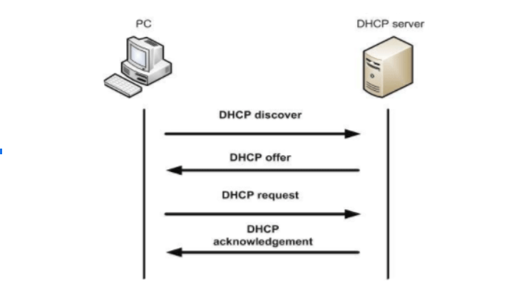


- `DHCP Discover `là một gói tin được gửi đến DHCP server từ một thiết bị Client khi muốn truy cập mạng để yêu cầu thông tin địa chỉ IP DHCP Offer
- `DHCP Offer` là gói tin chứa địa chỉ IP và thông tin cấu hình TCP/IP bổ sung bao gồm địa chỉ MAC,gateway,.... Nó được DHCP server gửi về cho Client sau khi nhận được DHCP Discover.
- `DHCP Request` là gói tin được DHCP client phản hồi với máy chủ sau khi nhận được DHCP Offer để thể hiện sự chấp nhận đối với địa chỉ IP.
- `DHCP Acknowledge` là một gói tin được DHCP server gửi đến cho Client để xác thực việc chấp nhận DHCP Request và định hướng các tham số tùy chọn cho phép Client tham gia mạng TCP/IP và hoàn thành hệ thống khởi động.
Trong trường hợp địa chỉ IP không được Client sử dụng vì không còn giá trị hoặc đã được dùng bởi một máy khác. DHCP server sẽ gửi một gói `DHCP Nak` và Client phải tiến hành quá trình thuê lại IP.`DHCP Nak` chính là một gói được gửi từ DHCP server đến Client khi nó nhận được yêu cầu từ một địa chỉ IP không có giá trị theo các Scope mà nó được định cấu hình.
Trường hợp DHCP Client quyết định tham số thông tin được đề nghị nào không có giá trị nó sẽ gửi một gói DHCP Decline đến các server và Client phải bắt đầu tiến trình thuê lại IP

**Ưu điểm**  
  + Giúp các thiết bị kết nối mạng nhanh chóng từ máy tính, laptop, điện thoại,máy tính bảng+   Quản lý địa chỉ IP một cách khoa học, tránh trường hợp trùng IP,đảm bảo cấu hình tự động cho mọi thiết bị kết nối mạng
  + Quản lý địa chỉ IP và các tham số TCP/IP
  + Cách nhà quản trị mạng có thể thay đổi cấu hình và thông số của IP để nâng cấp cơ sở hạ tầng .Các thiết bị có thể di chuyển tự do từ mạng này sang mạng khác và nhận IP mới tự động.
**Nhược điểm**
  + Việc sử dụng IP động của DHCP không phù hợp với các thiết bị cố định như máy in,file server.
  + DHCP thường chỉ đc sử dụng tại các hộ gia đình hoặc mô hình mạng nhỏ

Đối với mô hình mạng nhỏ ( hộ gia đình ) Router hoạt động như một máy chủ DHCP, với mô hình mạng lớn hơn thì không thể quản lý số lượng thiết bị nên sẽ cần một máy chủ chuyên dụng để cấp phát IP.
*Bước 1:*
  + DHCP Client gửi broadcast thông điệp discover message để tìm một DHCP Server nhằm xin IP.
  Gói tin DHCP này được bọc trong một gói UDP với source port là 68 và destination port là 67. Gói UDP đến lượt nó được đóng gói vào một gói IP với source IP là 0.0.0.0 và destination IP là 255.255.255.255
Bước 2:
  + DHCP Server nhận được thông điệp này sẽ gửi lại thông điệp offer message cho Client.
  Thông điệp Offer ghi ra mọi thông số server cấp xuống cho client (MAC của client, địa chỉ ip client, subnet mask, địa chỉ ip server, thời gian cho thuê đến client).
  Gói tin OFFER này được bọc trong một gói UDP với source port là 67 và destination port là 68. Gói UDP đến lượt nó được đóng gói vào một gói IP với source IP là địa chỉ IP của server và destination IP là 255.255.255.255
  Bước 3:
  + Client sẽ chọn 1 trong các địa chỉ IP, sau đó gửi lại thông điệp request message tương ứng với DHCP server đó.
  + Gói REQUEST này sẽ được đóng vào một gói UDP với source port là 68 và destination port là 67. Gói UDP sẽ được truyền tải trong một gói IP với source IP là 0.0.0.0 và destination IP là 255.255.255.255
Bước 4:
  + Server sẽ hoàn tất bằng cách gửi thông điệp ACK cho client. Ngoài ra còn có gateway mặc định, địa chỉ dns server.
  + DHCP ACK được đóng vào gói UDP với source port là 67 và destination port là 68, được truyền tải trong gói IP có source IP là IP của server và destination IP là 255.255.255.255
  + Đến đây, client chính thức có cấu hình IP và có thể sử dụng địa chỉ IP được cấp phát để trao đổi dữ liệu. Mỗi cấu hình IP được cấp phát sẽ chỉ có thời hạn trong một khoảng thời gian nhất định, sau khoảng thời gian này, client phải yêu cầu server cấp phát gia hạn lại cấu hình IP của mình. Trong những lần sau, các thông điệp DHCP được gửi unicast thay vì broadcast như lần cấp phát đầu tiên.

### 1.3. Lab DHCP  cấp ip cho các ip ở bài lab này dùng router cấp phát dhcp cho PC


Thực hiện cấu hình trên server : 

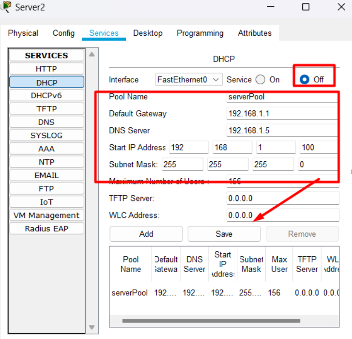


Ở đây không bật `on` vì sử dụng router để cấp phát địa chỉ ip
Cấu hình trên router 1 


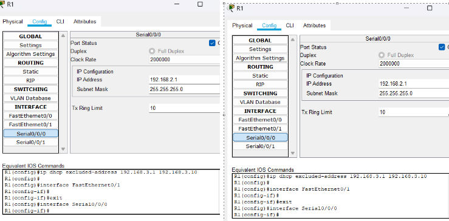


Cấu hình trên R2 : 


**B2 : Cấp phát địa chỉ cho PC1**

```
R1(config)#ip dhcp pool mang192
R1(dhcp-config)#net
R1(dhcp-config)#network 192.168.1.0 255.255.255.0
R1(dhcp-config)#de
R1(dhcp-config)#default-router 192.168.1.1
R1(dhcp-config)#dns
R1(dhcp-config)#dns-server 192.168.1.5
R1(dhcp-config)#exit
R1(dhcp-config)#exit
R1(config)#ip d
R1(config)#ip dh
R1(config)#ip dhcp ex
R1(config)#ip dhcp excluded-address 192.168.1.1 192.168.1.10 //không cấp phát từ 1->10
```

**Cấp phát IP cho PC2**

```
R1(config)#ip dhcp
R1(config)#ip dhcp po
R1(config)#ip dhcp pool mang193
R1(dhcp-config)#net
R1(dhcp-config)#network 192.168.3.0 255.255.255.0
R1(dhcp-config)#de
R1(dhcp-config)#default-router 192.168.3.1
R1(dhcp-config)#dn
R1(dhcp-config)#dns-server
% Incomplete command.
R1(dhcp-config)#dns-server 192.168.1.5
R1(dhcp-config)#ext
R1(config)#ip dhcp excluded-address 192.168.3.1 192.168.3.10

```

**Trên R2 :**

```
R2(config)#router rip
R2(config-router)#net
R2(config-router)#network 192.168.2.0
R2(config-router)#network 192.168.3.0
R2(dhcp-config)#i int f0/0
R2(config-if)#ip helper-address 192.168.2.1 //kết nối với router 1 để cấp phát ip

```


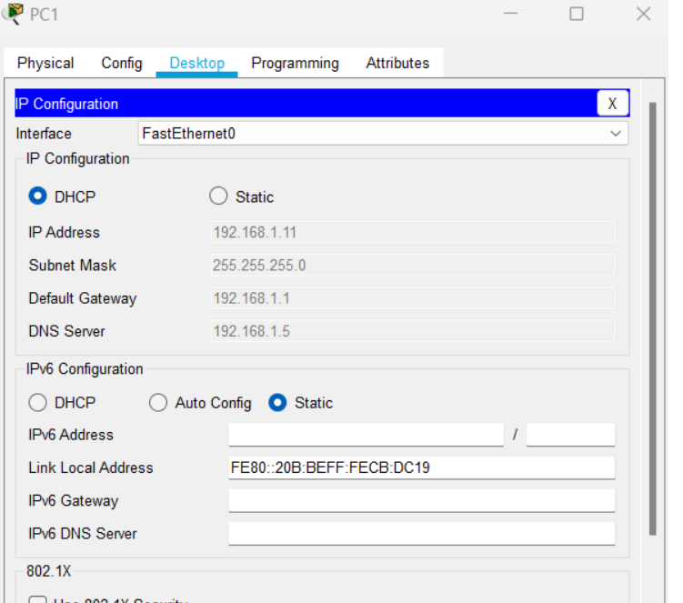


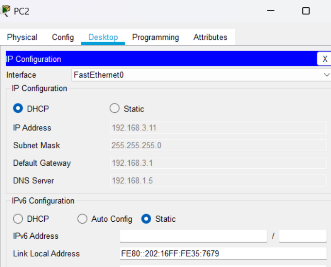


### 1.4. ARP Protocol
**Định nghĩa**
ARP là phương thức phân giải địa chỉ động giữa địa chỉ lớp network và địa chỉ lớp datalink. Quá trình thực hiện bằng cách: một thiết bị IP trong mạng gửi một gói tin local broadcast đến toàn mạng yêu cầu thiết bị khác gửi trả lại địa chỉ phần cứng ( địa chỉ lớp datalink ) hay còn gọi là Mac Address của mình.ARP là giao thức lớp 2 - Data link layer trong mô hình OSI và là giao thức lớp Link layer trong mô hình TCP/IP.
Địa chỉ MAC có độ dài 48 bit

**Mô hình hoạt động của ARP**


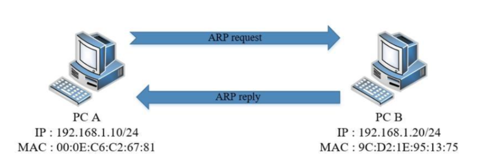


Bước 1: PC A sẽ kiểm tra cache của mình . Nếu đã có MAC address của IP 192.168.1.10 thì PC A sẽ gửi packet cho PC B.

Bước 2: Bắt đầu khởi tạo gói tin ARP Request. Nó sẽ gửi một gói tin broadcast đến toàn bộ các máy khác trong mạng với MAC address và IP máy gửi là địa chỉ của chính nó, địa chỉ IP máy nhận là 192.168.1.20, và MAC address máy nhận là ff:ff:ff:ff:ff:ff.

Bước 3: PC A phân phát gói tin ARP Request trên toàn mạng. Khi switch nhận được gói tin broadcast nó sẽ chuyển gói tin này tới tất cả các máy trong mạng LAN đó.

Bước 4: Các PC trong mạng đều nhận được gói tin ARP Request. PC kiểm tra trường địa chỉ Target Protocol Address. Nếu trùng với địa chỉ của mình thì tiếp tục xử lý, nếu không thì hủy gói tin.

Bước 5: PC B có IP trùng với IP trong trường Target Protocol Address sẽ bắt đầu quá trình khởi tạo gói tin ARP Reply bằng cách:

lấy các trường Sender Hardware Address và Sender Protocol Address trong gói tin ARP nhận được đưa vào làm Target trong gói tin gửi đi.

Đồng thời thiết bị sẽ lấy địa chỉ MAC của mình để đưa vào trường Sender Hardware Address

Bước 6: PC B đồng thời cập nhật bảng ánh xạ IP address và MAC address của thiết bị nguồn vào bảng ARP cache của mình để giảm bớt thời gian xử lý cho các lần sau .

Bước 7: PC B bắt đầu gửi gói tin Reply đã được khởi tạo đến PC A.

Bước 8: PC A nhận được gói tin reply và xử lý bằng cách lưu trường Sender Hardware Address trong gói reply vào bảng ARP cache làm MAC address tương ứng với IP address của PC B. Lần sau sẽ không còn cần tới request


### 1.5. DNS
DNS (Domain Name System – hệ thống phân giải tên miền) là một hệ thống giúp con người và máy tính giao tiếp dễ dàng hơn. Con người sử dụng tên, còn máy tính sử dụng số, DNS chính là một hệ thống giúp biên dịch tên hostname (tên miền) thành số để máy tính có thể hiểu được.

Sử dụng cổng 53 để truyền tải thông tin
Sử dụng giao thức TCP và UDP
Sử dụng TCP khi cập nhật thông tin với các server khác
Sử dụng UDP khi trả lời truy vấn của client
Hoạt động theo mô hình Client-Server
Khi bạn truy cập web mà trên máy tính thiết lập DNS server là 8.8.8.8 chẳng hạn, thì bạn sẽ truy vấn DNS trên DNS server 8.8.8.8.
Nếu bạn không thiết lập DNS trên máy tính có nghĩa là bạn đang sử dụng DNS được thiết lập trên Modem và thường mặc định nó sẽ là địa chỉ DNS server của nhà mạng bạn đang sử dụng.
Mỗi trang web sẽ là địa chỉ ip tĩnh và không bao giờ thay đổi để DNS có thể dễ dàng quản lý

**Vai trò, chức năng của DNS**
Chức năng của DNS về căn bản là một hệ thống giúp cho việc chuyển đổi các tên miền mà con người dễ ghi nhớ (dạng ký tự, ví dụ www.google.com) sang địa chỉ IP vật lý (dạng số, ví dụ 123.11.5.19) tương ứng của tên miền đó.

Khi mở một trình duyệt Web và nhập tên website, trình duyệt sẽ đến thẳng website mà không cần phải thông qua việc nhập địa chỉ IP của trang web. Quá trình "dịch" tên miền thành địa chỉ IP để cho trình duyệt hiểu và truy cập được vào website là công việc của một DNS server. Các DNS trợ giúp qua lại với nhau để dịch địa chỉ "IP" thành "tên" và ngược lại. Người sử dụng chỉ cần nhớ "tên", không cần phải nhớ địa chỉ IP (địa chỉ IP là những con số rất khó nhớ).

Đặt thêm 1 bí danh cho 1 tên miền.ví dụ là 1 tên miền chính và 1 tên miền phụ

**Cách thức hoạt động của DNS**

+ Khi nhập một tên miền vào trình duyệt web, ví dụ như "www.example.com", trình duyệt sẽ gửi yêu cầu đến máy chủ DNS (DNS resolver) để tìm địa chỉ IP tương ứng của tên miền đó. Máy chủ DNS resolver sẽ thực hiện quá trình tìm kiếm theo các bước sau:

+ Local DNS Cache: Đầu tiên, máy chủ DNS resolver sẽ kiểm tra trong bộ nhớ cache của mình xem có thông tin về tên miền được yêu cầu không. Nếu có, nó trả về địa chỉ IP từ cache và quá trình kết thúc.
+ Recursive Query: Nếu không có thông tin trong cache, máy chủ DNS resolver sẽ thực hiện một truy vấn đệ quy (recursive query). Nó sẽ gửi yêu cầu đến các máy chủ DNS khác nhau, bắt đầu từ máy chủ DNS gốc (root DNS server), sau đó đi qua máy chủ DNS cấp cao nhất (top-level domain DNS server) và tiếp tục tới máy chủ DNS miền (domain DNS server).

+ Caching và Trả lời: Khi máy chủ DNS resolver nhận được câu trả lời từ máy chủ DNS, nó sẽ lưu thông tin đó vào bộ nhớ cache để sử dụng cho các truy vấn tương lai và trả về địa chỉ IP cho trình duyệt web của người dùng.

**Thế nào là DNS Record, một số loại record phổ biến**
` Bản ghi loại A`
Address Mapping records: Sử dụng để chuyển đổi một domain name thành một địa chỉ IPv4.

`Bản ghi loại AAAA` - IP Version 6 Address records: Sử dụng để chuyển đổi một domain name thành một địa chỉ IPv6.

`Bản ghi loại NS`

Name Server records: Lưu thông tin về Name Server. Nó định danh cho một máy chủ có thẩm quyền về một zone nào đó.
`Bản ghi loại CNAME`
`Canonical Name records`: Bản ghi CNAME chỉ định một tên miền cần phải được truy vấn để giải quyết truy vấn DNS ban đầu. Vì vậy các bản ghi CNAME được sử dụng để tạo các bí danh tên miền. Bản ghi CNAME thực sự hữu ích khi chúng ta muốn bí danh tên miền của chúng ta tới miền bên ngoài. Trong các trường hợp khác, chúng ta có thể xóa các bản ghi CNAME và thay thế chúng bằng các bản ghi A. 4.5 Bản ghi loại PTR
Reverse-lookup Pointer records: bản ghi PTR được sử dụng để tra cứu tên miền dựa trên địa chỉ IP. 4.6 `Bản ghi loại MX`
`Mail exchanger record`: MX chỉ định một máy chủ trao đổi thư cho một tên miền DNS. Thông tin được sử dụng bởi Giao thức truyền thư đơn giản (SMTP) để định tuyến email đến máy chủ thích hợp. Thông thường, có nhiều hơn một máy chủ trao đổi thư cho một miền DNS và mỗi DNS trong số chúng đã đặt ưu tiên.

#### 1.5.1. bài lab về DNS

Mô hình 


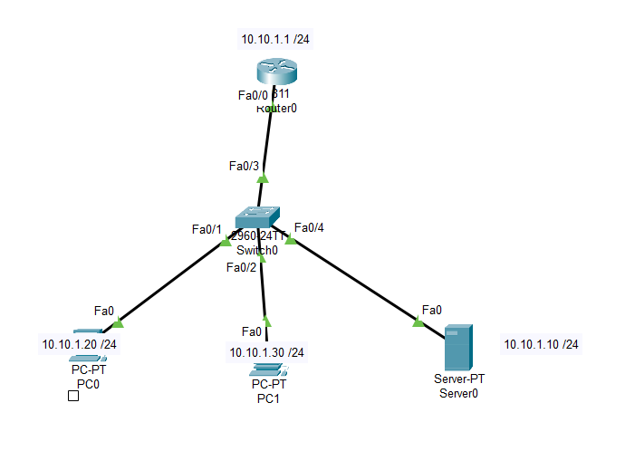

Thực hiện cấu hình trên server 

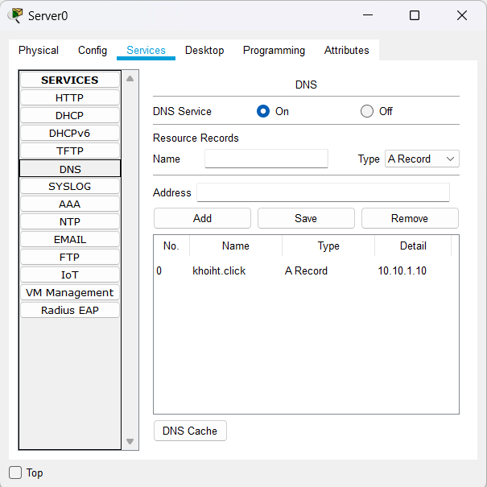

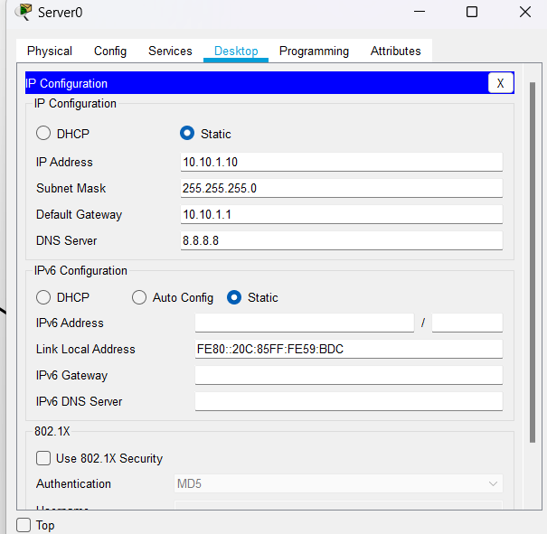


Thực hiện cấu hình trên pc


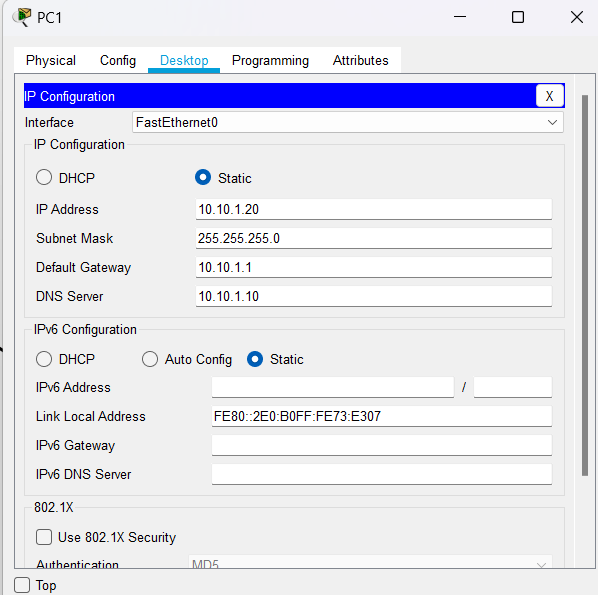


Thực hiện truy cập vào IP 

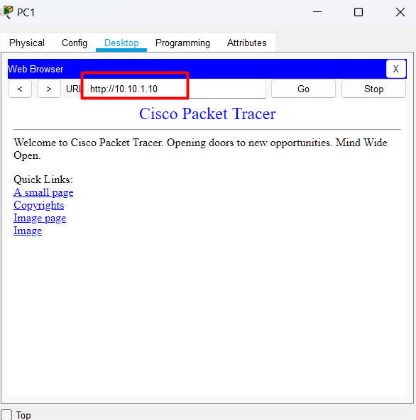


Thực hiện phân giải DNS 


#### 1.5.2. Thực hiện cấu hình một DNS thực tế 

Yêu cầu cần có domain


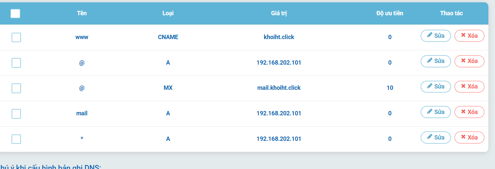


### Ethernet 
EtherChannel là một kỹ thuật nhóm hai hay nhiều đường kết nối truyền tải dữ liệu vật lý (Link Aggregation) thành một đường ảo duy nhất (Logic) có Port ảo thậm chí cả MAC ảo nhằm mục đích tăng tốc độ truyền dữ liệu và tăng khả năng dự phòng (Redundancy) cho hệ thống
### Điều kiện cài port-channel
+ Cùng tốc độ
+ Cùng chung một môi trường truyền dẫn (không thể đồng và quang)
+ Cùng chung mode:  
      Có 2 mode: kiểu 1 là vừa truyền vừa nhận
			            kiểu 2 là chỉ truyền hoặc nhận

### Phân loại Etherchannel:
* LACP (Link Aggregation Control Protocol) :
- Là giao thức cấu hình EtherChannel chuẩn quốc tế IEEE 802.3ad và có thể dùng được cho hầu hết các thiết bị thuộc các hãng khác nhau, LACP hỗ trợ ghép tối đa 16 Link vật lý thành một Link luận lý (8 Port Active – 8 Port Passive)

* `LACP` có 3 chế độ
`On`:tự động
`Active`: Chế độ chủ động– chủ động động thương lượng với đối tác
`Passive`: Chế độ bị động – Chờ được thương lượng


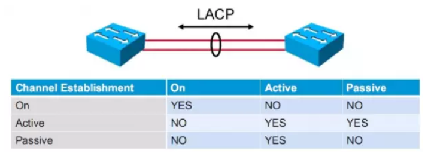


`PAgP` (Port Aggregation Protocol):
Là giao thức cấu hình EtherChannel độc quyền của các thiết bị hãng Cisco và chỉ hỗ trợ ghép tối đa 8 Link vật lý thành một Link luận lý
có 3 chế độ:
`On`: Chế độ cấu hình EtherChannel tĩnh
`Active`: Chế độ tự động – Tự động thương lượng với đối tác
`Passive`: Chế độ bị động – Chờ được thương lượng


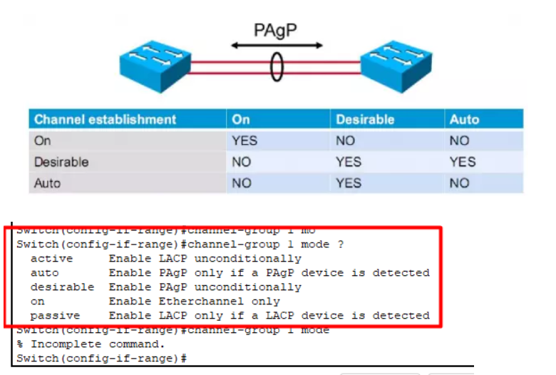


### Lab Ethernet channel 

Active : chủ động - Tự động thương lượng 
Passive: bị động - Chờ được thương lượng
```
Các bước cấu hình

	Bước 1: tiến hành int vào các port thiết lập trunk
	Bước 3 : tạo group và tạo kiểu active hoặc passive cho sw
	Bước 4 : khi 2 dây vật lý được đồng bộ thành 1 dây, ta tiến hành tạo lại đường trunk cho dây
	Bước 5 : kiểm tra 
```


**Mô hình bài lab**


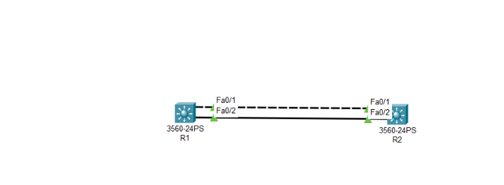


**Trên sw1 cấu hình như sau  :**

```
Switch(config)#int range f0/1-2
Switch(config-if-range)#switchport trunk encapsulation dot1q
Switch(config-if-range)#sw mode trunk 
Switch(config-if-range)#channel-group 1 mode active //để ở chế độ active
Switch(config-if-range)#int port-channel 1 
Switch(config-if)#switchport trunk encapsulation dot1q
Switch(config-if)#switchport mode trunk 
```

**Trên sw2 cấu hình như sau :**

```
Switch(config)#int range f0/1-2
Switch(config-if-range)#switchport trunk encapsulation dot1q
Switch(config-if-range)#sw mode trunk 
Switch(config-if-range)#channel-group 1 mode passive //để ở chế độ passive
Switch(config-if-range)#int port-channel 1 
Switch(config-if)#switchport trunk encapsulation dot1q
Switch(config-if)#switchport mode trunk 
```

**Xem trạng thái :**

`show etherchannel summary`


Trên sw2: 


 Trên sw1 :


 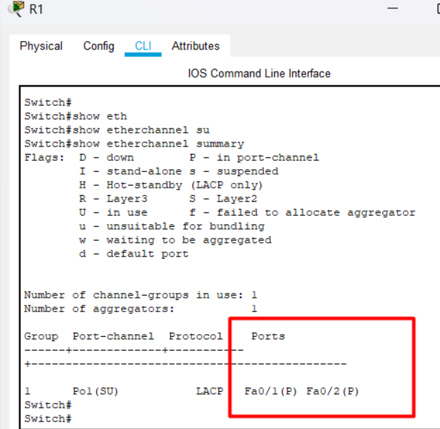


**note : đây là kết quả trước khi chưa cấu hình**


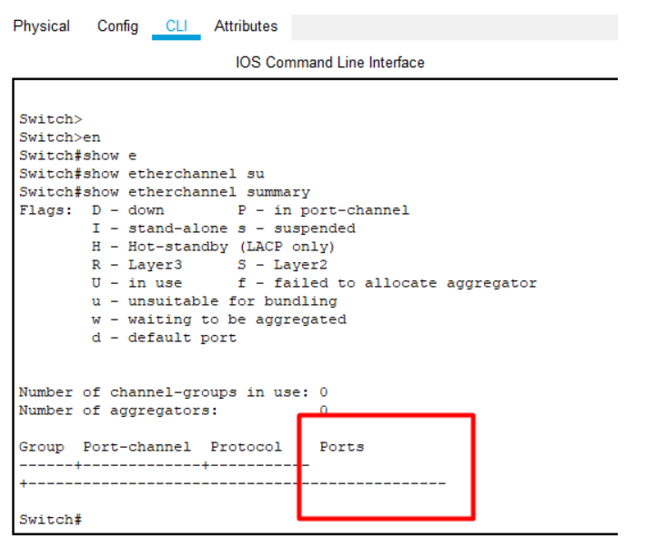

