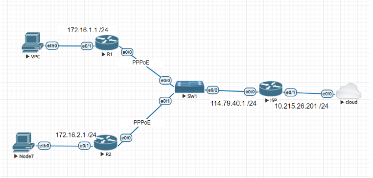
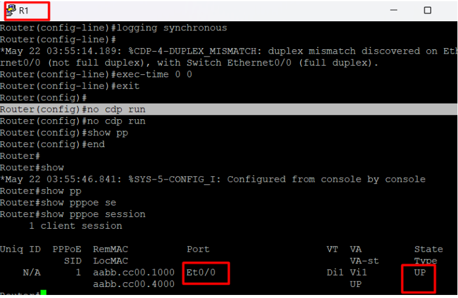
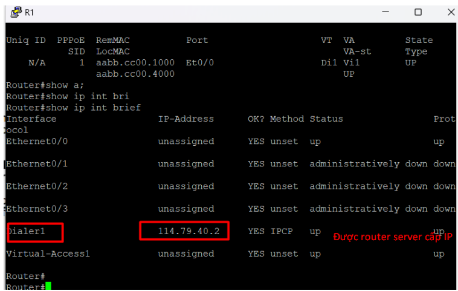
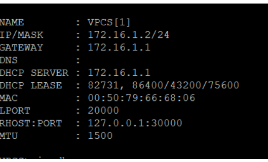
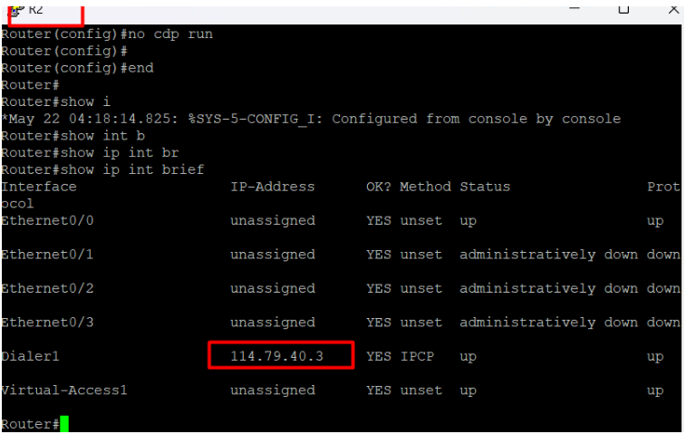
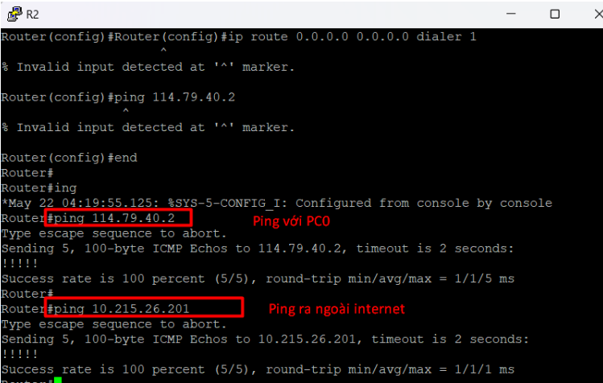
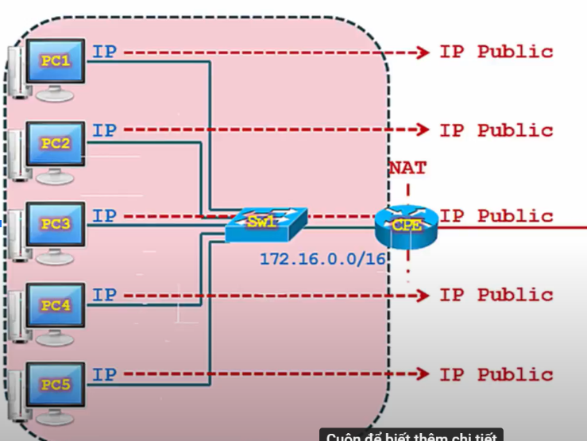
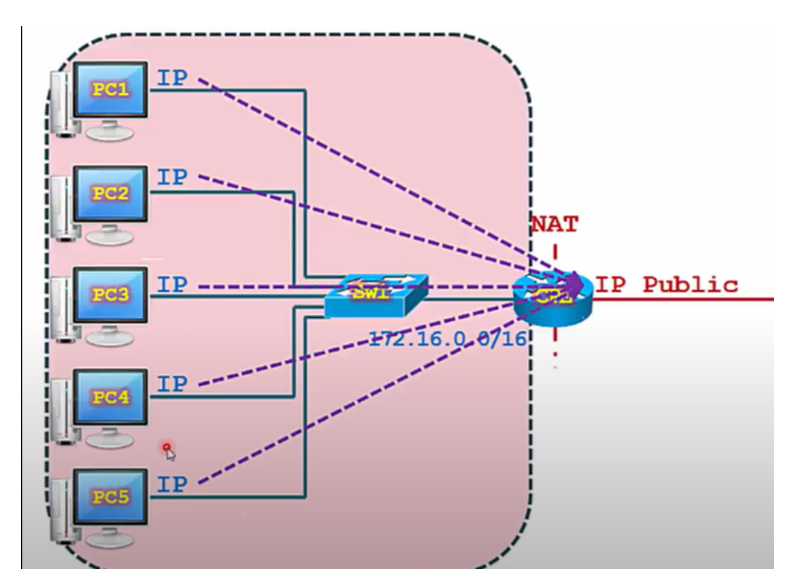
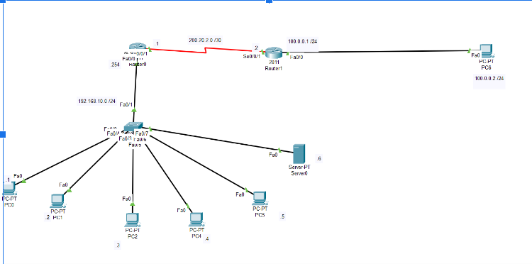
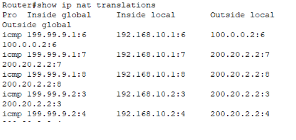

- [1. Định nghĩa](#1-định-nghĩa)
  - [1.1. PPPoE](#11-pppoe)
  - [1.2. Ứng dụng của PPPoE là gì?](#12-ứng-dụng-của-pppoe-là-gì)
  - [1.3. Ưu nhược điểm của PPPoE ?](#13-ưu-nhược-điểm-của-pppoe-)
  - [1.4. PPPoE có thể được chia thành hai loại:](#14-pppoe-có-thể-được-chia-thành-hai-loại)
  - [1.5. Bài lab triển khai PPPoE](#15-bài-lab-triển-khai-pppoe)
  - [1.6. NAT](#16-nat)
  - [1.7. Định nghĩa](#17-định-nghĩa)
  - [1.8. Bài lab cơ bản cấu hình static nat :](#18-bài-lab-cơ-bản-cấu-hình-static-nat-)


## 1. Định nghĩa 
### 1.1. PPPoE 
+ PPP over Ethernet (PPPoE) là một phương thức kết nối Internet được sử dụng để thiết lập kết nối mạng giữa các máy tính và modem DSL / Cable của nhà cung cấp dịch vụ Internet (ISP). PPPoE cho phép người dùng kết nối với Internet thông qua đường truyền Ethernet, tuy nhiên, nó cần phải sử dụng giao thức PPP để thiết lập kết nối với ISP. Khi người dùng kết nối với Internet bằng PPPoE, họ được cung cấp một tên đăng nhập và mật khẩu để xác thực với ISP và có thể sử dụng Internet theo đúng gói cước đã đăng ký
+ Với giao thức PPPoE, các nhà cung cấp có thể quản lý các hệ thống khách hàng, từ đó xác thực quyền truy cập của khách vào những dịch vụ của mình, tiếp theo đó theo dõi quá trình sử dụng dữ liệu khách. Giao thức PPPoE hỗ trợ các dịch vụ như: nén dữ liệu và mã hóa.


### 1.2. Ứng dụng của PPPoE là gì?
+ Kết nối Internet: PPPoE cho phép người dùng kết nối với Internet thông qua đường truyền Ethernet. Điều này giúp cho người dùng có thể kết nối Internet với tốc độ cao hơn và sử dụng các gói cước đã đăng ký của ISP.
+ Quản lý băng thông: PPPoE cho phép quản lý băng thông truy cập Internet bằng cách giới hạn băng thông được sử dụng theo từng tài khoản đăng nhập. Điều này giúp cho các doanh nghiệp hoặc cá nhân có thể quản lý băng thông truy cập Internet một cách hiệu quả.
Cung cấp dịch vụ Internet: Nhà cung cấp dịch vụ Internet (ISP) có thể sử dụng PPPoE để cung cấp dịch vụ Internet cho khách hàng của mình. PPPoE giúp cho ISP có thể quản lý tài khoản và băng thông một cách dễ dàng hơn.
+ Kết nối mạng máy tính: PPPoE cũng có thể được sử dụng để kết nối các mạng máy tính với nhau. Điều này giúp cho các doanh nghiệp có thể quản lý và chia sẻ tài nguyên mạng một cách hiệu quả hơn.


### 1.3. Ưu nhược điểm của PPPoE ? 

| Ưu điểm                                                                                                                                                                                                                                                              | Nhược điểm                                                                                                                                                                                                                              |
| -------------------------------------------------------------------------------------------------------------------------------------------------------------------------------------------------------------------------------------------------------------------- | --------------------------------------------------------------------------------------------------------------------------------------------------------------------------------------------------------------------------------------- |
| Điều khiển băng thông: PPPoE cho phép quản lý băng thông truy cập Internet bằng cách giới hạn băng thông được sử dụng theo từng tài khoản đăng nhập. Điều này giúp các đơn vị quản lý băng thông truy cập Internet một cách hiệu quả và hạn chế việc sử dụng quá tải | Tốc độ chậm hơn: Khi sử dụng PPPoE để kết nối Internet, tốc độ truyền tải dữ liệu thường chậm hơn so với các phương pháp kết nối khác như DHCP hoặc Static IP.                                                                          |  |
| Bảo mật cao: PPPoE cung cấp bảo mật tốt hơn so với các phương pháp kết nối Internet khác. Người dùng cần phải xác thực để có thể truy cập vào mạng, tránh tình trạng bị xâm nhập trái phép hay các cuộc tấn công mạng.                                               |
| Khó sử dụng: việc thiết lập kết nối PPPoE có thể rất khó khăn và phức tạp.                                                                                                                                                                                           |
| Quản lý tài khoản dễ dàng: PPPoE cho phép quản lý tài khoản đăng nhập và băng thông dễ dàng hơn. ISP có thể quản lý tài khoản, xóa hoặc khóa tài khoản một cách nhanh chóng khi cần thiết                                                                            | Thiết bị yêu cầu hỗ trợ: PPPoE yêu cầu modem hoặc router của người dùng phải hỗ trợ giao thức PPPoE. Nếu thiết bị không hỗ trợ, sẽ không thể kết nối với Internet.                                                                      |
| Dễ dàng triển khai: PPPoE là một chuẩn giao thức phổ biến và có sẵn trong các router và modem thông dụng. Do đó, việc triển khai PPPoE rất dễ dàng và tiết kiệm chi phí.                                                                                             | Sự cố kết nối: Nếu có sự cố xảy ra trong quá trình kết nối PPPoE, sẽ không thể kết nối được với Internet. Các sự cố này có thể do lỗi phần cứng, phần mềm hoặc cấu hình sai.                                                            |
| Hỗ trợ đa dịch vụ: PPPoE có khả năng hỗ trợ đa dịch vụ, bao gồm cả giọng nói, video và dữ liệu. Do đó, nó được sử dụng rộng rãi trong các mạng LAN, WAN và Internet.                                                                                                 | Chi phí cao: PPPoE yêu cầu ISP phải đầu tư vào các cơ sở hạ tầng mạng để triển khai giao thức PPPoE. Do đó, chi phí cho việc triển khai và quản lý PPPoE có thể cao hơn so với các phương pháp kết nối - [1. Định nghĩa](#1-định-nghĩa) |


### 1.4. PPPoE có thể được chia thành hai loại:

+ **PPOE Client:**

 Là thiết bị kết nối đến mạng PPPoE, thường là máy tính cá nhân hoặc router. PPPoE client được cung cấp bởi các nhà sản xuất và được cài đặt trên máy tính của người dùng. Thiết bị này phải cung cấp thông tin xác thực đúng để có thể kết nối với PPPoE server.
 + **PPOE Server:**

 Là thiết bị cung cấp dịch vụ PPPoE trên mạng, thường được cung cấp bởi nhà cung cấp dịch vụ internet (ISP). PPPoE server phải xác thực người dùng và phải giám sát phiên làm việc để đảm bảo an toàn cho hệ thống mạng của ISP.


### 1.5. Bài lab triển khai PPPoE





```
Yêu cầu bài lab : 

Cấu hình PPPoE , xác thực ChAP cấu hình trên các router đảm bảo có thể ping ra ngoài internet 
Cấu hình ISP dùng làm PPPoE server 
Router 1 xác thực với CHAP với username là zonelan1 và password là 1357
Router 2 xác thực với CHAP với username là zonelan2 và password là 2468
Thực hiện dùng R1 cấp DCHP cho các thiết bị LAN 1

```

**Thực hiện cấu hình trên router ISP :**
```
Router(config)#hostname ISP
ISP(config)#bba-group pppoe MyGroup
ISP(config-bba-group)#virtual-template 1  // liên kết MyGroup vs virtual-template 1
ISP(config-bba-group)#exit
ISP(config)#username zonelan1 password 1357 //tạo ra các username để thuận tiện trong quá trình xác thực pppoe
ISP(config)#username zonelan2 password 2468
ISP(config)#int virtual-template 1 // tạo ra một int virtual-template 1
ISP(config-if)#ip add 114.79.40.1 255.255.255.0 
ISP(config-if)#peer default ip address pool MyPool // dải địa chỉ ip cấp phát cho client 
ISP(config-if)#ppp authentication chap callin  //yêu cầu router client xác thực 
ISP(config-if)#ip nat inside  //cấu hình NAT để thực hiện trao đổi với internet 
ISP(config)#ip local pool MyPool 114.79.40.2 114.79.40.253  
ISP(config)#int e0/0  //nhúng MyGroup vào cổng vật lý 
ISP(config-if)#no keepalive
ISP(config-if)#no ip address
ISP(config-if)#pppoe enable group MyGroup
ISP(config-if)#no shutdown
ISP(config)#ip nat inside source list 1 interface e0/1 overload
ISP(config)#ac
ISP(config)#access-list 1 per
ISP(config)#access-list 1 permit 114.79.40.0 0.0.0.255
ISP(config)#ip route 0.0.0.0 0.0.0.0 dhcp

ISP(config)#line vty 0 4
ISP(config-line)#privilege level 15
ISP(config-line)#password admin
ISP(config-line)#exec-t./anh/ime 0 0
ISP(config-line)#exit
ISP(config)#line console 0
ISP(config-line)#logging synchronous
ISP(config-line)#exec-t./anh/ime 0 0
ISP(config-line)#exit
ISP(config)#no cdp run
```

**Cấu hình ở trên router 1 :** 
```
Router(config)#int dialer1
Router(config-if)#dialer pool 1
Router(config-if)#encapsulation ppp
Router(config-if)#ip address negotiated
Router(config-if)#mtu 1942
Router(config-if)#ppp chap hostname zonelan1
Router(config-if)#ppp chap password 1357
Router(config-if)#exit
Router(config)#int e0/0
Router(config-if)#pppoe-client dial-pool-number 1
Router(config-if)#no shutdown
Router(config-if)#exit
Router(config)#line vty
Router(config)#line vty 0 4
Router(config-line)#privilege level 15
Router(config-line)#no login
Router(config-line)#exec-t./anh/ime 0 0
Router(config-line)#exit
Router(config)#line console 0
Router(config-line)#logging synchronous
Router(config)#no cdp run

Router(config)#ip route 0.0.0.0 0.0.0.0 114.79.40.1
Router#conf t
Router(config)#ip dhcp excluded-address 172.16.1.1
Router(config)#ip dhcp pool LAN1
Router(dhcp-config)#network 172.16.1.0 255.255.255.0
Router(dhcp-config)#default-router 172.16.1.1
Router(dhcp-config)#exit
Router(config)#int e0/1
Router(config-if)#ip add
Router(config-if)#ip address 172.16.1.1 255.255.25


Router(config-if)#exit
Router(config)#ip nat inside source list 1 interface dialer 1 overload

Router(config)#access-list 1 permit 172.16.1.0 0.0.0.255

Router(config)#int dialer 1
Router(config-if)#ip nat outside

Router(config-if)#exi

Router(config)#int e0/1
Router(config-if)#ip nat inside

```


**Show xem phiên kết nối pppoe xem có thành công không**








**Thực hiện xem IP cho PC 1 :** 




**Thực hiện cấu hình trên R2** 


```

Router#conf t
Router(config)#int
Router(config)#interface dialer1
Router(config-if)#dialer pool 1
Router(config-if)#encapsulation ppp
Router(config-if)#ip address negotiated
Router(config-if)#mtu 1492
Router(config-if)#ppp chap hostname zonelan2
Router(config-if)#ppp chap password 2468
Router(config-if)#exit
Router(config)#int e0/0
Router(config-if)#pppoe-client dial-pool-number 1
Router(config-if)#no shu
Router(config-if)#no shutdown
Router(config-if)#exit
Router(config)#line vty 0 4
Router(config-line)#privilege level 15
Router(config-line)#no login
Router(config-line)#exec-t./anh/ime 0 0
Router(config-line)#exit
Router(config)#line console 0
Router(config-line)#logging synchronous
Router(config-line)#exec-t./anh/ime 0 0
Router(config-line)#exit
Router(config)#no cdp run
Router(config)#ip route 0.0.0.0 0.0.0.0 dialer 1

```








### 1.6. NAT
### 1.7. Định nghĩa 

NAT (Network Address Translation) là một công nghệ được sử dụng trong mạng máy tính để chuyển đổi địa chỉ IP của các thiết bị trong mạng nội bộ thành địa chỉ IP bên ngoài mạng. NAT cho phép một mạng nội bộ sử dụng ít hoặc không có địa chỉ IP bên ngoài, và do đó giúp tăng cường an ninh mạng bằng cách ẩn danh địa chỉ IP thật sự của các thiết bị nội bộ. NAT cũng cho phép chia sẻ kết nối internet với nhiều thiết bị trong mạng nội bộ thông qua việc chuyển đổi các địa chỉ IP cục bộ thành địa chỉ IP bên ngoài.

**NAT được chia làm 3 loại : **
+ Static NAT 
+ Dynamic NAT 
+ PAT 

Hai loại Static NAT và Dynamic NAT được gọi là one-to-one còn loại PAT là many to -one

Không gian IP được chia làm 2 phần: Public và Private

+ IP Public là địa chỉ dùng cho định tuyến toàn cầu.
+ IP Private là IP của mạng LAN, mạng nội bộ, được sử dụng bởi người quản trị thiết lập. Nó có thể giống nhau giữa các doanh nghiệp này và doanh nghiệp khác. Nó giúp hỗ trợ cho việc tránh hết IP Public.

Hiện nay kỹ thuật phổ biến là PAT ( NAT overload)
+ Là kỹ thuật thuộc one - to - one 1 IP privat tương ứng với một IP public





Kỹ thuật PAT là nhiều IP private tương ứng với nhiều ip public





### 1.8. Bài lab cơ bản cấu hình static nat : 




```
Yêu cầu bài toán : 

Cấu hình rip cho router0 , router1
Cấu hình routing 
Cấu hình static NAT, cấu hình PAT
```


**Câu lệnh trên router 0** 

```
Router(config)#router rip
Router(config)#router rip 
Router(config-router)#network 192.168.10.0
Router(config-router)#network 200.20.2.0
```

**Câu lệnh trên router 1 :**

```
Router(config)#router rip
Router(config)#router rip 
Router(config-router)#network 100.0.0.0
Router(config-router)#network 200.20.2.0
Router(config)#ip route 199.99.9.0 255.255.255.248 s0/0/1 //cấp địa chỉ ip public
```
**Cấu hình NAT static trên router 0 :**
```
Router(config)#ip nat inside source static 192.168.10.1
Router(config)#ip nat inside source static 192.168.10.1 199.99.9.1
Router(config)#ip nat inside source static 192.168.10.2 199.99.9.2
Router(config)#ip nat inside source static 192.168.10.3 199.99.9.3
Router(config)#ip nat inside source static 192.168.10.4 199.99.9.4
Router(config)#ip nat inside source static 192.168.10.5 199.99.9.5
Router(config)#int f0/0
Router(config-if)#ip nat inside 
Router(config-if)#exit
Router(config)#int s0/0/1
Router(config-if)#ip nat outside 

```

**Lệnh show :** 

`Router#show ip nat translations`





**Cài đặt PAT cho router 0 :** 

```
Router(config)#access-list 10 permit 192.168.10.0 0.0.0.255
Router(config)#ip nat
Router(config)#ip nat ins
Router(config)#ip nat inside so
Router(config)#ip nat inside source lis
Router(config)#ip nat inside source list int
Router(config)#ip nat inside source list 10 i
Router(config)#ip nat inside source list 10 interface s0/0/1 over
Router(config)#ip nat inside source list 10 interface s0/0/1 overload
Router(config)#int f0/0
Router(config-if)#ip nat inside 
Router(config)#int s0/0/1
Router(config-if)#ip nat outside

```

