- [1. Thực hiện cấu hình giữa các sw core và sw acc](#1-thực-hiện-cấu-hình-giữa-các-sw-core-và-sw-acc)
	- [1.1. - Cấu hình etherchannel giữa CORE1 và CORE2](#11---cấu-hình-etherchannel-giữa-core1-và-core2)
		- [1.1.1. Thực hiện cấu hình trên sw core 1](#111-thực-hiện-cấu-hình-trên-sw-core-1)
	- [1.2. Trên CORE1 tạo vlan 10,20,30,40,50. Đồng thời cấu hình VTP với CORE1 là server và các sw khác là client](#12-trên-core1-tạo-vlan-1020304050-đồng-thời-cấu-hình-vtp-với-core1-là-server-và-các-sw-khác-là-client)
		- [1.2.1. Cấu hình trên sw core 1](#121-cấu-hình-trên-sw-core-1)
	- [1.3. 4- Trên các sw ACC gán các port vào vlan như hình](#13-4--trên-các-sw-acc-gán-các-port-vào-vlan-như-hình)
		- [1.3.1. ACC3 với vlan 10 và vlan 20](#131-acc3-với-vlan-10-và-vlan-20)
		- [1.3.2. Cấu hình spanning-tree với CORE1 là root-sw cho vlan 10,20,50 và CORE2 là root-sw cho vlan 30,40](#132-cấu-hình-spanning-tree-với-core1-là-root-sw-cho-vlan-102050-và-core2-là-root-sw-cho-vlan-3040)
	- [1.4. 6- Đặt ip cho các vlan trên sw CORE như sau: CORE1 là 192.168.x.1/24 và CORE2 là 192.168.x.2/24](#14-6--đặt-ip-cho-các-vlan-trên-sw-core-như-sau-core1-là-192168x124-và-core2-là-192168x224)
	- [1.5. Cấu hình HSRP trên sw CORE với vlan 10,20,50 ưu tiên đi CORE1 và vlan 30,40 ưu tiên đi CORE2](#15-cấu-hình-hsrp-trên-sw-core-với-vlan-102050-ưu-tiên-đi-core1-và-vlan-3040-ưu-tiên-đi-core2)
	- [1.6. 8- Cấu hình SERVER làm DHCP server, cấp phát ip cho các VPC với vlan tương ứng](#16-8--cấu-hình-server-làm-dhcp-server-cấp-phát-ip-cho-các-vpc-với-vlan-tương-ứng)
		- [1.6.1. Đặt ip cho các R và sw CORE, cấu hình Nat trên R để mạng nội bộ ra được internet (ping đc 8.8.8.8)](#161-đặt-ip-cho-các-r-và-sw-core-cấu-hình-nat-trên-r-để-mạng-nội-bộ-ra-được-internet-ping-đc-8888)
		- [1.6.2. Thực hiện cấu hình định tuyến động](#162-thực-hiện-cấu-hình-định-tuyến-động)
	- [1.7. Nat SERVER ra ngoài internet với địa chỉ public 203.162.1.2 cho dịch vụ web và ftp](#17-nat-server-ra-ngoài-internet-với-địa-chỉ-public-20316212-cho-dịch-vụ-web-và-ftp)
	- [1.8. Cấu hình load-balancing trên R-Hải Phòng ra Net](#18-cấu-hình-load-balancing-trên-r-hải-phòng-ra-net)
	- [1.9. 13- Cấu hình GRE VPN trên R-Active, R-Backup, R-Chi nhánh để dù 1 R trên trụ sở down thì vẫn vpn vào SERVER bằng R còn lại](#19-13--cấu-hình-gre-vpn-trên-r-active-r-backup-r-chi-nhánh-để-dù-1-r-trên-trụ-sở-down-thì-vẫn-vpn-vào-server-bằng-r-còn-lại)
	- [1.10. Cấu hình chỉ cho vlan 10 có thể telnet/SSH vào các R và sw CORE](#110-cấu-hình-chỉ-cho-vlan-10-có-thể-telnetssh-vào-các-r-và-sw-core)
		- [1.10.1. Thực hiện show kq](#1101-thực-hiện-show-kq)

Mô hình bài lab 


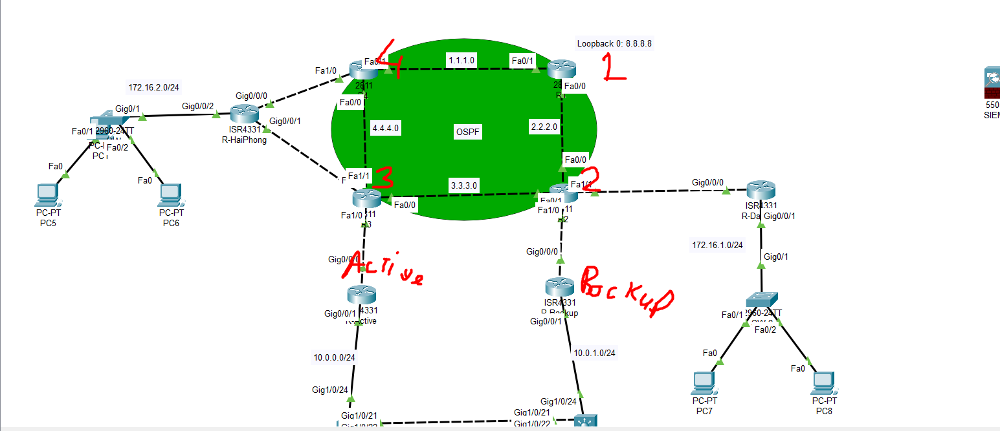


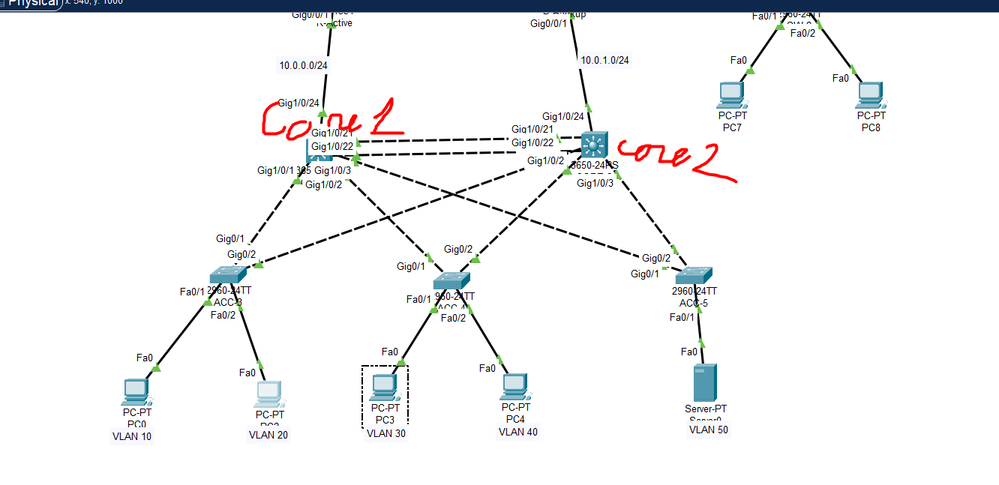


## 1. Thực hiện cấu hình giữa các sw core và sw acc


Trên sw core 1 :

```
Switch(config)#int r
Switch(config)#int range Gi1/0/1-3
Switch(config-if-range)#switchport trunk encapsulation dot1q 
Switch(config-if-range)#switchport mode trunk 

```


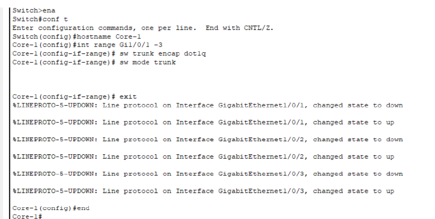


Trên sw core 2 :

```
Switch>en
Switch#conf t

Switch(config)#int r
Switch(config)#int range Gi1/0/1-3
Switch(config-if-range)#switchport mode trunk 
```

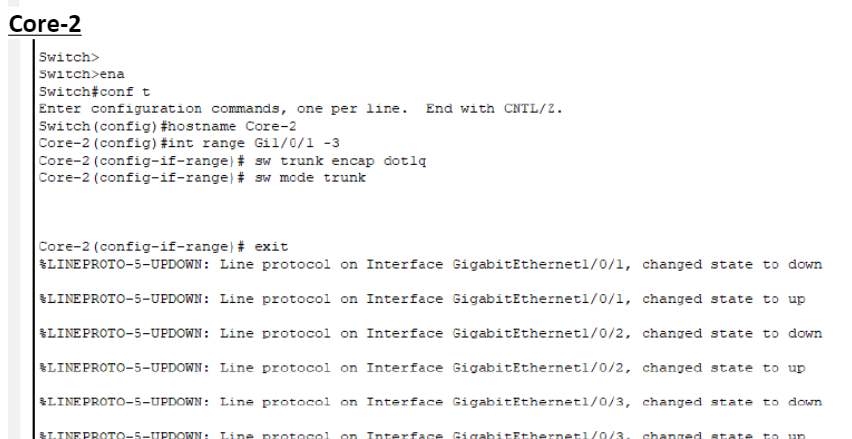


 
Thực hiện cấu hình trên acc 3 : 
```
ACC3(config)#int ra
ACC3(config)#int range Gi0/1-2
ACC3(config-if-range)#switchport mode trunk 

```

Thực hiện cấu hình trên acc  4, 5 tương tự 


### 1.1. - Cấu hình etherchannel giữa CORE1 và CORE2


#### 1.1.1. Thực hiện cấu hình trên sw core 1

```

Switch(config)#int r
Switch(config)#int range Gi0/1/21-22
Switch(config-if-range)#channel-group 1 mode on

Switch(config)#end
Switch#
```

Sau khi cấu hình sử dụng câu lệnh để xem kết quả 

`show etherchannel summary `


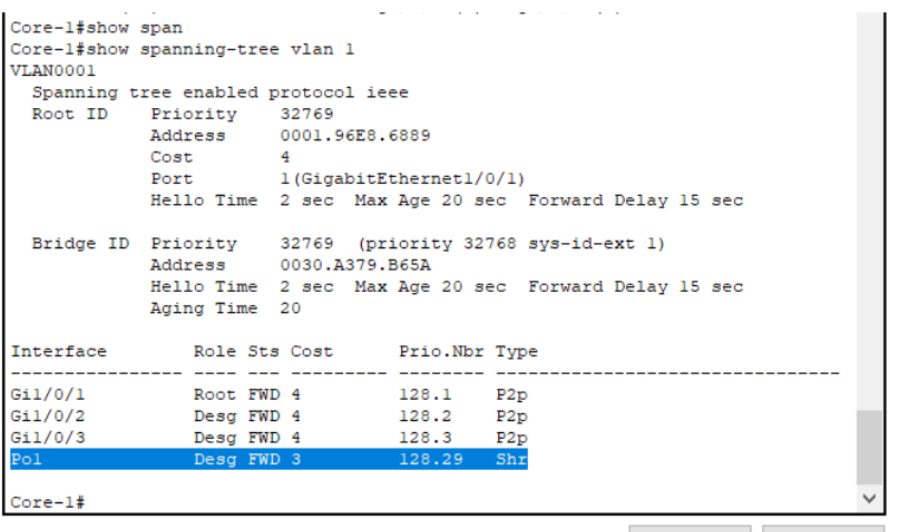


Ở phần sw core 2 làm tương tự


### 1.2. Trên CORE1 tạo vlan 10,20,30,40,50. Đồng thời cấu hình VTP với CORE1 là server và các sw khác là client


#### 1.2.1. Cấu hình trên sw core 1

```
Switch(config)#v
Switch(config)#vt
Switch(config)#vtp d
Switch(config)#vtp domain khoiht
Changing VTP domain name from NULL to khoiht
Switch(config)#vt
Switch(config)#vtp mo
Switch(config)#vtp mode se
Switch(config)#vtp mode server 
Device mode already VTP SERVER.
Switch(config)#vlan 10
Switch(config-vlan)#vlan 20
Switch(config-vlan)#vlan 30
Switch(config-vlan)#vlan 40
Switch(config-vlan)#vlan 50
Switch(config-vlan)#ex
Switch(config)#end
```

Thực hiện cấu hình trên các sw core 2 và acc 345 để làm client 


Trên sw core 2
```
Switch(config)#vt 
Switch(config)#vt do
Switch(config)#vt domain khoiht
Domain name already set to khoiht.
Switch(config)#vt
Switch(config)#vtp mo
Switch(config)#vtp mode cli
Switch(config)#vtp mode client 
Setting device to VTP CLIENT mode.
Switch(config)#end
```


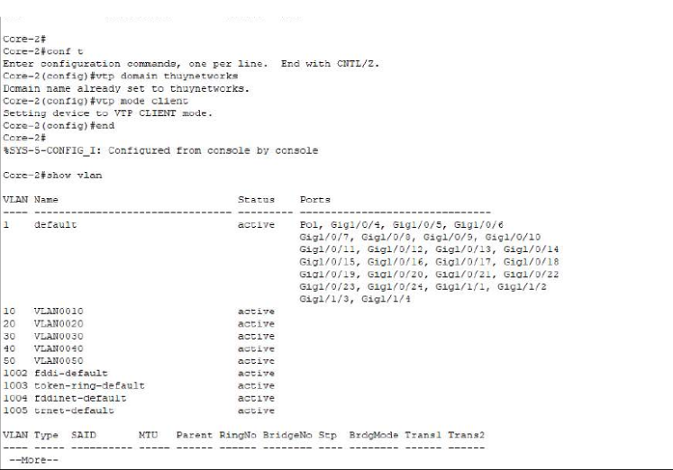


Trên acc 3 , 4 ,5 tương tự 


### 1.3. 4- Trên các sw ACC gán các port vào vlan như hình


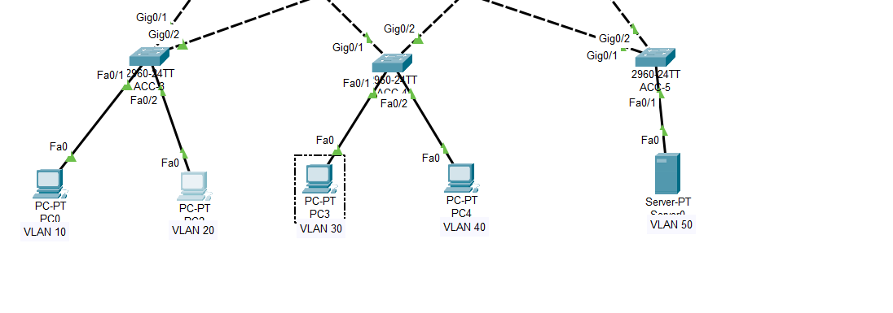


#### 1.3.1. ACC3 với vlan 10 và vlan 20

```
ACC3(config)#int fa0/1
ACC3(config-if)#sw
ACC3(config-if)#switchport vl
ACC3(config-if)#switchport a
ACC3(config-if)#switchport access vla
ACC3(config-if)#switchport access vlan 10
ACC3(config-if)#ex
ACC3(config)#int fa0/2
ACC3(config-if)#sw
ACC3(config-if)#switchport a
ACC3(config-if)#switchport access vl
ACC3(config-if)#switchport access vlan 20
ACC3(config-if)#ex
ACC3(config)#
```

Thực hiện xem kết quả 


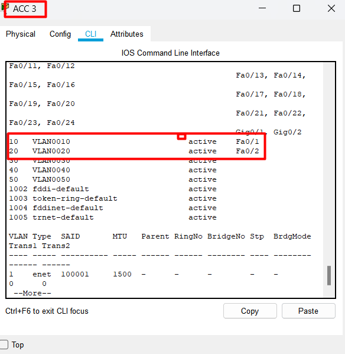


Thực hiện làm tương tự với các ACC4,5 


#### 1.3.2. Cấu hình spanning-tree với CORE1 là root-sw cho vlan 10,20,50 và CORE2 là root-sw cho vlan 30,40

**Thực hiện cấu hình trên sw core 1**

```
Switch(config)#spanning-tree mode rapid
Switch(config)#spanning-tree vlan 10 root pr./anh_lab/imary 
Switch(config)#spanning-tree vlan 20 root pr./anh_lab/imary 
Switch(config)#spanning-tree vlan 50 root pr./anh_lab/imary 
Switch(config)#spanning-tree vlan 30 root secondary 
Switch(config)#spanning-tree vlan 40 root secondary 
```

**Thực hiện cấu hình trên core 2 thì ngược lại với core 1**

```
Switch(config)#spanning-tree vlan 10 root secondary 
Switch(config)#spanning-tree vlan 20 root secondary 
Switch(config)#spanning-tree vlan 50 root secondary 
Switch(config)#spanning-tree vlan 30 root pr./anh_lab/imary 
Switch(config)#spanning-tree vlan 40 root pr./anh_lab/imary
```

Thực hiện cấu hình trên acc 3,4,5

```
ACC3>
ACC3>en
ACC3#conf t
ACC3(config)#spanning-tree mode rapid
```

**Trên acc 4 5 làm tương tự**


### 1.4. 6- Đặt ip cho các vlan trên sw CORE như sau: CORE1 là 192.168.x.1/24 và CORE2 là 192.168.x.2/24

Thực hiện trên sw core 1

```
Switch(config)#int vlan 1
Switch(config-if)#ip address 192.168.1.1 255.255.255.0
Switch(config-if)#no shutdown 
Switch(config-if)#ex

Switch(config)#int vlan 10
Switch(config-if)#ip address 192.168.10.1 255.255.255.0
Switch(config-if)#no shutdown 
Switch(config-if)#ex

Switch(config)#int vlan 20
Switch(config-if)#ip address 192.168.20.1 255.255.255.0
Switch(config-if)#no shutdown 
Switch(config-if)#ex


Switch(config)#int vlan 30
Switch(config-if)#ip address 192.168.30.1 255.255.255.0
Switch(config-if)#no shutdown 
Switch(config-if)#ex

Switch(config)#int vlan 40
Switch(config-if)#ip address 192.168.40.1 255.255.255.0
Switch(config-if)#no shutdown 
Switch(config-if)#ex


Switch(config)#int vlan 50
Switch(config-if)#ip address 192.168.50.1 255.255.255.0
Switch(config-if)#no shutdown 
Switch(config-if)#ex
```

**Thực hiện kiểm tra**


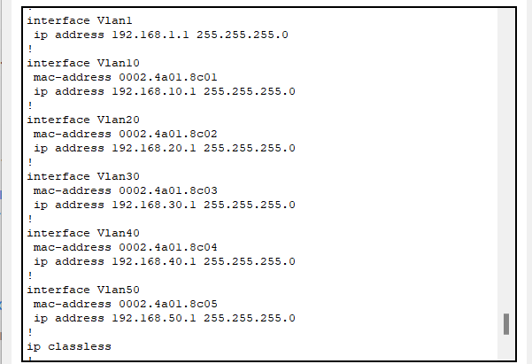


**Làm tương tự trên sw core 2**


Thực hiện xem kq trên core 2


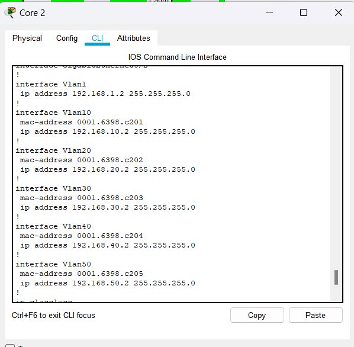


### 1.5. Cấu hình HSRP trên sw CORE với vlan 10,20,50 ưu tiên đi CORE1 và vlan 30,40 ưu tiên đi CORE2


**Trên sw core 1**   


```
Switch(config)#int vlan 10
Stch(config-if)#st
Switch(config-if)#standby 1 ip 192.168.10.1
Switch(config-if)#standby 1 priority  105
Switch(config-if)#ex

Switch(config)#int vlan 20
Stch(config-if)#st
Switch(config-if)#standby 1 ip 192.168.20.1
Switch(config-if)#standby 1 priority  105
Switch(config-if)#ex

Switch(config)#int vlan 50
Stch(config-if)#st
Switch(config-if)#standby 1 ip 192.168.50.1
Switch(config-if)#standby 1 priority  105
Switch(config-if)#ex

Switch(config)#int vlan 30
Stch(config-if)#st
Switch(config-if)#standby 1 ip 192.168.30.1
Switch(config-if)#standby 1 priority  95
Switch(config-if)#ex

Switch(config)#int vlan 40
Stch(config-if)#st
Switch(config-if)#standby 1 ip 192.168.40.1
Switch(config-if)#standby 1 priority  95
Switch(config-if)#ex
```

Thực hiện trên sw core 2 làm ngược lại 


Tại sw core 1 cấu hình thêm 
```
Switch(config)#int port-channel 1
Switch(config-if)#sw
Switch(config-if)#switchport tr
Switch(config-if)#switchport trunk e
Switch(config-if)#switchport trunk encapsulation d
Switch(config-if)#switchport trunk encapsulation dot1q 
Switch(config-if)#sw
Switch(config-if)#switchport mo
Switch(config-if)#switchport mode tr
Switch(config-if)#switchport mode trunk 
```

cấu hình cổng Port-Channel 1 trên switch để hoạt động như một trunk port, và đóng gói gói tin bằng giao thức 802.1Q (dot1q) để đánh dấu các VLAN trên cổng này.


### 1.6. 8- Cấu hình SERVER làm DHCP server, cấp phát ip cho các VPC với vlan tương ứng

Cấu hình trên server 


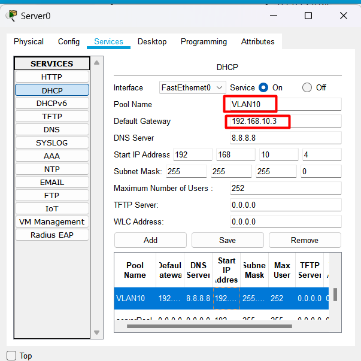


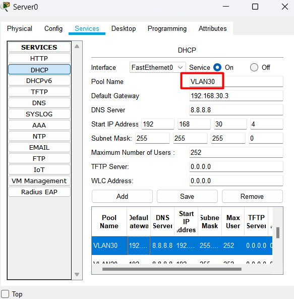


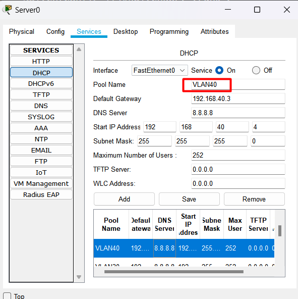


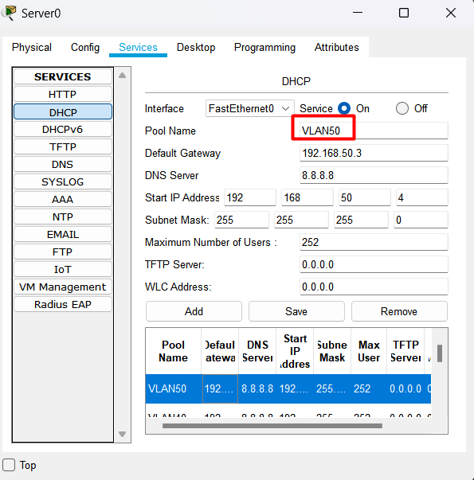


Thực hiện cấu hình trên sw core 1 2 

```
CORE2(config)#int vlan 10
CORE2(config-if)#ip helper
CORE2(config-if)#ip helper-address 192.168.50.254
CORE2(config-if)#ex

CORE2(config)#int vlan 20
CORE2(config-if)#ip helper-address 192.168.50.254
CORE2(config-if)#ex


CORE2(config)#int vlan 30
CORE2(config-if)#ip helper-address 192.168.50.254
CORE2(config-if)#ex

CORE2(config)#int vlan 40
CORE2(config-if)#ip helper-address 192.168.50.254
CORE2(config-if)#ex

CORE2(config)#int vlan 50
CORE2(config-if)#ip helper-address 192.168.50.254
CORE2(config-if)#ex

CORE1(config)#int vlan 10
CORE1(config-if)#ip helper
CORE1(config-if)#ip helper-address 192.168.50.254
CORE1(config-if)#ex

CORE1(config)#int vlan 20
CORE1(config-if)#ip helper-address 192.168.50.254
CORE1(config-if)#ex


CORE1(config)#int vlan 30
CORE1(config-if)#ip helper-address 192.168.50.254
CORE1(config-if)#ex

CORE1(config)#int vlan 40
CORE1(config-if)#ip helper-address 192.168.50.254
CORE1(config-if)#ex

CORE1(config)#int vlan 50
CORE1(config-if)#ip helper-address 192.168.50.254
CORE1(config-if)#ex

```

Thực hiện kiểm tra trên các pc 


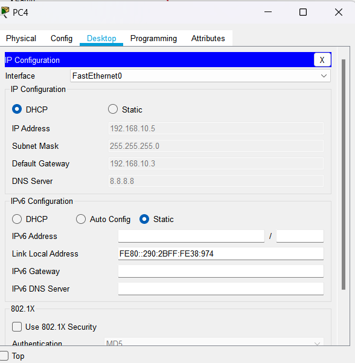


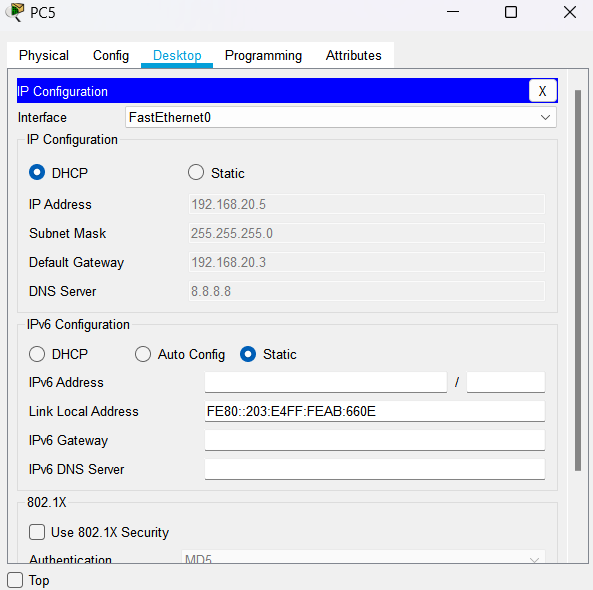


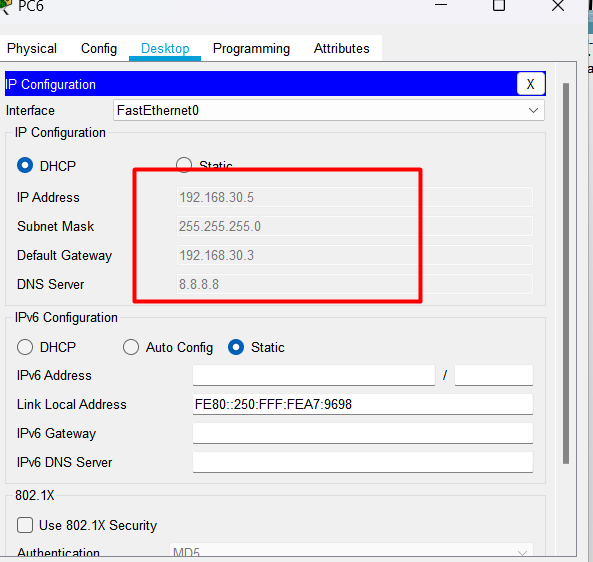

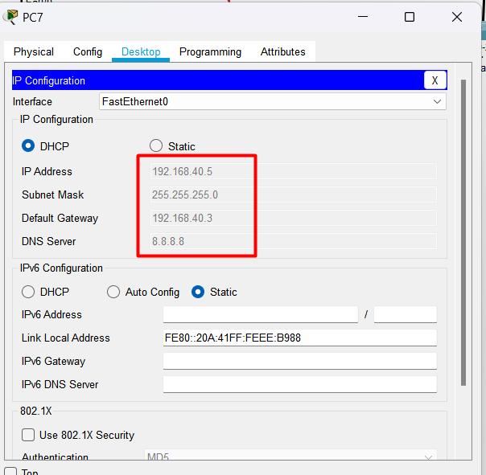


#### 1.6.1. Đặt ip cho các R và sw CORE, cấu hình Nat trên R để mạng nội bộ ra được internet (ping đc 8.8.8.8)


**Thực hiện đặt địa chỉ ip cho R_backup , R_active , cổng của sw core 1 , swc core 2**


**Trên R_active**

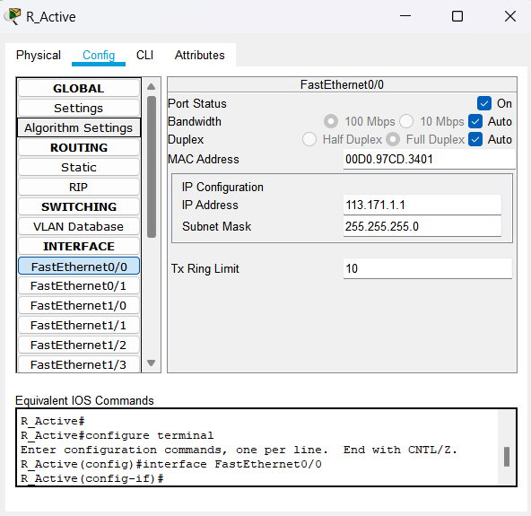


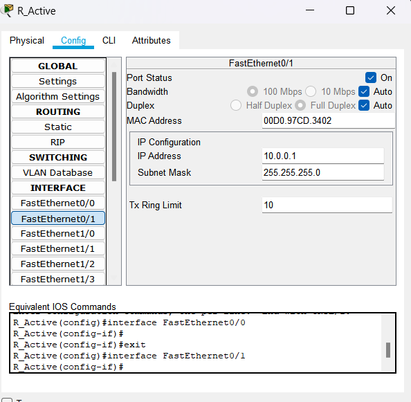


**Trên R_backup**


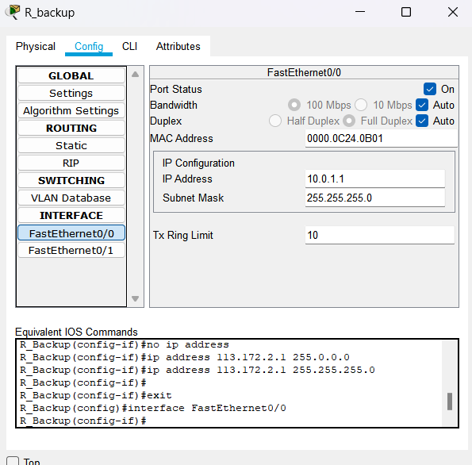


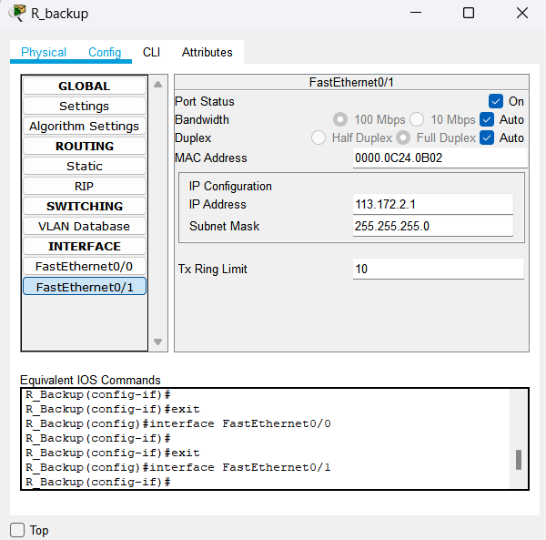


**Trên sw core 1**

```

Switch(config)#interface FastEthernet0/1
Switch(config-if)#no switchport 
Switch(config-if)#ip address 10.0.0.2 255.255.255.0
Switch(config-if)#no shutdown 


```

**Trên sw core 2**

```
Switch(config)#interface FastEthernet0/1
Switch(config-if)#no switchport 
Switch(config-if)#ip address 10.0.1.2 255.255.255.0
Switch(config-if)#no shutdown 

```


#### 1.6.2. Thực hiện cấu hình định tuyến động 

**R_Active**

```
R_Active(config)#ip route 0.0.0.0 113.171.1.3
R_Active(config)#router ospf 1
R_Active(config-router)#network 10.0.0.0 0.0.0.255 area 0
R_Active(config-router)#default-information originate 
R_Active(config-router)#ex
```

**R_backup**

```
R_Backup(config)#ip route 0.0.0.0 0.0.0.1 113.171.2.3
R_Backup(config)#router ospf 1
R_Backup(config-router)#network 10.0.1.0 0.0.0.255 area 0
R_Backup(config-router)#default-information originate 
R_Backup(config-router)#ex
```

**sw core 1:** 

```
Switch(config)#ip routing 
Switch(config)#router ospf 1
Switch(config-router)#network 10.0.0.0 0.0.0.255 area 0
Switch(config-router)#network 192.168.0.0 0.0.0.255 area 0
```
**sw core 2:** 

```
CORE2(config)#ip routing
CORE2(config)#router ospf 1
CORE2(config-router)#network 10.0.1.0 0.0.0.255 area 0
CORE2(config-router)#network 192.168.0.0 0.0.0.255 area 0
```

Thực hiện đổi port layer 2 (trunk) sang  port layer 3

**sw core 1:** 
```
CORE1(config)#int port-channel 1
CORE1(config-if)#no switchport 
Switch(config-if)#ip address 10.0.12.1 255.255.255.0
Switch(config-if)#no shutdown 
Switch(config)#router ospf 1
Switch(config-router)#network 10.0.12.0 0.0.0.255 area 0
Switch(config-router)#passive-interface vlan 1
Switch(config-router)#passive-interface vlan 10
Switch(config-router)#passive-interface vlan 20
Switch(config-router)#passive-interface vlan 30
Switch(config-router)#passive-interface vlan 40
Switch(config-router)#passive-interface vlan 50
Switch(config-router)#ex

```


**sw core 2:** 

```
CORE2(config)#int port-channel 1
CORE2(config-if)#no switchport 
CORE2(config-if)#ip address 10.0.12.2 255.255.255.0
CORE2(config-if)#no shutdown 
CORE2(config-router)#network 10.0.12.0 0.0.0.255 area 0
CORE2(config-router)#passive-interface vlan 1
CORE2(config-router)#passive-interface vlan 10
CORE2(config-router)#passive-interface vlan 20
CORE2(config-router)#passive-interface vlan 30
CORE2(config-router)#passive-interface vlan 40
CORE2(config-router)#passive-interface vlan 50
```


Vì packet trancer không hỗ trợ lệnh => Dùng EIRGP để tiếp tục thay cho ospf


Thực hiện trên core 1:
```
no router ospf 1
router eigrp 1
	network 10.0.0.0
	network 10.0.12.0
	network 192.168.0.0
	passive-interface vlan 1
	passive-interface vlan 10
	passive-interface vlan 20
	passive-interface vlan 30
	passive-interface vlan 40
	passive-interface vlan 50
```

Thực hiện trên core 2:

```
no router ospf 1
router eigrp 1
	network 10.0.1.0
	network 10.0.12.0
	network 192.168.0.0
	passive-interface vlan 1
	passive-interface vlan 10
	passive-interface vlan 20
	passive-interface vlan 30
	passive-interface vlan 40
	passive-interface vlan 50
```

Thực hiện trên R_Active 
```
no router ospf 1	
router eigrp 1
	network 10.0.0.0
```

Thực hiện trên R_Backup

```
no router ospf 1
router eigrp 1
	network 10.0.1.0
```

Tiến  hành redistribute trên 2 R_Active  R_Backup


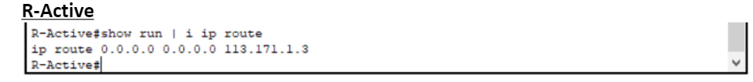

Trên R_Active: 
```
Router(config)#router eigrp 1
Router(config-router)#redistribute static metric 1000 10 255 1 1500
```

Trên R_Backup: 
```
Router(config)#router eigrp 1
Router(config-router)#redistribute static metric 1000 10 255 1 1500
```

Thực hiện kiểm tra trên core 1 và core 2


Cấu hình NAT trên R_Active

```
Router(config)#access-list 1 permit any 
Router(config)#ip nat inside source list 1 interface gi0/0/0 overload 
Router(config)#int gi0/0/0
Router(config-if)#ip nat outside 
Router(config-if)#ex
Router(config)#int gi0/0/1
Router(config-if)#ip nat inside 
```
Cấu hình nat trên R_Backup
```
Router(config)#access-list 1 permit any 
Router(config)#ip nat inside source list 1 interface gi0/0/0 overload 
Router(config)#int gi0/0/0
Router(config-if)#ip nat outside 
Router(config-if)#ex
Router(config)#int gi0/0/1
Router(config-if)#ip nat inside 
```


**Lưu ý trong bài cấu hình phải đồng bộ eirgp chứ không được bên dưới eirgp trên thì ospf(sau khi đã thử định tuyến ospf)**


Trên R1:
```
Router(config)#no router ospf 1
Router(config)#router eigrp 1
Router(config-router)#network 8.0.0.0
Router(config-router)#net
Router(config-router)#network 2.2.2.0
Router(config-router)#network 1.1.1.0
```

Trên R2:

```
Router(config)#no router ospf 1
Router(config)#router eigrp 1
Router(config-router)#network 2.2.2.0
Router(config-router)#network 3.3.3.0
Router(config-router)#network 113.171.3.0
Router(config-router)#network 113.171.2.0

```

Trên R3:

```
Router(config)#no router ospf 1
Router(config)#router eigrp 1
Router(config-router)#network 3.3.3.0
Router(config-router)#network 4.4.4.0
Router(config-router)#network 113.171.1.0 
Router(config-router)#network 113.171.5.0 
```

Trên R4 : 

```
Router(config)#no router ospf 1
Router(config)#router eigrp 1
Router(config-router)#network 1.1.1.0
Router(config-router)#network 4.4.4.0
Router(config-router)#network 113.171.4.0
```


Sau khi cấu hình ping từ PC1 ra internet 


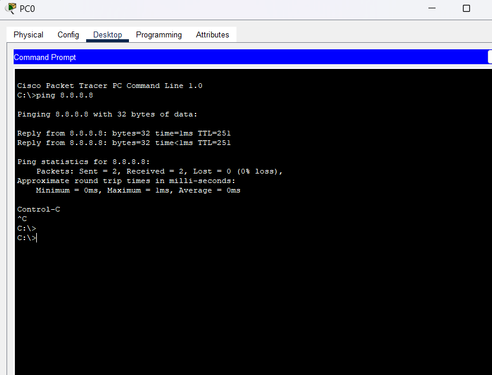


### 1.7. Nat SERVER ra ngoài internet với địa chỉ public 203.162.1.2 cho dịch vụ web và ftp


Cấu hình trên R_backup
```
Router(config)#ip nat inside source static tcp 192.168.50.254 80 203.168.1.2 8080 
Router(config)#ip nat inside source static tcp 192.168.50.254 443 203.168.1.2 8443 
Router(config)#ip nat inside source static tcp 192.168.50.254 21 203.168.1.2 8021 
```

Cấu hình trên R_active
```
Router(config)#ip nat inside source static tcp 192.168.50.254 80 203.168.1.2 8080 
Router(config)#ip nat inside source static tcp 192.168.50.254 443 203.168.1.2 8443 
Router(config)#ip nat inside source static tcp 192.168.50.254 21 203.168.1.2 8021 
```


### 1.8. Cấu hình load-balancing trên R-Hải Phòng ra Net

Thực hiện cấu hình trên R-HaiPhong

```
int Gi0/0/0
	ip add 113.171.4.1 255.255.255.0
	ip nat outside
	no shut
int Gi0/0/1
	ip add 113.171.5.1 255.255.255.0
	ip nat outside
	no shut
int Gi0/0/2
	ip add 172.16.2.1 255.255.255.0
	ip nat inside
	no shut
	exit

ip route 0.0.0.0 0.0.0.0 Gi0/0/0
ip route 0.0.0.0 0.0.0.0 Gi0/0/1

access-list 1 permit any

ip nat inside source list 1 int Gi0/0/0 overload
ip nat inside source list 1 int Gi0/0/1 overload
```


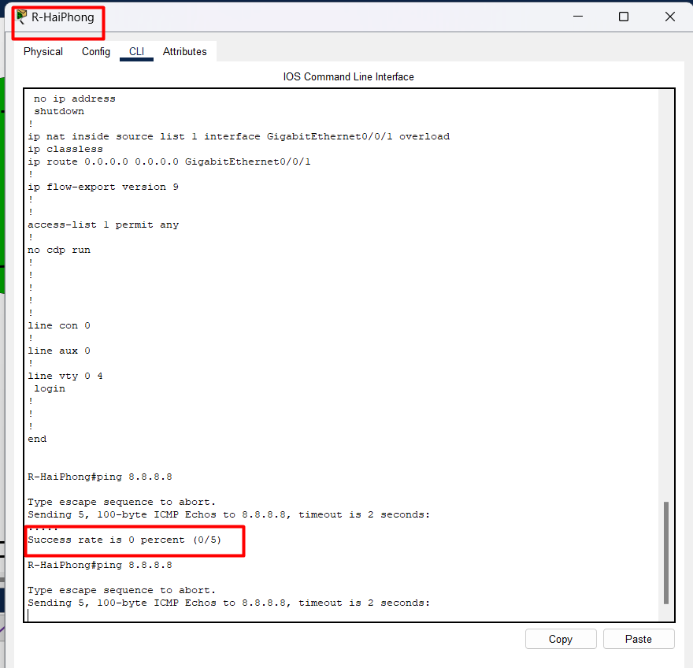


### 1.9. 13- Cấu hình GRE VPN trên R-Active, R-Backup, R-Chi nhánh để dù 1 R trên trụ sở down thì vẫn vpn vào SERVER bằng R còn lại


Cấu hình trên R-Danang

```
int Gi0/0/0
	ip add 113.171.3.1 255.255.255.0
	ip nat outside
	no shut
int Gi0/0/1
	ip add 172.16.1.1 255.255.255.0
	ip nat inside
	no shut
	exit

ip route 0.0.0.0 0.0.0.0 Gi0/0/0

access-list 1 permit any

ip nat inside source list 1 int Gi0/0/0 overload

```


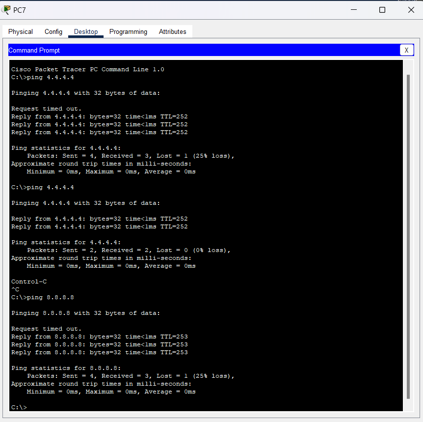


Cấu hình trên R_Active

```
int Tunnel 13
	ip add	10.1.13.1 255.255.255.0	
	tunnel source Gi0/0/0
	tunnel destination 113.171.3.1
	tunnel mode	gre ip 
	exit
int Tunnel 15
	ip add	10.1.15.1 255.255.255.0	
	tunnel source Gi0/0/0
	tunnel destination 113.171.5.1
	tunnel mode	gre ip 
	exit
```

Cấu hình trên R_backup

```
int Tunnel 23
	ip add	10.1.23.1 255.255.255.0	
	tunnel source Gi0/0/0
	tunnel destination 113.171.3.1
	tunnel mode	gre ip 
	exit
int Tunnel 25
	ip add	10.1.25.1 255.255.255.0	
	tunnel source Gi0/0/0
	tunnel destination 113.171.5.1
	tunnel mode	gre ip 
	exit
```

Cấu hình trên R_HaiPhong
```
int Tunnel 15
	ip add	10.1.15.5 255.255.255.0	
	tunnel source Gi0/0/1
	tunnel destination 113.171.1.1
	tunnel mode	gre ip 
	exit
int Tunnel 25
	ip add	10.1.25.5 255.255.255.0	
	tunnel source Gi0/0/1
	tunnel destination 113.171.2.1
	tunnel mode	gre ip 
	exit
```

Cấu hình trên R_DaNang

```
int Tunnel 13
	ip add	10.1.13.3 255.255.255.0	
	tunnel source Gi0/0/0
	tunnel destination 113.171.1.1
	tunnel mode	gre ip 
	exit
int Tunnel 23
	ip add	10.1.23.3 255.255.255.0	
	tunnel source Gi0/0/0
	tunnel destination 113.171.2.1
	tunnel mode	gre ip 
	exit
```


Thực hiện kiểm tra bằng câu lệnh ping 


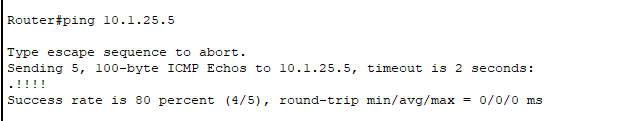


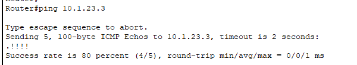


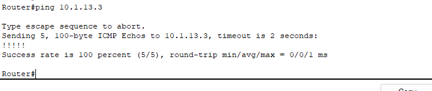


### 1.10. Cấu hình chỉ cho vlan 10 có thể telnet/SSH vào các R và sw CORE


Thực hiện cấu hình trên r active , backup,  core 1 , core 2

```
ip domain-name khoikhoi.edu.vn
crypto key generate rsa
1024
username admin password admin
enable secret admin
line vty 0 4
	login local
	transport input ssh
	exit
```

Khi thực hiện câu lệnh trên thì các PC máy nào cũng có thể ssh vào được theo đề bài thì mình chỉ có máy nằm trong vlan 10 ssh vào được 
Thực hiện câu lệnh sau vào các R_active,R_backup,core 1 , core 2


```
access-list 2 permit 192.168.10.0 0.0.0.255
line vty 0 4
	access-class 2 in
```

```
access-list 2 permit 192.168.10.0 0.0.0.255: tạo một Access Control List (ACL) có số thứ tự là 2. ACL này cho phép các gói tin có địa chỉ nguồn thuộc dải mạng 192.168.10.0/24 truy cập qua thiết bị
access-class 2 in: Đây là lệnh áp dụng ACL số 2 đã tạo ở trên cho các session vty, nghĩa là chỉ cho phép các gói tin đi vào (inbound) qua các session vty nếu chúng thỏa mãn điều kiện trong ACL.
```


#### 1.10.1. Thực hiện show kq

Thực hiện ssh ở PC0 thuộc vlan 10


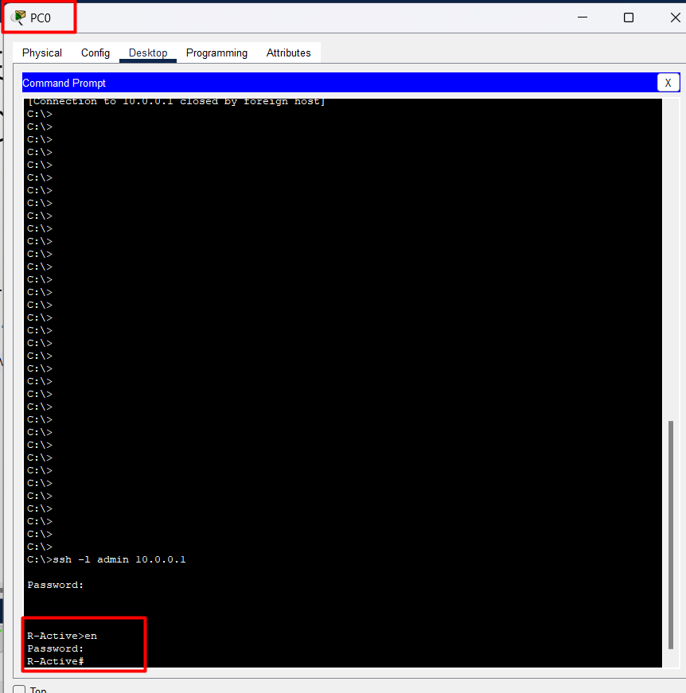


Thực hiện xem  ở vlan khác


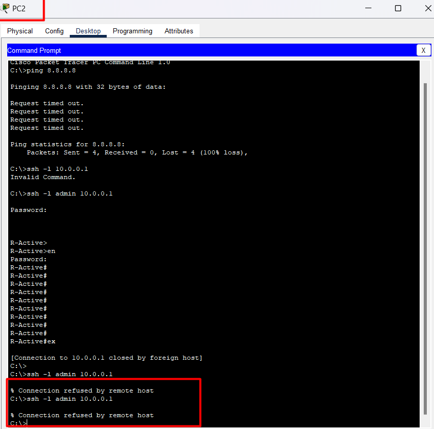


