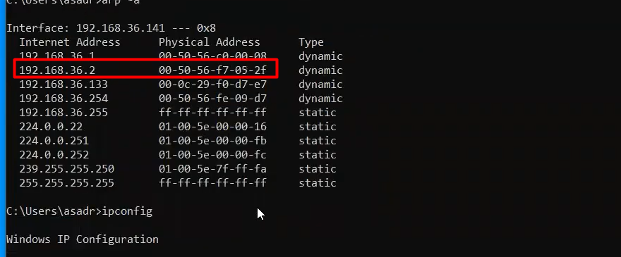
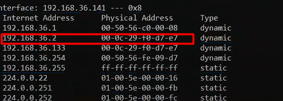
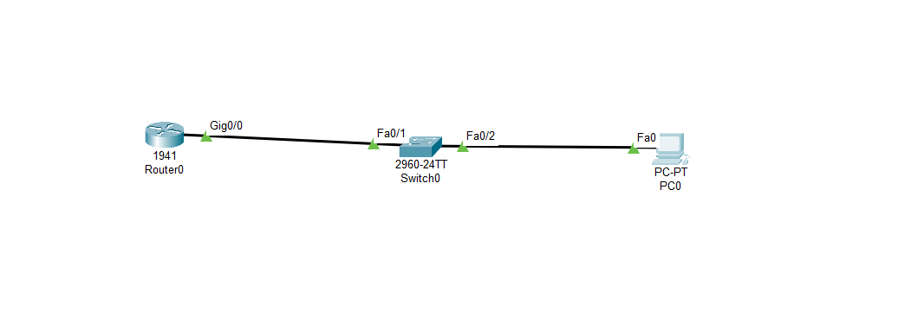
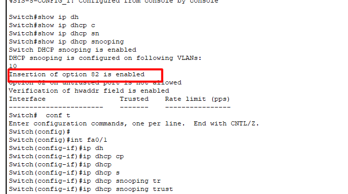
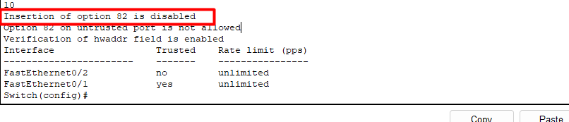
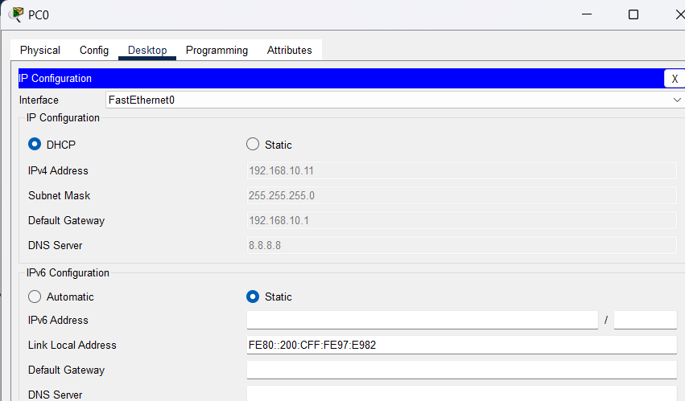

- [1. Định nghĩa  ARP Spoofing](#1-định-nghĩa--arp-spoofing)
- [2. MAC Snooping](#2-mac-snooping)
- [3. DHCP Spoofing](#3-dhcp-spoofing)


### 1. Định nghĩa  ARP Spoofing

ARP Spoofing (ARP Cache Poisoning hoặc ARP Poisoning) là một cuộc tấn công trong mạng máy tính, trong đó kẻ tấn công gửi các gói tin ARP giả mạo trong mạng LAN. Giao thức ARP được sử dụng để ánh xạ địa chỉ IP thành địa chỉ MAC trong mạng. Khi một thiết bị trong mạng cần gửi dữ liệu tới một địa chỉ IP khác trong cùng mạng, nó sẽ yêu cầu địa chỉ MAC tương ứng bằng cách gửi gói tin ARP Request. Thiết bị có địa chỉ IP đích sẽ trả lời bằng một gói tin ARP Reply chứa địa chỉ MAC của nó.

Trong cuộc tấn công ARP Spoofing, tấn công giả mạo các gói tin ARP Reply để làm cho các thiết bị trong mạng tin rằng địa chỉ MAC của kẻ tấn công là địa chỉ MAC của thiết bị mạng quan trọng khác như Router hoặc Gateway. Khi đó, lưu lượng mạng sẽ được chuyển hướng qua thiết bị mà kẻ tấn công kiểm soát. 

Trước khi chưa tấn công `arp Spoofing`





Sau khi tấn công 





**ARP Spoofing Xảy ra ở đâu**

ARP Spoofing thường xảy ra trong mạng LAN, nơi mà các thiết bị nằm cùng một broadcast domain và có thể giao tiếp trực tiếp với nhau. Kẻ tấn công thường sẽ thực hiện cuộc tấn công trong cùng một phạm vi mạng LAN để có thể tiếp cận và tấn công các thiết bị trong mạng một cách hiệu quả


**Cách để phát hiện 1 cuộc tấn công ARP Spoofing** 
Kiểm tra bảng ARP (ARP Table): Kiểm tra bảng ARP của thiết bị mạng để xem xem có các địa chỉ MAC lạ hoặc trùng lắp không đáng tin cậy. Nếu bạn thấy các địa chỉ MAC không phù hợp với các địa chỉ IP đã biết, có thể có dấu hiệu của ARP Spoofing.

`ARP Spoofing Detection Tool`: Có nhiều công cụ phát hiện ARP Spoofing có sẵn, giúp bạn giám sát và phát hiện sự thay đổi bất thường trong bảng ARP của các thiết bị mạng.

`ARP Watch`: ARP Watch là một phần mềm theo dõi ARP, giúp phát hiện và cảnh báo sớm khi có sự thay đổi không mong muốn trong bảng ARP.

**Cách ngăn chặn ARP Spoofing:** 

Cấu hình các mục ARP tĩnh (Static ARP entries): Xác định các mục ARP tĩnh trên các thiết bị mạng, đặc biệt là các thiết bị quan trọng như Router và Gateway. Các mục ARP tĩnh sẽ giữ cho các bản ghi ARP cố định và không thay đổi khi có các ARP Reply không phù hợp.

`Port Security` và `DHCP Snooping`: Sử dụng tính năng `Port Security` để giới hạn số lượng địa chỉ MAC hợp lệ trên một cổng và `DHCP Snooping` để chặn các gói tin DHCP không hợp lệ từ kẻ tấn công.

Cập nhật Firmware và Phần mềm: Luôn đảm bảo cập nhật firmware và phần mềm của các thiết bị mạng lên phiên bản mới nhất. Các bản vá lỗi và cập nhật an ninh thường bao gồm các cải tiến bảo mật để ngăn chặn các lỗ hổng bảo mật và tấn công như ARP Spoofing.

Sử dụng VLAN Segmentation: Sử dụng VLAN segmentation giúp tách mạng thành các VLAN riêng biệt, giảm thiểu khả năng tấn công trên toàn bộ mạng.

ARP Spoofing Prevention Protocols: Triển khai các giao thức và tiêu chuẩn như ARP Spoofing Prevention Protocol (ASPP) và Dynamic ARP Inspection (DAI) để xác thực và kiểm tra tính hợp lệ của các gói tin ARP trước khi chấp nhận chúng.


### 2. MAC Snooping

**Định nghĩa**

MAC Snooping là một tính năng có sẵn trên các switch trong mạng LAN, được sử dụng để giám sát và học hỏi thông tin về địa chỉ MAC (Media Access Control) của các thiết bị kết nối vào các cổng của switch. Khi một switch nhận được một khung Ethernet từ một thiết bị, nó sẽ học thông tin địa chỉ MAC của thiết bị này và ghi vào bảng MAC của nó, kết hợp địa chỉ MAC này với cổng mà nó nhận được từ thiết bị.

**MAC Snooping xảy ra ở đâu:**
MAC Snooping xảy ra trên các switch trong mạng LAN, chẳng hạn như switch Ethernet thông thường hoặc switch Layer 2. Mỗi switch sẽ có khả năng học hỏi và quản lý thông tin địa chỉ MAC của các thiết bị kết nối vào các cổng của nó.


**Cách thức phòng tránh:**
Để phát hiện hành động của bạn có ảnh hưởng đến tính năng MAC Snooping hay không, bạn có thể thực hiện các bước sau:

Theo dõi log (nhật ký) của switch: Switch thường ghi lại các thông báo và sự kiện liên quan đến hoạt động của MAC Snooping trong log của nó.Có thể xem log để kiểm tra xem có thông báo hoặc cảnh báo nào liên quan đến MAC Snooping xuất hiện không.
Kiểm tra bảng MAC của switch:kiểm tra bảng MAC của switch để xem các địa chỉ MAC đã học được và các cổng mà chúng đã được gán. Nếu các thông tin trong bảng MAC không chính xác hoặc không như mong đợi, điều này có thể là dấu hiệu của vấn đề liên quan đến MAC Snooping.
Sử dụng công cụ giám sát mạng: Các công cụ giám sát mạng như Wireshark, tcpdump, hoặc các phần mềm giám sát mạng có thể giúp bạn theo dõi lưu lượng trên mạng và xem các thông báo hoặc ghi chú liên quan đến hoạt động của MAC Snooping. Điều này sẽ giúp bạn theo dõi các gói tin và tìm hiểu liệu có sự thay đổi hoặc hiệu ứng không mong muốn nào xảy ra trong mạng.


### 3. DHCP Spoofing

**Định nghĩa**

DHCP Spoofing (hay còn được gọi là DHCP Poisoning) là một hình thức tấn công trong mạng, trong đó kẻ tấn công giả mạo các thông điệp DHCP (Dynamic Host Configuration Protocol) để đánh lừa các máy tính trong mạng nhận các thông tin cấu hình IP không đáng tin cậy. Khi các máy tính trong mạng yêu cầu nhận địa chỉ IP từ máy chủ DHCP, kẻ tấn công sẽ trả lời trước và cung cấp thông tin giả mạo, như địa chỉ IP và thông báo DHCP, để làm chủ quyền địa chỉ IP của máy tính đích.

**DHCP Spoofing xảy ra ở đâu:**
DHCP Spoofing xảy ra trong mạng LAN nơi có một máy chủ DHCP chịu trách nhiệm cấp phát địa chỉ IP cho các máy tính trong mạng. Kẻ tấn công thường phải có quyền truy cập vào mạng LAN hoặc sử dụng các công cụ tấn công mạng để thực hiện hành động này.


DHCP Spoofing xuất hiện khi kẻ tấn công giả mạo các thông điệp DHCP để lừa đảo các máy tính trong mạng nhận các thông tin cấu hình IP giả mạo. Khi một máy tính mới kết nối vào mạng hoặc yêu cầu gia hạn lại địa chỉ IP từ máy chủ DHCP, kẻ tấn công sẽ trả lời trước và cung cấp các thông tin giả mạo, làm cho máy tính đích nhận địa chỉ IP không đáng tin cậy.


**Cách thức phòng tránh:**
Để phát hiện và ngăn chặn DHCP Spoofing, bạn có thể thực hiện các biện pháp bảo mật sau:

Sử dụng DHCP Snooping: DHCP Snooping là một tính năng có sẵn trên nhiều switch, nó giúp giám sát và kiểm soát lưu lượng DHCP trên mạng LAN. Khi kích hoạt DHCP Snooping, switch sẽ ghi lại các thông điệp DHCP và kiểm tra tính hợp lệ của chúng trước khi truyền tiếp đến các máy tính trong mạng.


Sử dụng ARP Inspection: ARP Inspection là một tính năng bảo mật mạng, nó kiểm tra tính hợp lệ của thông báo ARP trong mạng. Khi kích hoạt ARP Inspection, switch sẽ chặn các gói tin ARP giả mạo được gửi từ các cổng không hợp lệ, làm giảm khả năng thực hiện DHCP Spoofing.


Xác định các địa chỉ MAC hợp lệ của máy chủ DHCP: Trong cấu hình DHCP, bạn có thể chỉ định các địa chỉ MAC của máy chủ DHCP hợp lệ. Điều này sẽ giúp ngăn chặn các máy tính khác giả mạo thành máy chủ DHCP và thực hiện DHCP Spoofing.


Theo dõi log (nhật ký) của switch: Switch thường ghi lại các thông báo và sự kiện liên quan đến hoạt động của DHCP Snooping và ARP Inspection trong log của nó. Bạn có thể xem log để kiểm tra xem có thông báo hoặc cảnh báo nào liên quan đến DHCP Spoofing xuất hiện không.


Thực hiện phòng chống dhcp Spoofing bằng cách sử dụng dhcp Snooping

Nếu gói tin DHCP chứa thông tin từ máy chủ DHCP hợp lệ, switch sẽ tiếp tục chuyển gói tin đến máy chủ DHCP để xử lý yêu cầu cấp phát địa chỉ IP.

Nếu gói tin DHCP chứa thông tin từ máy chủ DHCP không hợp lệ (chưa từng được xác định trước đó), switch sẽ từ chối gói tin này, không cho phép nó đi qua cổng đó và từ chối cấp phát địa chỉ IP

Chống các ip giả mạo

**Bài lab cấu hình dhcp snooping để thực hiện cách phòng chống:**

Mô hình bài lab 





Thực hiện cấp dhcp cho pc 

Trên router:

```
R1(config)#int g0/0
R1(config-if)#ip address 192.168.10.1 255.255.255.0
R1(config)#ip dhcp pool lan10
R1(dhcp-config)#network 192.168.10.0 255.255.255.0
R1(dhcp-config)#default-router 192.168.10.1
R1(dhcp-config)#dns-server 8.8.8.8
R1(dhcp-config)#ip dhcp excluded-address 192.168.10.1 192.168.10.10
R1(config-if)#no shutdown
```

Thực hiện cấu hình trên sw:

```
Switch(config)#vlan 10
Switch(config)#int range fa0/1-2
Switch(config-if-range)#switchport access vlan 10
Switch(config)#ip dhcp snooping vlan 10

```


Sau khi thực hiện cấu hình thì chưa nhận được ip 
Phải cấu hình trust để mở port để cho dhcp gửi dữ liệu vào 





```
Switch(config)#int fa0/1
Switch(config-if)#no ip dhcp snooping information option


```





Thực hiện nhận ip trên pc





