### ACL

**Khái niệm về ACL**

- ACL (access control list) là danh sách tuần tự các câu lệnh dùng để quản lý lưu lượng truy cập đến hoặc đi , xác định cách chuyển tiếp hoặc ngăn chặn một gói tin trên một thiết bị , được áp dụng trên 1 interface nào đó và trên bộ đệm vào hoặc ra ,điều khiển router thực hiện các hành động một cách cho phép

**Chức năng của ACL**

- ACL có chức năng kiểm soát quyền truy cập của các đối tượng hoặc các thiết bị kết nối trực tiếp được sử dụng trong mạng như cổng mạng hoặc thiết bị đầu cuối . Mức đặc quyền thì sẽ tùy thuộc vào các đối tượng có vai trò khác nhau 

- ACL giúp cải thiện hiệu suất mạng và cung cấp một số quyền chi tiết hơn trên hệ thống máy tính của tổ chức dành riêng cho người quản lý (hỗ trợ an toàn hơn cho các lưu lượng mạng độc hại )


**Phân loại ACL**
`System ACLs` : là hệ thống quản lý quyền truy cập vào các tệp và thư mục. Đồng thời cung cấp cách thiết lập quyền truy cập cho người dùng và một số đặc quyền cụ thể.

`Networking ACLs` : giống như tường lửa giúp quản lý quyền truy cập mạng và xác định các loại lưu lượng mạng được phép hoạt động thông qua bộ chuyển mạch hoặc bộ định tuyến.

`Standard ACLs` : Ngăn chặn hoặc cho phép các giao thức sử dụng địa chỉ IP nguồn.

`Extended ACLs` : Ngăn chặn hoặc cho phép mở rộng lưu lượng mạng gồm địa chỉ IP nguồn và đích hoặc số cổng mạng cần sử dụng.


#### Bài lab thực hiện ACL


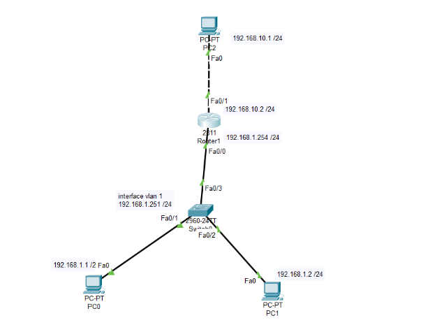


Yêu cầu : 
```
camtelnet

```


**Trên router cấu hình như sau :**


```
Router(config)#line vty 0 4
Router(config-line)#privilege level 15
Router(config-line)#no login
Router(config-line)#transport input telnet 

Router(config)#ip access-list standard camtelnet //tên mình tự đặt
Router(config-std-nacl)#permit 192.168.1.251 //liệt kê những ip có thể telnet
Router(config-std-nacl)#permit 192.168.1.1 //liệt kê những ip có thể telnet

Router(config-std-nacl)#exit
Router(config)#line vty 0 4
Router(config-line)#access-class camtelnet in

```


**Thực hiện telnet tới router từ PC0**


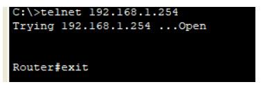


**Ở PC1 thực hiện telnet tới router**


### Mô hình bài lab thứ 2: 


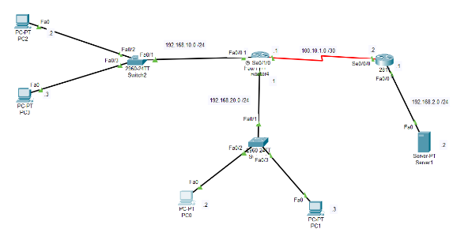


`Cấu hình cho các pc2 3 không thể ping đến server`


**Đầu tiên thì sẽ tạo đường rip** 
**Cấu hình trên sw 2 :** 


```
Router(config)#router rip
Router(config-router)#ver
Router(config-router)#version 2
Router(config-router)#network 192.168.2.0
Router(config-router)#network 100.10.1.0
Router(config)#access-list 1 deny 192.168.10.0 0.0.0.255 //deny cấm 
Router(config)#access-list 1 permit any                           // permit là cho phép
Router(config)#int f0/0                             // chặn out f0/0
Router(config-if)# ip access-group 1 out

```


**Trên sw1**

```
Router(config)#router rip
Router(config-router)#ver
Router(config-router)#version 2
Router(config-router)#new
Router(config-router)#netw
Router(config-router)#network 192.168.10.0
Router(config-router)#network 192.168.20.0
Router(config-router)#network 100.10.1.0
```


**Show ip access-list để xem :**


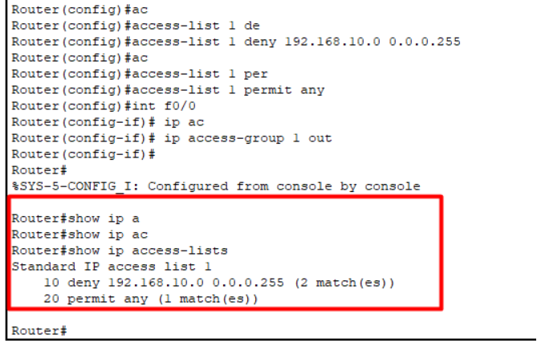


Thực hiện ping từ PC2 ,3 sang server


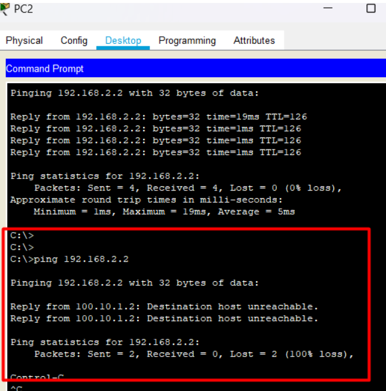


Thực hiện ping từ pc1,0 sang server


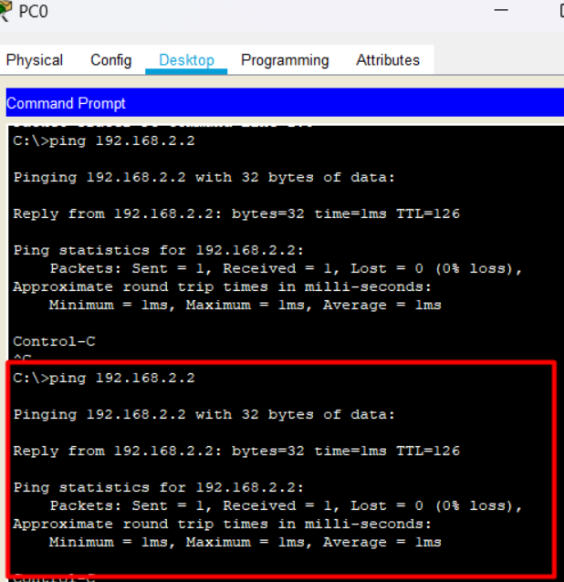


**Thực hiện cấm web của 192.160.10.0 Trước khi đó phải gỡ ping đến server**

```
Router#clear access-list counters 1
Router(config)#int f0/0
Router(config-if)#no access-list 1
Router(config)#access-list 100 deny tcp 192.168.10.0 0.0.0.255 192.168.2.2 0.0.0.0 eq 80 //(lưu ý ở đây http sử dụng dịch vụ tcp , số hiệu 100-199)
Router(config)#access-list 100 permit ip any any //câu lệnh thực hiện add các cổng còn lại
Router(config)#int f0/0 //vào cổng để add 
Router(config-if)#ip access-group 100 in // có thể in on( vào ra)
Router(config-if)#end
Router#show ip access-lists // lệnh show
Extended IP access list 100
10 deny tcp 192.168.10.0 0.0.0.255 host 192.168.2.2 eq www
20 permit ip any any

```


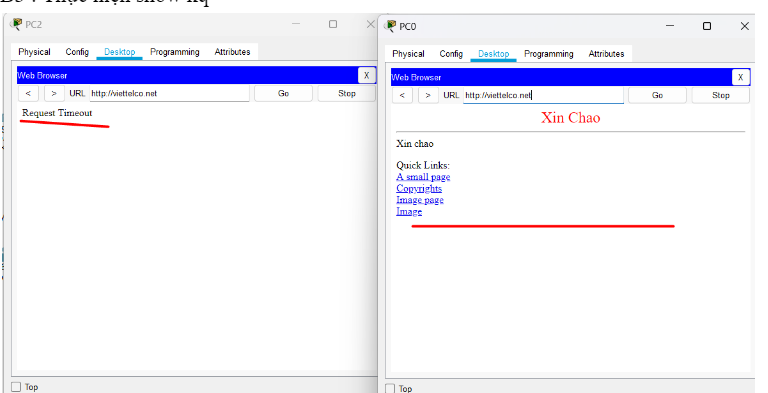


### HSRP

**Định nghĩa của HSRP :**

- Được viết tắt của Hot Standby Router Protocol . Là một giao thức định tuyến dự phòng được sử dụng để cung cấp tính sẵn sàng cao cho các mạng LAN. HSRP cho phép nhiều thiết bị định tuyến trong cùng một mạng IP hoạt động cùng nhau để cung cấp tính sẵn sàng cao, đảm bảo rằng khi một router chính không khả dụng, một router dự phòng có thể tiếp tục cung cấp dịch vụ cho mạng


**Bài toán đặt ra khi sử tại sao cần HSRP :** 
Trong một hệ thống mạng , router xảy ra các vấn đề(down , đứt , mất ip .. ) Ta cần hệ thống vẫn hoạt động bình thường qua các router còn lại → Việc cấu hình HSRP sẽ giải quyết được bài toán này 

**Cách thức hoạt động :**

- Trong một nhóm HSRP, có một router được chọn làm active và một router khác làm standby. Các router khác trongak. Router active sẽ đảm nhận việc gửi các gói tin đ nhóm sẽ ở trạng thái listen hoặc speến địa chỉ MAC ảo của nhóm HSRP, trong khi router standby chỉ lắng nghe liên tục để đảm bảo rằng nó sẵn sàng tiếp quản nếu router active không hoạt động. Nếu router active không hoạt động được nữa, router standby sẽ tự động thay thế nó và trở thành router active mớ

**Vai trò của active router :**

- Trả lời ARP request của các host
- Là con forwarding chính, đứng ra đảm nhận thông tin như là con Virtual Router.
- Có nhiệm vụ gửi các gói hello để các con standby nhận được thông tin
- Phải biết hết các Router IP Address


**Vai trò của Router Standby :**

- Chỉ ngồi lắng nghe gói tin hello được gửi từ phía Active nếu trong 1 chu kỳ mà con Active không gửi gói hello thì nó sẽ lên làm con Active

**Cách thức  để chọn router active và router standby:** 


- Router nào có Priority trên cổng nối xuống cao hơn thì sẽ được bầu chọn làm active ,router có Priority thấp hơn thì sẽ được bầu làm standby
- Trong trường hợp các router có giá trị Priority bằng nhau thì , địa chỉ IP sẽ được sử dụng để bầu chọn , địa chỉ ip nào cao hơn thì sẽ được chọn làm active , cao nhì sẽ chọn làm standby


#### Bài lab mô phỏng HSRP 


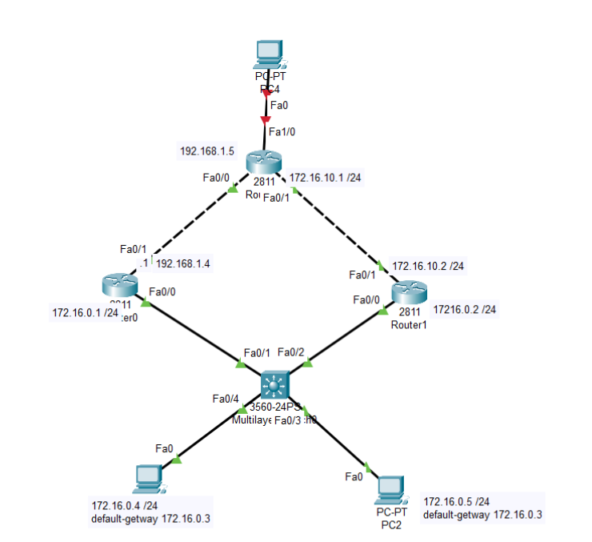


```

Yêu cầu Thực hiện cài đặt active và stand cho 2 router
Yêu cầu show kq hiển thị
Yêu cầu khi router active tắt thì router stand sẽ chuyển sang như nào cho xem kết quả


```


```
Ta thực hiện cấu hình trên router 0 và router 1 
Ta thực hiện cấu hình địa chỉ ip như trên 
Cấu hình group và IP cho router ảo
Khai báo group mà các router tham gia chỉ định địa chỉ IP dành cho router ảo:
```

**Cấu hình group và IP cho router ảo**
Khai báo group mà các router tham gia chỉ định địa chỉ IP dành cho router ảo:
`Router(config-if)#standby group-id ip IP_router_ảo`


Trên router 1 : 

```
Router(config)#int f0/0
Router(config-if)#standby 1 ip 172.16.0.3
Router(config-if)#stan
Router(config-if)#standby 1 pri
Router(config-if)#standby 1 priority 20
```

trên sw2 : 


```
Router(config)#int f0/0
Router(config-if)#standby 1 ip 172.16.0.3
Router(config-if)#stan
Router(config-if)#standby 1 pri
Router(config-if)#standby 1 priority 10

```

**B3 : kiểm tra dùng câu lệnh**

`Router#show standby br`


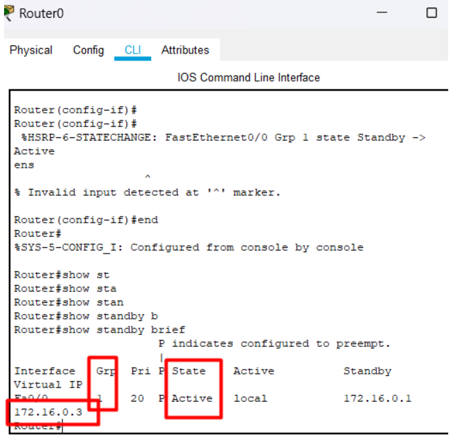


Ở router 2 ;


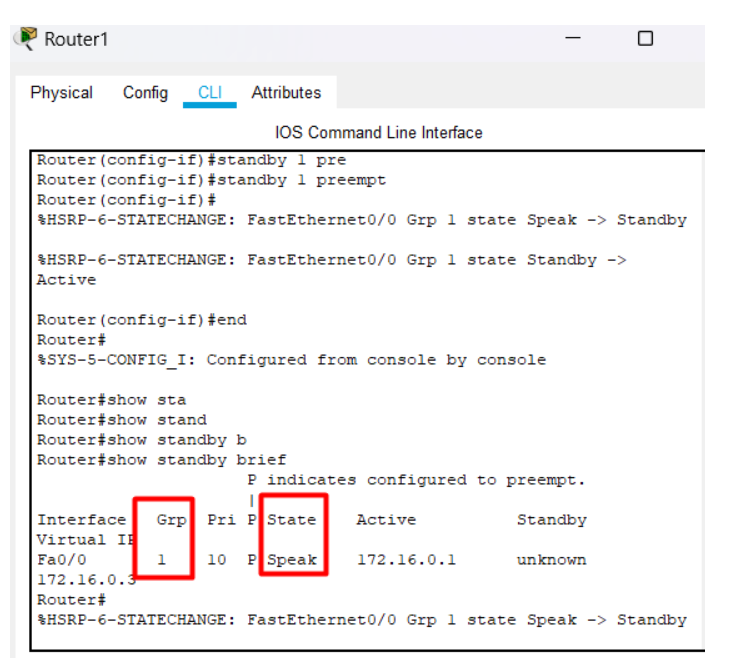


**Thực hiện tắt cổng f0/0 của router active :**


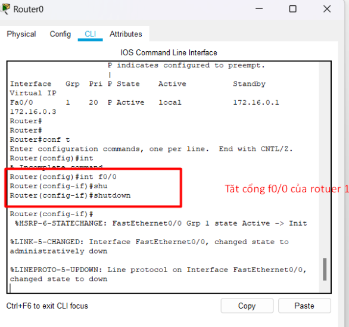


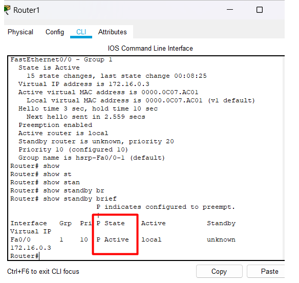


=> PC1 vẫn ping thông mà không bị ngắt kết nối 


### VRRP 

**Định nghĩa**

- VRRP là một giao thức mạng dùng để tạo tính dự phòng cho các thiết bị định tuyến (router) trên mạng. Với VRRP, có thể kết hợp nhiều router vật lý thành một nhóm và chia sẻ một địa chỉ IP và một cổng gateway ảo. Một trong các router sẽ đảm nhận vai trò "active", xử lý dữ liệu và định tuyến, trong khi các router khác trong nhóm sẽ ở chế độ "standby" sẵn sàng tiếp quản nếu router "active" gặp sự cố.


**Bài toán đặt ra và lý do sử dụng VRRP:**

- Khi có một mạng lưới mà thiết bị định tuyến (router) đóng vai trò quan trọng trong việc kết nối các mạng con với mạng lớn hơn, sự dừng hoạt động của router có thể dẫn đến gián đoạn dịch vụ và sự không ổn định trong mạng. Đây là lý do tại sao cần có tính dự phòng cho router =>  đó là nhiệm vụ chính của VRRP.

**Cách thức hoạt động cơ bản của VRRP:**

`Router ảo (Virtual Router)`: Trong một nhóm VRRP, một trong các router thực tế được chọn làm "router ảo" (Virtual Router). Router ảo này có địa chỉ IP và MAC ảo, và chính nó sẽ xử lý dữ liệu và định tuyến cho mạng. Các router khác trong nhóm sẽ hoạt động ở chế độ dự phòng.

`Chu kỳ quảng bá (Advertisement Interval)`: Router ảo định thời gian giữa các thông báo VRRP được gửi tới các router khác trong nhóm, gọi là "chu kỳ quảng bá" (Advertisement Interval). Thông báo này chứa thông tin về trạng thái của router ảo (active hoặc standby), địa chỉ IP và MAC ảo của router ảo.

`Router Active và Standby`: Ban đầu, một trong các router trong nhóm được chọn để làm router active. Router active sẽ xử lý dữ liệu và định tuyến cho mạng. Các router khác sẽ ở chế độ standby, sẵn sàng tiếp quản nếu router active gặp sự cố.

`Bầu chọn thông qua Priority:` Mỗi router trong nhóm có một giá trị ưu tiên (priority) được cấu hình. Router có ưu tiên cao nhất sẽ được chọn làm router active ban đầu. Nếu router active gặp sự cố hoặc không hoạt động, router có ưu tiên cao nhất trong các router standby sẽ được chọn để trở thành router active.

`Chuyển đổi nhanh (Fast Switchover)`: Khi router active gặp sự cố hoặc không hoạt động, quá trình chuyển đổi từ router active sang router standby diễn ra nhanh chóng và tự động. Các máy tính và thiết bị trong mạng không cần phải thay đổi cấu hình hoặc địa chỉ IP để tiếp tục truy cập mạng.

`Sticky IP (Optional)`: Một cải tiến của VRRP gọi là "sticky IP" cho phép thiết lập địa chỉ IP ảo cố định cho router ảo. Điều này giúp đảm bảo rằng các kết nối đến cùng một địa chỉ IP trong mạng nội bộ luôn được định tuyến đến cùng một router ảo.


### Bài lab cấu hình VRRP 


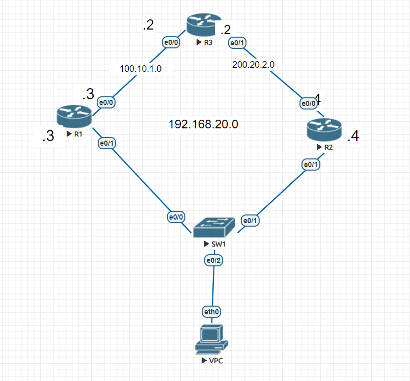


Thực hiện cấu hình đặt địa chỉ ip và cấu hình routing 

Thực hiện cấu hình vrrp trên router 12 

```
Router(config)#int e0/1
Router(config-if)#vrrp 1 ip 192.168.20.1

```

Thực hiện show kq


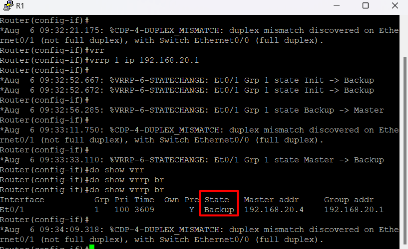


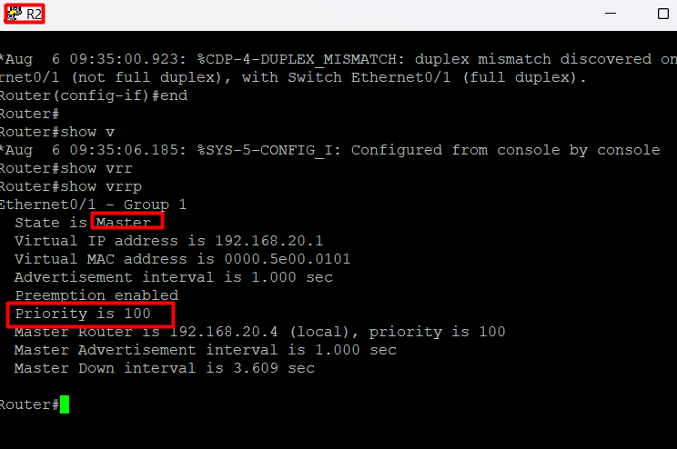


Nếu muốn chuyển master và backup thì thực hiện đổi Priority bằng câu lệnh dưới 

`int e0/1`
`vrrp 1 priority 90`


R2 bây g thành backup
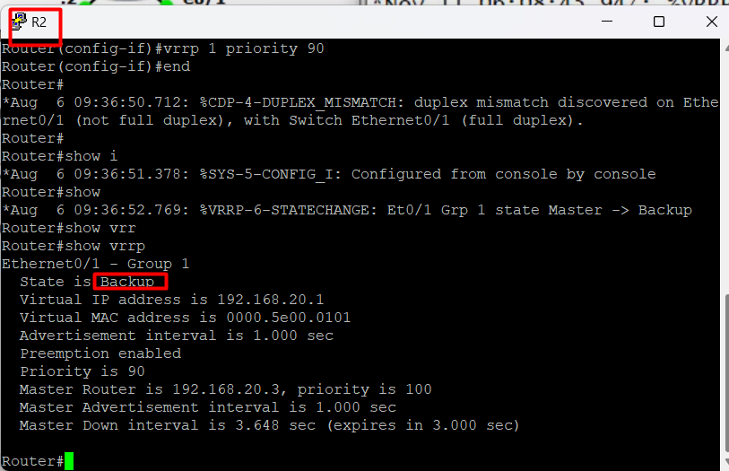


### Sự khác nhau giữa vrrp và hsrp 

`VRRP`: Sử dụng một chuỗi các địa chỉ IP ảo (virtual IP address) cho mỗi nhóm VRRP. Mỗi router ảo trong nhóm có một địa chỉ IP ảo duy nhất.
`HSRP`: Sử dụng một địa chỉ IP ảo duy nhất cho cả nhóm HSRP. Các router trong nhóm sẽ chia sẻ cùng một địa chỉ IP ảo.

`VRRP`: Các router trong nhóm VRRP có giá trị ưu tiên (priority value) từ 0 đến 255. Router có giá trị ưu tiên cao nhất trong nhóm sẽ trở thành router active.

`HSRP`: Các router trong nhóm HSRP cũng có giá trị ưu tiên từ 0 đến 255. Tuy nhiên, trong HSRP, giá trị ưu tiên được tính toán dựa trên một giá trị chuẩn gọi là Active Router Priority (ARP) và ưu tiên cấu hình.

`VRRP`: Chu kỳ quảng bá mặc định là 1 giây.

`HSRP`: Chu kỳ quảng bá mặc định là 3 giây.

