- [1. EthernetChanel](#1-ethernetchanel)
- [2. Load balancing trên Etherchannel](#2-load-balancing-trên-etherchannel)
  - [2.1. Định nghĩa](#21-định-nghĩa)
  - [2.2. Phương pháp Load Balancing trên EtherChannel](#22-phương-pháp-load-balancing-trên-etherchannel)
- [3. Inter vlan routing, sub interface](#3-inter-vlan-routing-sub-interface)
  - [3.1. Định nghĩa](#31-định-nghĩa)
  - [3.2. Bài lab cấu hình subinterface VLAN](#32-bài-lab-cấu-hình-subinterface-vlan)
- [Bài Lab demo](#bài-lab-demo)


### 1. [EthernetChanel](/Tuần%201/DHCP,ARP,DNS,Ethernet.md)

###  2. Load balancing trên Etherchannel
#### 2.1. Định nghĩa
Load Balancing trong EtherChannel là một phương pháp được sử dụng để phân chia tải (traffic) ra giữa các cổng vật lý được gom nhóm. Mục tiêu của load balancing là đảm bảo rằng băng thông của tất cả các cổng trong EtherChannel được tận dụng một cách hiệu quả, giảm thiểu tình trạng trênchỉnh tải (congestion) và cải thiện hiệu suất tổng thể của mạng.

#### 2.2. Phương pháp Load Balancing trên EtherChannel
Có hai phương pháp phổ biến để thực hiện load balancing trên EtherChannel:
**Load Balancing dựa trên địa chỉ MAC (MAC address-based):**
Trong phương pháp này, gói tin được gửi từ một địa chỉ MAC cụ thể sẽ luân phiên đi qua các cổng trong EtherChannel. Cơ chế này đảm bảo rằng các kết nối từ một thiết bị mạng cụ thể sẽ được phân tán đồng đều ra các cổng. Điều này có ý nghĩa khi nhiều thiết bị kết nối vào cùng một switch thông qua EtherChannel.


**Load balancing dựa trên địa chỉ MAC sử dụng thông tin SMAC và DMAC như sau:**

`SMAC` (địa chỉ MAC nguồn): Đại diện cho địa chỉ MAC của thiết bị gửi gói tin. SMAC xác định nguồn gốc của gói tin.
`DMAC` (địa chỉ MAC đích): Đại diện cho địa chỉ MAC của thiết bị đích mà gói tin đang được gửi đến. DMAC xác định thiết bị hoặc máy tính nào sẽ nhận và xử lý gói tin.

- Khi một thiết bị trong mạng nhận được một gói tin, nó sử dụng thông tin `SMAC` và `DMAC` của gói tin này để xác định cổng nào trong nhóm EtherChannel hoặc port-channel sẽ được sử dụng để gửi gói tin đi. Các gói tin từ cùng một cặp địa chỉ MAC nguồn và đích sẽ luân phiên đi qua các cổng của EtherChannel hoặc port-channel.

**Ưu điểm của load balancing dựa trên địa chỉ MAC:**

Cân bằng tải công bằng: Load balancing dựa trên địa chỉ MAC đảm bảo rằng các gói tin từ cùng một cặp địa chỉ MAC nguồn và đích sẽ được phân chia tải một cách công bằng giữa các cổng trong EtherChannel hoặc port-channel. Điều này giúp tăng cường hiệu suất và giảm thiểu tình trạng tắc nghẽn (congestion) trên mạng.

Tối ưu hóa sử dụng băng thông: Load balancing dựa trên địa chỉ MAC tận dụng tối đa băng thông của các cổng trong EtherChannel hoặc port-channel, giúp tối ưu hóa việc sử dụng tài nguyên mạng.

Tăng cường tính sẵn sàng: Giao diện ảo (EtherChannel hoặc port-channel) được tạo ra bằng cách gom nhóm các cổng vật lý, giúp tăng tính sẵn sàng của kết nối mạng. Nếu một trong các cổng vật lý bị lỗi, các gói tin có thể được chuyển tiếp qua các cổng khác trong EtherChannel hoặc port-channel.

**Load Balancing dựa trên IP (IP address-based):**
Trong phương pháp này, gói tin được gửi từ một địa chỉ IP cụ thể sẽ luân phiên đi qua các cổng trong EtherChannel. Kỹ thuật này đặc biệt hữu ích khi có nhiều đích đến IP khác nhau trong mạng và giúp phân chia tải một cách công bằng giữa các dịch vụ hoặc máy chủ đích.

Thực hiện cấu hình bài Lab load Balancing trên EtherChannel


mô hình bài lab 

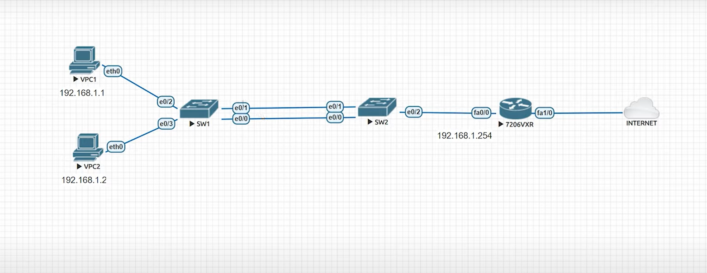


Sau khi thực hiện cấu hình EtherChannel thì mặc định của 


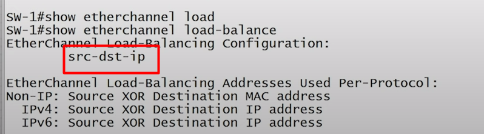


Vì  src-dst-ip  chỉ áp dụng trên port layer 3 nên port layer 2 không có tác dụng 

=> sử dụng thuật toán src-mac trên sw bằng câu lệnh sau 
`port-channel load-balance src-mac`


EtherChannel chỉ có 2 link nên chỉ để ý địa chỉ `mac` cuối cùng của 2 địa chỉ mac của pc, Nếu địa chỉ `mac` tận cùng bằng số 0 thì đi 1 đường địa chỉ `mac` bằng 1 thì đi đường còn lại 


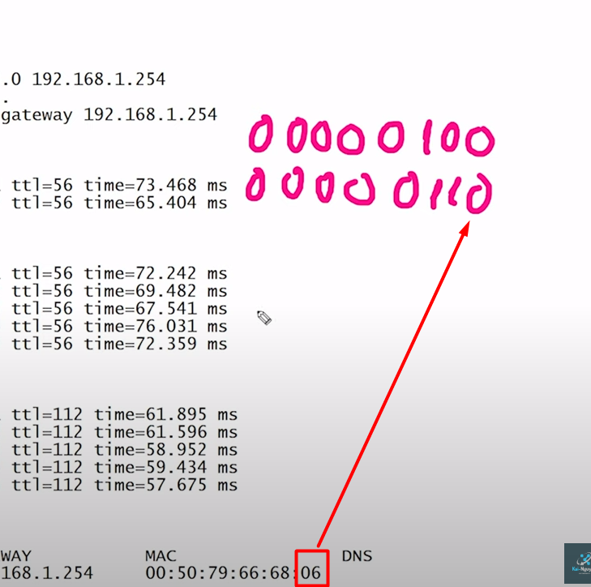  


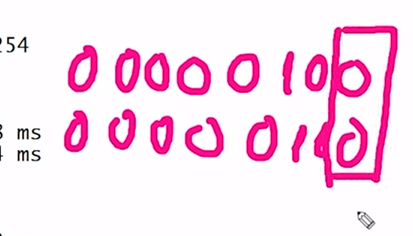


Sử dụng thuật toán `src-dst-mac ` 
`port-channel load-balance src-dst-mac`


### 3. Inter vlan routing, sub interface

#### 3.1. Định nghĩa
**Inter vlan routing**
Inter-VLAN Routing là quá trình cho phép các VLAN (Virtual Local Area Network) khác nhau trong mạng liên lạc với nhau thông qua một thiết bị định tuyến hoặc một Switch layer 3. Khi mạng được chia thành nhiều VLAN, các thiết bị trong cùng một VLAN có thể giao tiếp với nhau một cách trực tiếp, nhưng để giao tiếp giữa các VLAN khác nhau, ta cần một giải pháp để định tuyến dữ liệu qua các VLAN này.

Trong mạng VLAN, các thiết bị thuộc cùng một VLAN sẽ chia sẻ cùng một broadcast domain, điều này giúp giới hạn lưu lượng broadcast và giữ cho lưu lượng mạng cụ thể cho mỗi VLAN. Tuy nhiên, khi các VLAN cần giao tiếp với nhau, một thiết bị định tuyến hoặc Switch Layer 3  có khả năng định tuyến phải tham gia để cho phép giao tiếp giữa các VLAN khác nhau

**sub interface**

`Subinterface VLAN` (Virtual LAN) là một kỹ thuật trong mạng máy tính cho phép một cổng vật lý trên thiết bị định tuyến hoặc Switch  Layer 3  được chia thành nhiều giao diện logic ảo, mỗi giao diện ảo đại diện cho một VLAN riêng biệt. Điều này giúp mở rộng khả năng định tuyến giữa các VLAN và thực hiện Inter-VLAN Routing mà không cần sử dụng nhiều cổng vật lý riêng biệt.

Nguyên lý hoạt động của `Subinterface VLAN `:

Khi mạng được chia thành các vlan để tăng tính bảo mật , các thiết bị trong cùng 1 vlan có thể giao tiếp với nhau nhưng để giao tiếp các vlan với nhau thì ta cần định tuyến giữa vlan này . Trong trường hợp không sử dụng Subinterface VLAN, các VLAN sẽ được định tuyến thông qua các cổng vật lý riêng biệt, đòi hỏi một số lượng lớn cổng vật lý nếu mạng có nhiều VLAN

Subinterface VLAN giải quyết vấn đề này bằng cách tạo ra các giao diện ảo (Subinterface) trên một cổng vật lý duy nhất. Mỗi Subinterface đại diện cho một VLAN riêng biệt và có thể được cấu hình với địa chỉ IP của VLAN đó để thực hiện định tuyến giữa các VLAN.

Mô hình trước khi `không` áp dụng `Subinterface VLAN `


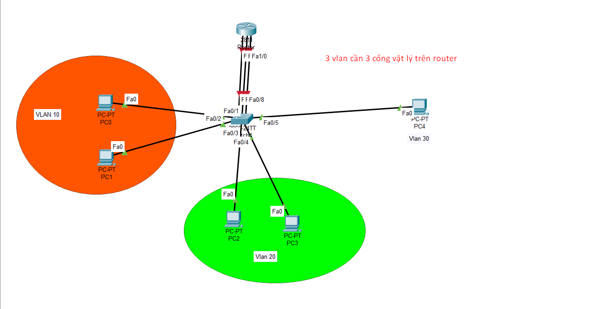


Mô hình trước khi `sau` áp dụng `Subinterface VLAN `


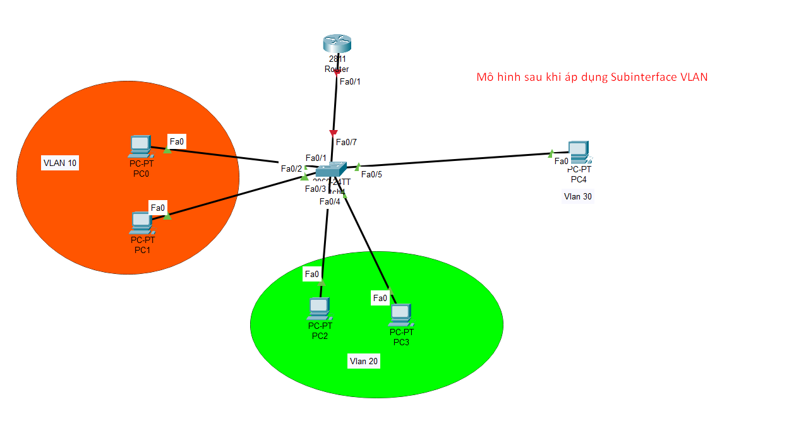


Ví dụ cấu hình Subinterface VLAN trên Router 

```
interface FastEthernet0/0
 no shutdown

interface FastEthernet0/0.10
 encapsulation dot1Q 10
 ip address 192.168.10.1 255.255.255.0

interface FastEthernet0/0.20
 encapsulation dot1Q 20
 ip address 192.168.20.1 255.255.255.0
```


#### 3.2. Bài lab cấu hình subinterface VLAN 


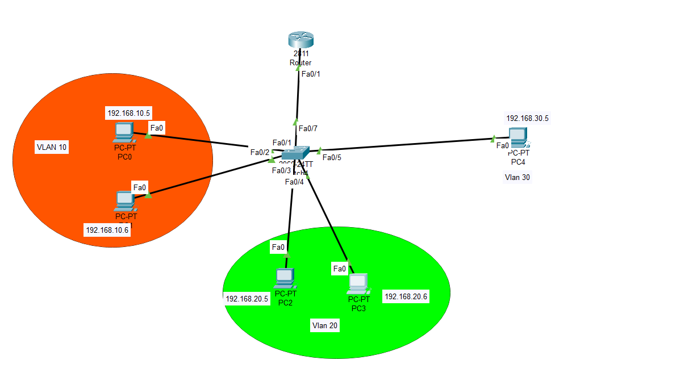


Thực hiện đặt ip cho pc theo kiểu như trên 


Thực hiện cấu hình trên router : 


```
Router(config)#int fa0/1.10
Router(config-subif)#encapsulation dot1Q 10
Router(config-subif)#ip address 192.168.10.1 255.255.255.0
Router(config-subif)#ex
Router(config)#int fa0/1.20
Router(config-subif)#encapsulation dot1Q 20
Router(config-subif)#ip address 192.168.20.1 255.255.255.0
Router(config-subif)#ex
Router(config-subif)#encapsulation dot1Q 20
Router(config-subif)#ip address 192.168.20.1 255.255.255.0
Router(config-subif)#ex
```

Thực hiện cấu hình trên sw : 

```
Switch#vlan 10
Switch#vlan 20
Switch#vlan 30
Switch(config)#int range fa0/1-2
Switch(config-if-range)#sw access vlan 10
Switch(config-if-range)#ex
Switch(config)#int range fa0/3-4
Switch(config-if-range)#sw access vlan 20
Switch(config-if-range)#ex
Switch(config)#int fa0/5
Switch(config-if-range)#sw access vlan 30
Switch(config-if-range)#ex
Switch(config)#int fa0/7
Switch(config-if)#switchport mode trunk 
```


Thực hiện show kq bằng cách ping từ pc1 sang pc 3 4 


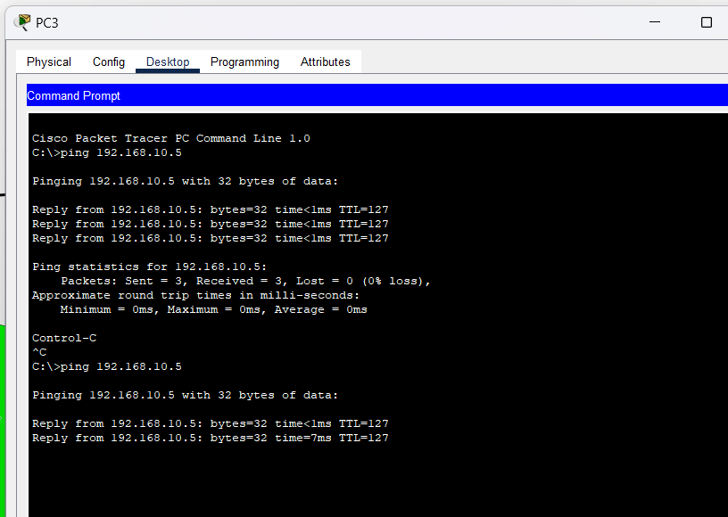


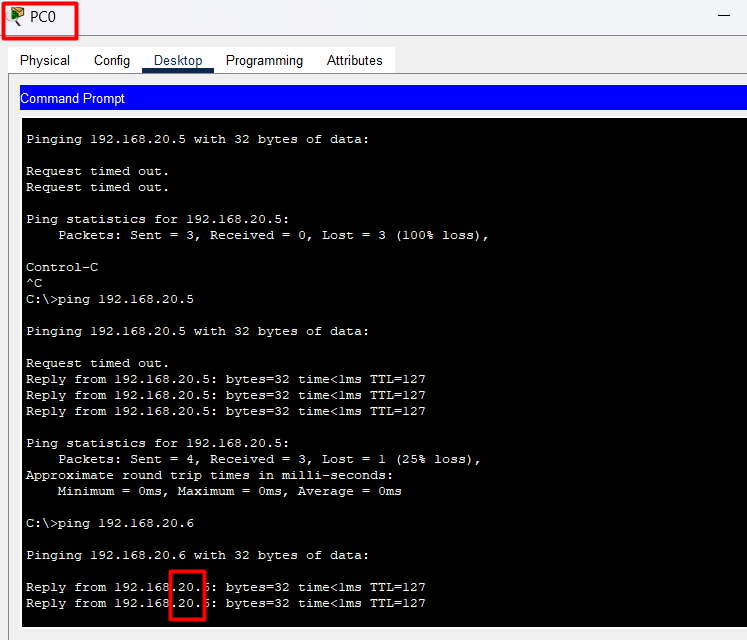


### Bài Lab demo 


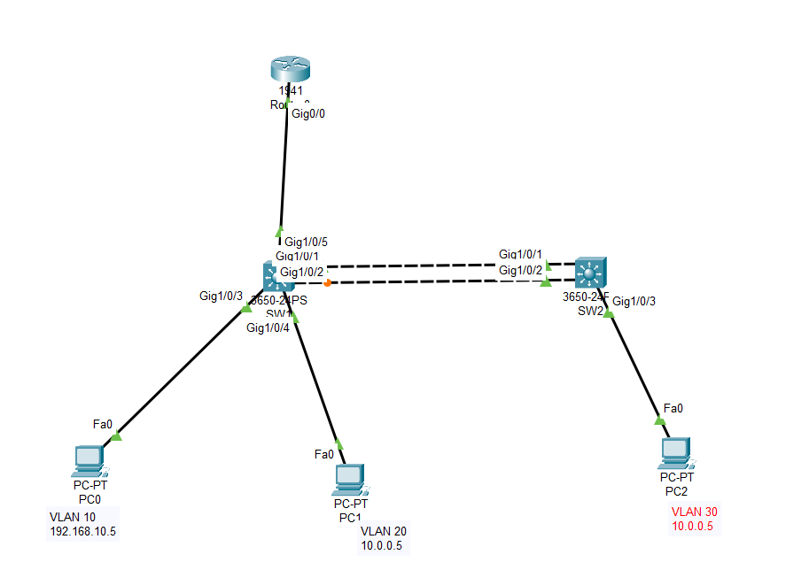


```
Yêu cầu cấu hình LACP trên sw
Tạo các vlan 10 ,20 , 30 , cấu hình vtp 
Tạo subinterface 

```


Thực hiện cấu hình trên sw1:

```
vtp domain khoikhoi
vtp mode server 
vlan 10 
vlan 20
vlan 30
ex
int range g1/0/1-2
sw mode trunk
channel-group 1 mode active
ex
int g1/0/3
sw mode access
sw acces vlan 10
int g1/0/4
sw mode access
sw acces vlan 20
ex
int g1/0/5
sw mode trunk
```

Thực hiện cấu hình trên sw2:

```
vtp domain khoikhoi
vtp mode server 
ex
int range g1/0/1-2
sw mode trunk
channel-group 1 mode active
ex
int g1/0/3
sw mode access
sw acces vlan 30
```


Thực hiện cấu hình trên router:

```
Router(config)#int g0/0.10
Router(config-subif)#encapsulation dot1Q 10
Router(config-subif)#ip address 192.168.10.1 255.255.255.0
Router(config-subif)#ex
Router(config)#int g0/0.20
Router(config-subif)#ip address 10.0.0.1 255.255.255.0
Router(config-subif)#encapsulation dot1Q 20
Router(config-subif)#ex
Router(config)#int g0/0.30
Router(config-subif)#encapsulation dot1Q 30
Router(config-subif)#ip address 192.168.30.1 255.255.255.0
```

Thực hiện đặt địa chỉ ip trên các pc 


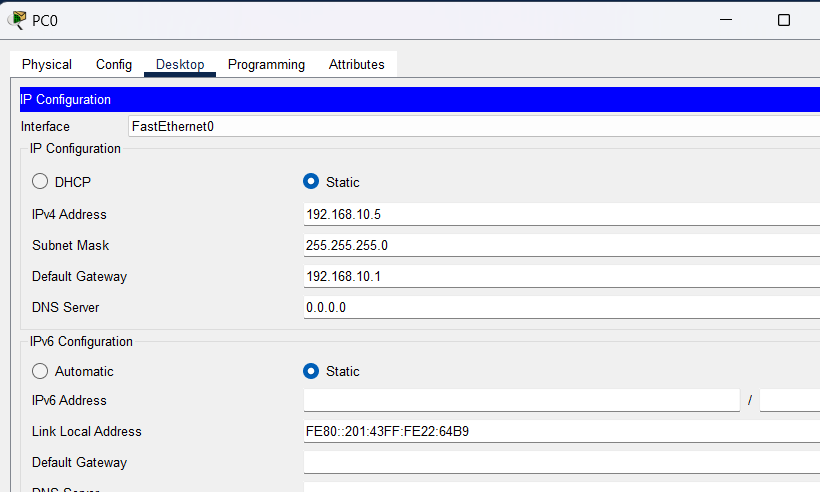


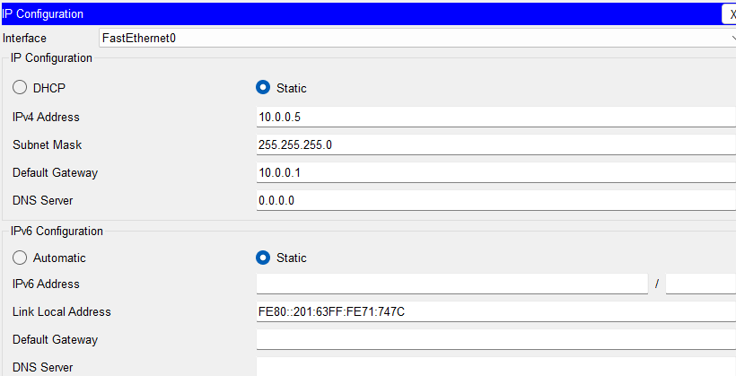


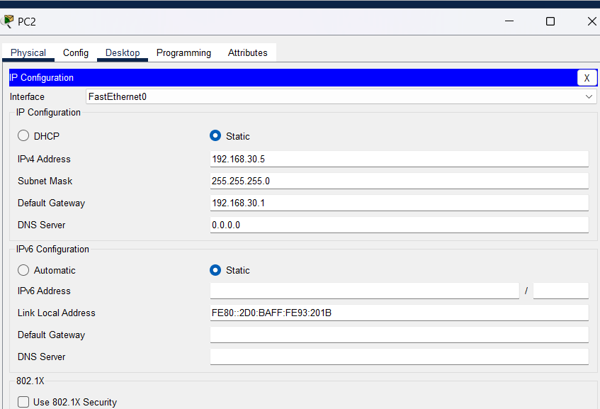


Thực hiện ping : 

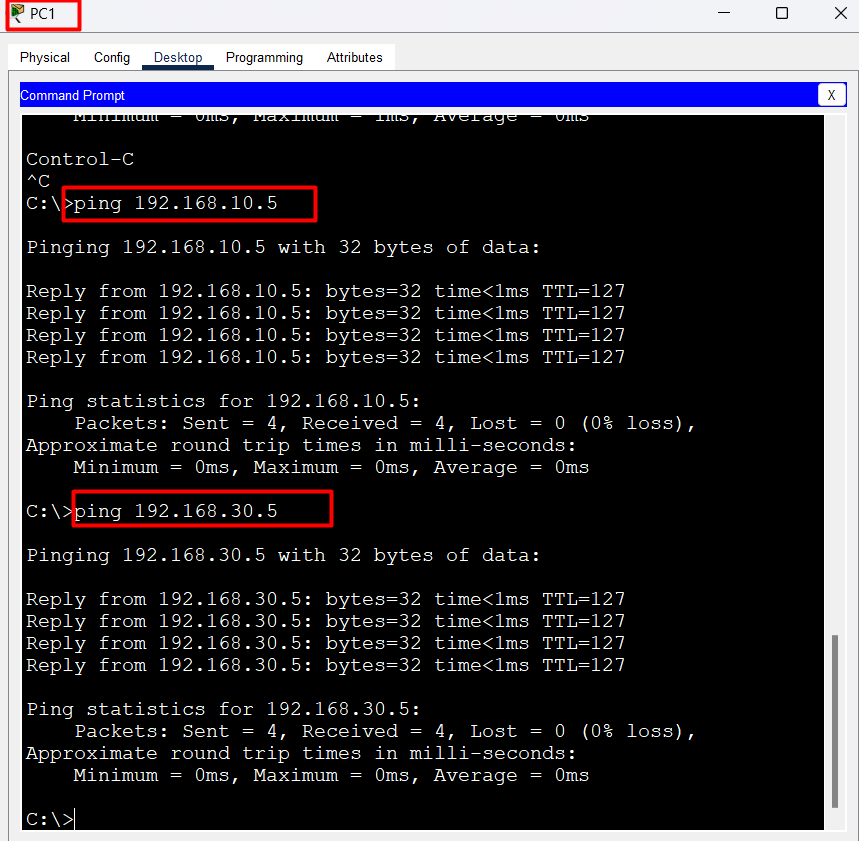


