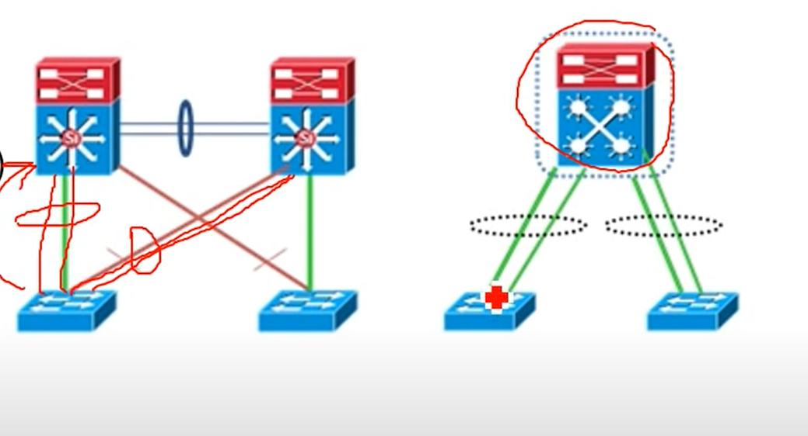
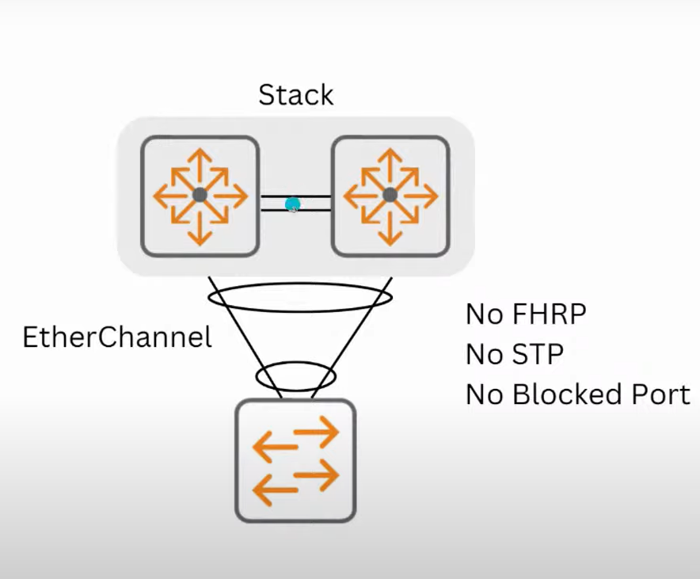
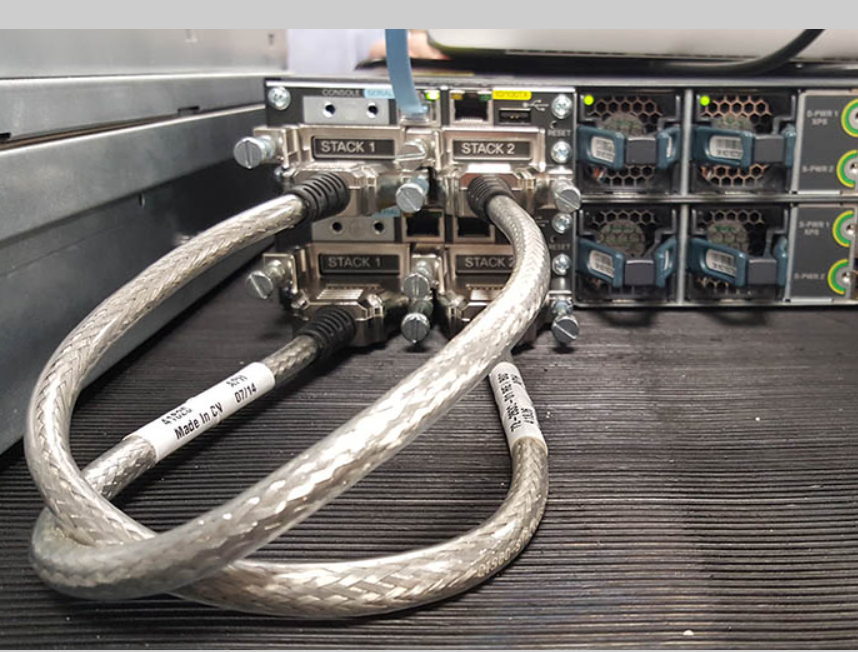
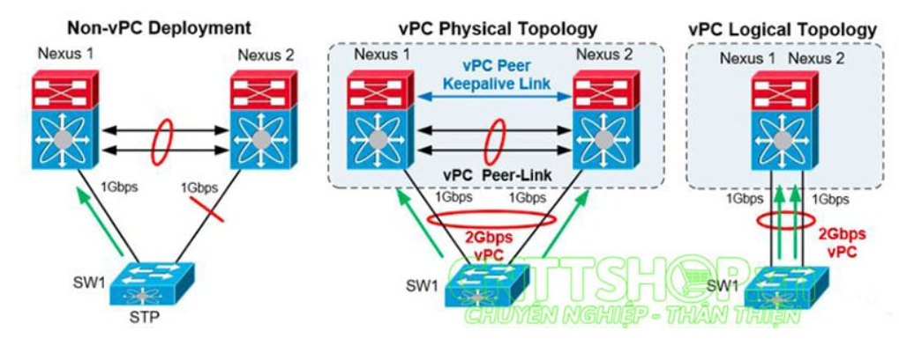
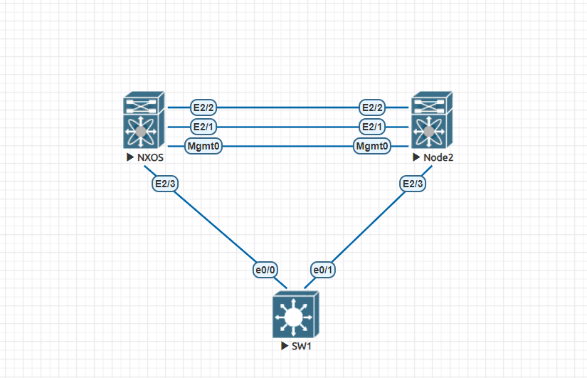
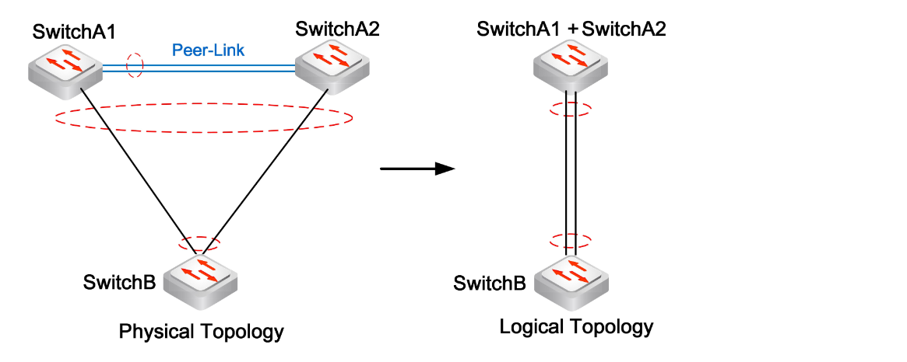
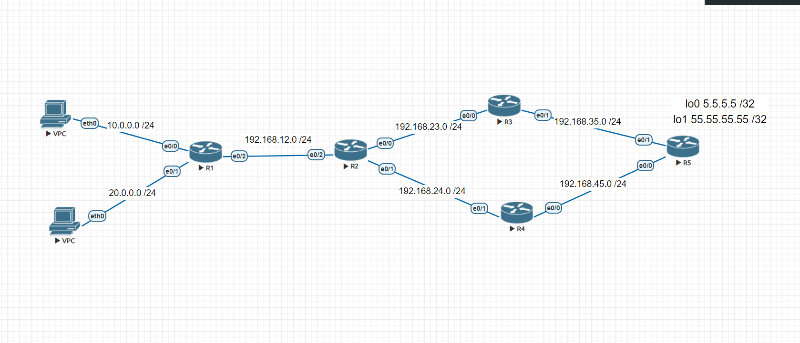
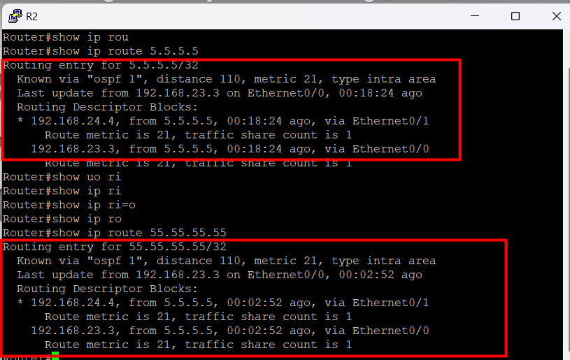
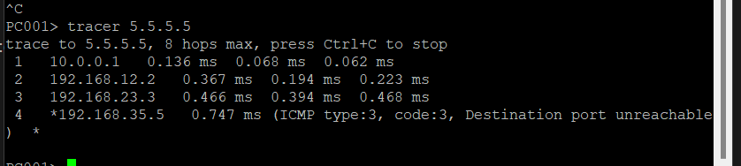

- [1. Virtual Switching System (VSS)](#1-virtual-switching-system-vss)
- [2. Stacking](#2-stacking)
- [3. Virtual Port Channel (vPC)](#3-virtual-port-channel-vpc)
- [Bài lab cấu hình vPC](#bài-lab-cấu-hình-vpc)
- [4. MLAG](#4-mlag)
- [5. So sánh VSS (Virtual Switching System) /Stack/vPC (virtual Port Chanel)/ MLAG](#5-so-sánh-vss-virtual-switching-system-stackvpc-virtual-port-chanel-mlag)
- [6. Policy-Based Routing (PBR):](#6-policy-based-routing-pbr)
  - [6.1. Mô hình bài lab](#61-mô-hình-bài-lab)


### 1. Virtual Switching System (VSS) 



Virtual Switching System (VSS) là một kiến trúc mạng được sử dụng trong các thiết bị chuyển mạch của Cisco, đặc biệt là các dòng sản phẩm Cisco Catalyst. VSS cho phép gộp hai thiết bị chuyển mạch vật lý thành một "switch ảo" duy nhất, tạo ra một sự kết nối mạng dự phòng và cung cấp hiệu suất tăng cao.


**Đặc điểm chính của Virtual Switching System:**

`Gộp các thiết bị chuyển mạch`: VSS cho phép hai hoặc nhiều thiết bị chuyển mạch vật lý hoạt động như một switch ảo duy nhất. Thay vì cấu hình và quản lý các thiết bị riêng lẻ, VSS cho phép tạo ra một lớp quản lý chung.

`Chia sẻ dự phòng (Redundancy`): VSS cung cấp tính năng dự phòng cao hơn bằng cách tự động chuyển dữ liệu từ một thiết bị chuyển mạch sang thiết bị khác trong trường hợp một trong chúng gặp sự cố. Điều này giúp giảm thiểu thời gian gián đoạn dịch vụ.

`Tăng cường hiệu suất`: Bằng cách gộp nhiều thiết bị thành một switch ảo, VSS cung cấp khả năng xử lý lưu lượng mạng cao hơn và tăng cường hiệu suất mạng.

`Load Balancing:` VSS cho phép phân phối tải lưu lượng truyền thông giữa các thành phần của hệ thống, giúp tận dụng tối đa khả năng xử lý của mỗi thiết bị.

`Cấu hình đơn giản hóa`: Với VSS, có thể cấu hình và quản lý toàn bộ hệ thống bằng cách xử lý một switch duy nhất thay vì phải làm việc với nhiều thiết bị riêng lẻ.

`Hỗ trợ các tính năng mạng nâng cao`: VSS cung cấp tích hợp với các tính năng nâng cao như Spanning Tree Protocol (STP) tiến hóa (Rapid PVST+), định tuyến đa lớp (MLP), và các tính năng bảo mật.


### 2. Stacking
Stacking là một phương pháp ghép nối nhiều thiết bị chuyển mạch cùng loại lại với nhau để tạo thành một thiết bị chuyển mạch duy nhất. Bằng cách kết hợp các thiết bị trong một stack, có thể tạo ra một switch có hiệu suất tốt hơn, khả năng mở rộng linh hoạt và quản lý dễ dàng hơn. Các thiết bị trong stack hoạt động như một, chia sẻ thông tin về cấu hình và bảng MAC. Stacking phù hợp cho các mạng trung bình và yêu cầu tính linh hoạt trong việc mở rộng mạng.





Cách thức hoạt động của stack

- **Stack Master**
Trong một stack, một thiết bị sẽ được chọn làm Stack Master. Nhiệm vụ của Stack Master là quản lý toàn bộ stack và xử lý các tác vụ quản lý như cấu hình và quản lý bảng MAC chun

Stack Master thường được chọn dựa trên các tiêu chí như ưu tiên cấu hình hoặc sự ổn định.


- **Kết Nối Vật Lý (Stacking Cable):**

Đấu chéo port 2 của sw 1 đấu chéo vs port 1 của sw 2 làm tương tự , port 2 của sw2 kết nối với port 1 của sw3 . Cuối cùng port 2 của sw cuối đấu chéo lên trên





**Port Channel Ảo:**

Các port trên các thiết bị trong stack có thể được gộp lại thành các port channel ảo để tăng băng thông và cân bằng tải.
Port channel ảo này giúp tăng cường hiệu suất mạng bằng cách phân phối lưu lượng truyền thông qua các port thành viên.

**Khả Năng Mở Rộng:**
Khi muốn mở rộng có thể thêm các thiết bị chuyển mạch mới vào stack hiện có.
Việc thêm stack member mới không làm gián đoạn hoạt động của mạng.

**Redundancy và Dự Phòng:**

Khi một thiết bị trong stack gặp sự cố, các thiết bị chuyển mạch còn lại trong stack vẫn có thể tiếp tục hoạt động và duy trì tính sẵn sàng của mạng.

**Spanning Tree Protocol (STP) Duy Nhất:**
Trong một stack, chỉ có một cơ chế Spanning Tree duy nhất được áp dụng. Các thiết bị trong stack làm việc cùng nhau để chọn root bridge và loại bỏ các hình chậm hơn.


### 3. Virtual Port Channel (vPC) 
Virtual Port Channel (vPC) là một giải pháp trong mạng máy tính của Cisco cho phép kết nối một thiết bị mạng (như máy chủ hoặc thiết bị chuyển mạch) với hai thiết bị chuyển mạch độc lập thông qua các port channel ảo. vPC tạo ra một sự liên kết song song giữa các thiết bị chuyển mạch, cung cấp tính dự phòng cao và tăng cường băng thông.




**Cách thức hoạt động:**
- Trong vPC, hai thiết bị chuyển mạch hoạt động cùng một hệ thống, được gọi là vPC peer.
- Mỗi vPC peer có một hoặc nhiều port channel ảo, được gọi là vPC domain.
- Máy chủ hoặc thiết bị kết nối vào cả hai vPC peer thông qua các port channel vPC.
- Các frame từ máy chủ đi qua một vPC peer đến vPC domain và sau đó được chuyển đến vPC peer còn lại để đi tiếp đến đích.

`vPC Peer Link`
vPC peer-link là thành phần kết nối quan trọng nhất trong thiết lập virtual Port Channel. vPC peer-link được sử dụng để đồng bộ hóa trạng thái giữa 2 thiết bị vPC thông qua các gói điều khiển vPC để tạo ra một mặt phẳng điều khiển duy nhất (1 switch logical). Trong trường hợp thiết bị vPC cũng là switch layer 3, vPC peer-link mang các gói Hot Standby Router Protocol (HSRP).
`vPC Peer Keepalive Link`
vPC Peer Keepalive Link là đường link Layer 3 được sử dụng để xác định các thiết bị trong cụm vPC và các đường vPC Peer Link có hoạt động hay không. Không có dữ liệu hay các gói tin đồng bộ đi qua vPC Peer Keepalive Link, chỉ có các gói tin IP/UDP sử dụng port 3200 để monitor switch và các peer link trong cụm vPC. Thời gian mặc định của các gói tin này là 1giây và timeout là 5 giây.


`vPC Domain`
vPC domain là thông số để xác định các thiết bị switch Cisco Nexus nào đang chung 1 miền vPC. Các  Switch Nexus trong 1 cụm vPC phải chung vPC Domain.

**Ưu điểm**

`Dự phòng cao:` vPC cung cấp tính dự phòng cao bằng cách cho phép các máy chủ hoặc thiết bị kết nối đồng thời với cả hai vPC peer, giúp tránh mất kết nối nếu một vPC peer gặp sự cố.
`Cân bằng tải:` Các frame được phân phối giữa cả hai vPC peer, giúp tận dụng tối đa khả năng xử lý của hệ thống.
`Tăng cường băng thông`: Máy chủ hoặc thiết bị có thể sử dụng băng thông từ cả hai vPC peer, cung cấp băng thông tăng gấp đôi so với một kết nối đơn lẻ.
`Khả năng mở rộng:` Bằng cách thêm vPC peer hoặc mở rộng vPC domain, có thể dễ dàng mở rộng mạng mà không làm gián đoạn hoạt động của mạng hiện có

**Nhược điểm:**

`Phức tạp cấu hình:` Cấu hình vPC đòi hỏi hiểu biết sâu về mạng và kỹ thuật của sản phẩm Cisco.
`Khả năng tương thích`: Cần phải đảm bảo tính tương thích giữa các phiên bản phần mềm và thiết bị để tránh vấn đề tương thích.
`Phải cân nhắc thiết kế`: Việc thiết kế vPC đúng cách là quan trọng để đảm bảo tính hiệu suất và tính sẵn sàng cao.


### Bài lab cấu hình vPC 

Mô hình bài lab





Thực hiện cấu hình trên vPC-Primary


[Link làm bài lab (do máy cài sw nexus lag nên không làm được)](https://www.forum.vnpro.org/forum/ccnp-enterprise/encor/421067-c%E1%BA%A5u-h%C3%ACnh-vpc-virtual-port-channel)


### 4. MLAG

**Định nghĩa:**
Multi-Chassis Link Aggregation (MLAG) là một giải pháp trong mạng máy tính cho phép kết nối một thiết bị mạng với hai thiết bị chuyển mạch độc lập thông qua các liên kết gộp kênh (link aggregation). MLAG cho phép các thiết bị hoạt động độc lập nhưng trông như một hệ thống duy nhất với tính dự phòng và cân bằng tải.





**Chức năng:**
- `Tăng cường tính dự phòng`: MLAG cung cấp tính dự phòng cao hơn bằng cách kết nối một thiết bị mạng với hai thiết bị chuyển mạch độc lập. Nếu một trong hai thiết bị gặp sự cố, thiết bị kia vẫn có thể tiếp tục hoạt động mà không làm gián đoạn dịch vụ.
- `Cân bằng tải`: MLAG cho phép cân bằng tải truyền thông giữa các thiết bị chuyển mạch, giúp tận dụng tối đa khả năng xử lý của mạng và cung cấp hiệu suất cao hơn.
- `Chia sẻ bảng MAC`: Các thiết bị chuyển mạch trong cặp MLAG chia sẻ thông tin về bảng MAC, giúp đảm bảo rằng các địa chỉ MAC được cập nhật và đồng bộ hóa đúng cách.
- `Hạn chế chết`: MLAG giúp giảm thiểu thời gian gián đoạn dịch vụ trong trường hợp một thiết bị gặp sự cố. Các thiết bị hoạt động độc lập, do đó, thời gian hồi phục có thể nhanh hơn so với một kiến trúc không có tính năng MLAG.

**Hoạt động:**

- Hai thiết bị chuyển mạch độc lập được cấu hình với MLAG. Chúng cùng chia sẻ thông tin về bảng MAC và cấu hình.
- Khi một frame từ một thiết bị trong mạng được gửi đến MLAG, nó được chuyển đến cả hai thiết bị chuyển mạch trong cặp MLAG.
- Các thiết bị MLAG sẽ xử lý frame và cập nhật bảng MAC chung.
- Khi một thiết bị trong cặp MLAG gặp sự cố, thiết bị kia có thể tiếp tục xử lý frame mà không làm gián đoạn 


**NHỮNG THUẬT NGỮ TRONG MLAG:**
`MLAG Domain` – một cặp của các switch vật lý
`MLAG peer` – một switch đơn có trong một MLAG domain
`MLAG peer-link` – liên kết Ethernet vật lý giữa các MLAG peer cần thiết để đồng bộ trạng thái giữa MLAG peer và mạng dữ liệu người dùng.
`MLAG member port` – một hoặc nhiều cổng vật lý hướng về người dùng tạo thành một MLAG
`MLAG port-channel` – đây là một tổ hợp user-facing port-channel giữa các MLAG peer bao gồm các MLAG member port trên cả các MLAG peer
`MLAG VLAN` – một VLAN được sử dụng thêm vào trên MLAG peer-link, để hỗ trợ giao tiếp control-plane giữa các MLAG peer.


### 5. So sánh VSS (Virtual Switching System) /Stack/vPC (virtual Port Chanel)/ MLAG

**VSS (Virtual Switching System):**

**Đặc điểm:** VSS là một giải pháp của Cisco cho phép kết nối hai switch đến nhau để tạo thành một hệ thống duy nhất với tính dự phòng và tăng cường hiệu suất. Hai switch hoạt động như một switch duy nhất trong mạng, có cùng một địa chỉ IP và các thông số cấu hình.

**Ưu điểm:** Tính dự phòng cao, tăng cường hiệu suất, khả năng quản lý dễ dàng.
**Nhược điểm:** Khả năng mở rộng hạn chế, thiết bị phải thuộc cùng dòng sản phẩm Cisco.


**Stacking:**


**Đặc điểm**: Stacking là quá trình kết nối nhiều switch lại với nhau để hình thành một switch vật lý lớn hơn. Các switch trong stack hoạt động như một thiết bị duy nhất, chia sẻ cùng một địa chỉ IP và cấu hình.
**Ưu điểm**: Tính dự phòng, tăng cường hiệu suất, khả năng mở rộng, dễ dàng quản lý.
**Nhược điểm:** Phụ thuộc vào dòng sản phẩm, giới hạn số lượng switch có thể kết nối.


**vPC (Virtual Port Channel):**

Đặc điểm: vPC là giải pháp của Cisco cho phép kết nối một thiết bị mạng với hai switch độc lập thông qua các port channel ảo. Máy chủ hoặc thiết bị kết nối với cả hai switch nhưng thấy chúng như một hệ thống duy nhất.
**Ưu điểm:** Tính dự phòng, tăng cường băng thông, cân bằng tải, khả năng mở rộng, phù hợp cho trung tâm dữ liệu.
**Nhược điểm:** Cấu hình phức tạp.

**MLAG (Multi-Chassis Link Aggregation):**

**Đặc điểm**: MLAG cho phép kết nối một thiết bị mạng với hai switch độc lập thông qua các liên kết gộp kênh. Hai switch hoạt động độc lập nhưng trông như một hệ thống duy nhất.
**Ưu điểm**: Tính dự phòng, cân bằng tải, khả năng mở rộng, phù hợp cho trung tâm dữ liệu.
**Nhược điểm:** Cấu hình phức tạp.
```
- Khi tính dự phòng cao là ưu tiên: VSS hoặc Stacking là lựa chọn tốt, tùy thuộc vào dòng sản phẩm và quy mô mạng.

- Khi cần tối ưu hóa băng thông và cân bằng tải: vPC hoặc MLAG phù hợp, đặc biệt cho trung tâm dữ liệu.

- Đối với mạng nhỏ hoặc môi trường doanh nghiệp: Stacking có thể đơn giản hóa quản lý và triển khai.

- Đối với mạng lớn và phức tạp: vPC hoặc MLAG cung cấp tính dự phòng và tối ưu hóa băng thông.
```

### 6. Policy-Based Routing (PBR):

**Định nghĩa:**
Policy-Based Routing (PBR) là một kỹ thuật trong mạng máy tính cho phép định hướng các gói dữ liệu dựa trên các tiêu chí khác nhau ngoài thông tin về địa chỉ IP và các quy tắc định tuyến thông thường. PBR cho phép áp dụng các chính sách (policy) để xác định cách các gói dữ liệu được xử lý và định tuyến.

**Chức năng:**

`Định tuyến dựa trên chính sách`: PBR cho phép thiết lập các chính sách cụ thể để xác định cách các gói dữ liệu sẽ được xử lý và định tuyến. Chính sách này có thể dựa trên các tiêu chí như địa chỉ nguồn, địa chỉ đích, giao thức, cổng, hoặc các thuộc tính khác của gói dữ liệu.


`Thiết lập đường đi tùy chỉnh`: Bằng cách sử dụng PBR, có thể chỉ định đường đi tùy chỉnh cho các gói dữ liệu thỏa mãn các điều kiện trong chính sách. Điều này cho phép định hướng các gói dữ liệu theo các đường đi khác nhau dựa trên nhu cầu cụ thể của mạng.


**Cách thức hoạt động:**

Xác định chính sách: Đầu tiên, xác định các chính sách cụ thể mà muốn áp dụng. Điều này có thể bao gồm việc chỉ định các tiêu chí như địa chỉ nguồn, địa chỉ đích, giao thức, cổng, hay các yếu tố khác.

Áp dụng chính sách: Khi gói dữ liệu tới thiết bị định tuyến, chính sách PBR sẽ được áp dụng. Hệ thống sẽ so khớp gói dữ liệu với các chính sách đã được xác định.

Chọn đường đi: Dựa trên kết quả của việc so khớp với chính sách, hệ thống quyết định đường đi nào sẽ được sử dụng cho gói dữ liệu. Điều này có thể là một đường đi tùy chỉnh đã được xác định trong chính sách.

Định tuyến: Cuối cùng, gói dữ liệu được định tuyến theo đường đi đã chọn dựa trên chính sách. Gói dữ liệu sẽ được chuyển đến điểm đích theo đường đi được chỉ định.


#### 6.1. Mô hình bài lab 





Yêu cầu bài lab : 

```
Thực hiện cấu hình định tuyến để cho pc : 10.0.0.10 đi đường phía R3 rồi đến R5 rồi ra internet mà không đi qua R4 


```

Lúc đầu khi chưa cấu hình thì đường đi có thể đi qua cả R3 và R4





Thực hiện đặt địa chỉ IP và cấu hình ospf cho trên R12345

`router ospf 1`
`network 0.0.0.0 255.255.255.255 area 0`


**Sử dụng PBR để định tuyến đường đi**


```
Router(config)#ip access-list extended ACL_PBR // tạo một danh sách kiểm soát truy cập
Router(config-ext-nacl)#permit ip host 10.0.0.0 host 5.5.5.5 //cho phép gói dữ liệu từ địa chỉ IP nguồn 10.0.0.0 đến địa chỉ IP đích 5.5.5.5.
Router(config-ext-nacl)#deny ip any any  //từ chối tất cả các gói dữ liệu không khớp với các quy tắc trước đó.

Router(config-route-map)#match ip address ACL-PBR //tạo một ánh xạ định tuyến
Router(config-route-map)#set ip next-hop 192.168.23.3 // thiết lập địa chỉ IP 192.168.23.3 làm đích tuyến tiếp theo cho các gói dữ liệu được khớp với quy tắc ACL_PBR.

Router(config)#int e0/2
Router(config-if)#ip policy route-map PBR_ROUTE_MAP  // Các gói dữ liệu được nhận trên giao diện này sẽ được xử lý dựa trên ánh xạ định tuyến PBR_ROUTE_MAP

```


Thực hiện show kq bằng câu lệnh `trancer`





