- [1. Layer 3 sw](#1-layer-3-sw)
- [2. EIGRP](#2-eigrp)
  - [2.1. Bài lab cấu hình giao thức EIGRP trên cisco](#21-bài-lab-cấu-hình-giao-thức-eigrp-trên-cisco)
- [3. OSPF](#3-ospf)
  - [3.1. Mô hình bài lab của OSPF :](#31-mô-hình-bài-lab-của-ospf-)
- [4. RIP](#4-rip)
- [5. BGP](#5-bgp)
  - [5.1. Bài lab về BGP](#51-bài-lab-về-bgp)
- [6. Ưu nhược điểm OSPF với EIGRP VỚI RIP](#6-ưu-nhược-điểm-ospf-với-eigrp-với-rip)

### 1. Layer 3 sw 


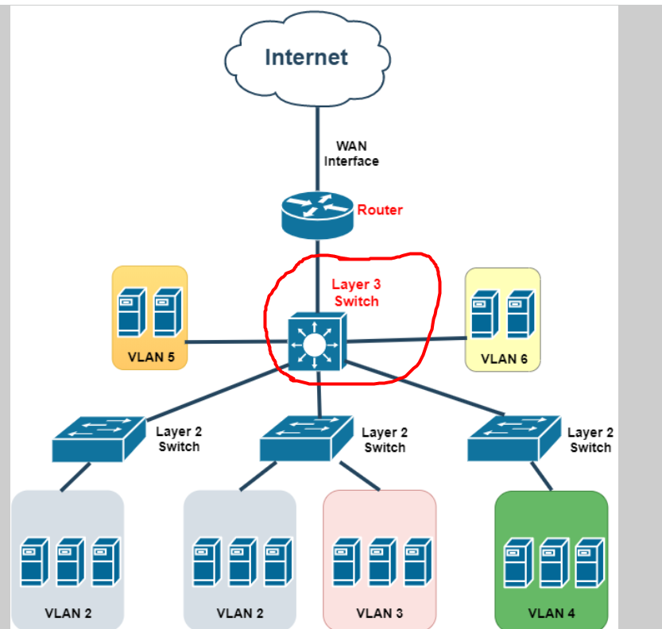


**1. Định nghĩa**

Một Layer 3 switch (còn được gọi là L3 switch) là một thiết bị mạng kết hợp tính năng của cả switch (L2 switch) và router (Layer 3 router). Nó hoạt động ở cả hai lớp trong mô hình OSI: Lớp 2 (Data Link Layer) và Lớp 3 (Network Layer).


**2. Một số ưu điểm của layer3 sw**

- `Chuyển mạch tại Lớp 2`: Giống như switch thông thường (L2 switch), Layer 3 switch có khả năng chuyển mạch dựa trên địa chỉ MAC (địa chỉ của thiết bị trong cùng mạng con).
- `Định tuyến tại Lớp 3`: Điểm đặc biệt của Layer 3 switch chính là khả năng định tuyến tại Lớp 3, giống như router. Nó có thể thực hiện việc định tuyến dựa trên địa chỉ IP của các gói dữ liệu.
- `Tăng hiệu suất`: So với router truyền thống, Layer 3 switch thường có hiệu suất cao hơn trong việc xử lý định tuyến và chuyển mạch. Giúp giảm độ trễ và tăng khả năng xử lý của mạng.
- `Thích hợp cho mạng lớn`: Layer 3 switch thường được sử dụng trong các mạng lớn với nhiều VLAN hoặc nhiều mạng con cần định tuyến giữa chúng.

- `Tiết kiệm băng thông`: Layer 3 switch có khả năng áp dụng các chính sách và quản lý luồng dữ liệu giữa các mạng con, giúp kiểm soát băng thông mạng hiệu quả.


**2. Một số nhược điểm của layer3 sw**

- `Giá thành cao hơn`: Layer 3 switch thường có giá thành cao hơn so với các thiết bị L2 switch. Điều này có thể là một yếu tố quan trọng đối với các tổ chức hoặc dự án có nguồn tài chính hạn chế.

- `Phức tạp về cấu hình`: So với L2 switch, cấu hình Layer 3 switch có thể phức tạp hơn do yêu cầu định cấu hình định tuyến và quản lý các giao thức Layer 3.

- `Yêu cầu kiến thức cao hơn`: Sử dụng và quản lý Layer 3 switch đòi hỏi kiến thức về cả chuyển mạch Layer 2 và định tuyến Layer 3, làm tăng độ phức tạp trong việc triển khai và duy trì mạng.

-` Khả năng định tuyến hạn chế`: Mặc dù Layer 3 switch có khả năng định tuyến, nhưng nó thường không mạnh mẽ bằng các router chuyên dụng. Điều này có thể gây ra hạn chế trong việc định tuyến giữa các mạng phức tạp.

- `Khả năng xử lý hạn chế`: Dù Layer 3 switch thường có hiệu suất cao hơn so với router truyền thống, nhưng vẫn có thể gặp hạn chế trong việc xử lý lưu lượng mạng rất lớn hoặc trong môi trường mạng đặc biệt.

- `Hỗ trợ giao thức Layer 3 hạn chế`: Layer 3 switch có thể hỗ trợ một số giao thức Layer 3, nhưng nó có thể thiếu hỗ trợ đầy đủ cho các tính năng đặc biệt của giao thức Layer 3 so với các router chuyên dụng.


### 2. EIGRP

**Định nghĩa :**
EIGRP (Enhanced Interior Gateway Routing Protocol)à một giao thức định tuyến nội bộ cho các mạng TCP/IP. EIGRP được phát triển bởi Cisco Systems và cung cấp cải tiến về hiệu suất so với các giao thức định tuyến khác như RIP và OSPF. EIGRP sử dụng thuật toán định tuyến DUAL (Diffusing Update Algorithm) để tìm đường đi tốt nhất và có thể tính toán được nhiều thông số để ước lượng độ trễ và bandwidth của mạng, giúp cải thiện hiệu suất định tuyến. Nó còn hỗ trợ load balancing trên nhiều đường đi và có thể tích hợp với các dịch vụ bảo mật của Cisco như VPN (Virtual Private Network) và Firewall.

**Đặc điểm :**
- Trong EIGRP router không quảng bá định kỳ 30s một lần những cái thông tin định tuyến mà nó biết qua cho router láng giềng mà nó sẽ Partial Updates (quảng bá những cái mạng mới nhất mà không cần phải quảng bá lại những cái mạng trước đó mà nó đã gửi qua cho router láng giềng nữa.
- R1 và R2 thiết lập quan hệ neighbor với nhau thì chúng sẽ quảng bá thông tin bảng định tuyến và thông tin cập nhật định tuyến của nó cho router láng giềng thông qua địa chỉ multicast là 224.0.0.10 dành riêng cho giao thức EIGRP
- Sau đó trên R2 khi nhận được thông tin bảng định tuyến từ R1 thì sẽ chạy một giải thuật là Dual algorithm để so sánh và tìm ra tuyến đường tối ưu nhất để lưu vào bảng định tuyến.


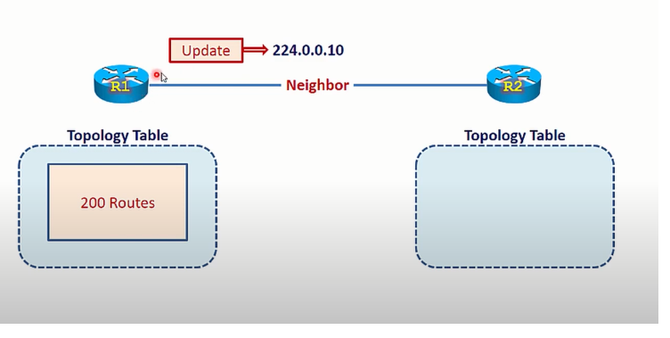


#### 2.1. Bài lab cấu hình giao thức EIGRP trên cisco 


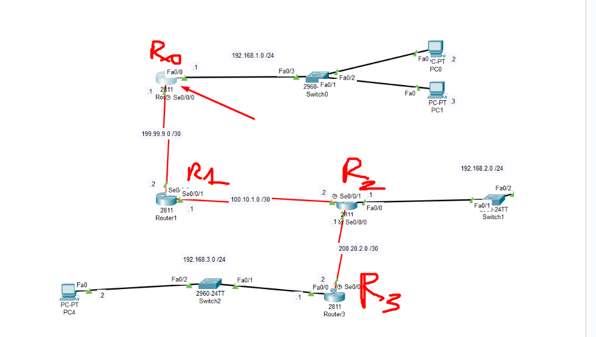


```
Yêu cầu bài lab : 

Thực hiện cấu hình địa chỉ IP cho từng cổng 
Thực hiện cấu hình eigrp trên các router
Thực hiện show cấu hình 
Thực hiện ping thông giữa các PC 
```

**Cấu hình thực hiện trên router 0 :**
```
Router(config)# router eigrp 100 //mình tự đặt 1-65535
Router(config-router)#network 192.168.1.0 0.0.0.255
Router(config-router)#network 199.99.9.0 0.0.0.3 //cach tính wile card mask lấy 255.255.255.255 - số subnetmask 
Router(config-router)#no auto-summary  // tắt tính năng tự chọn đường đi 

```


**Cấu hình trên router 1 :** 
```
Router(config)# router eigrp 100 //ở đây phải cùng số với router mình đặt lúc đầu 
Router(config-router)#network 100.10.1.0 0.0.0.3
Router(config-router)#network 199.99.9.0 0.0.0.3 //cach tính wile card mask lấy 255.255.255.255 - số subnetmask 
Router(config-router)#no auto-summary  // tắt tính năng tự chọn đường đi 
```

**Cấu hình trên router 2**
```
Router(config)# router eigrp 100 //ở đây phải cùng số với router mình đặt lúc đầu 
Router(config-router)#network 100.10.1.0 0.0.0.3
Router(config-router)#network 192.168.2.0 0.0.0.255//cach tính wile card mask lấy 255.255.255.255 - số subnetmask 
Router(config-router)#network 200.20.2.0 0.0.0.3
Router(config-router)#no auto-summary  // tắt tính năng tự chọn đường đi 

```

**Cấu hình trên router 3**

```
Router(config)# router eigrp 100 //ở đây phải cùng số với router mình đặt lúc đầu 
Router(config-router)#network 200.20.2.0 0.0.0.3
Router(config-router)#network 192.168.3.0 0.0.0.255 //cach tính wile card mask lấy 255.255.255.255 - số subnetmask 
Router(config-router)#no auto-summary  // tắt tính năng tự chọn đường đi 
```


**B3 : show kq và show kq ping trên các PC**


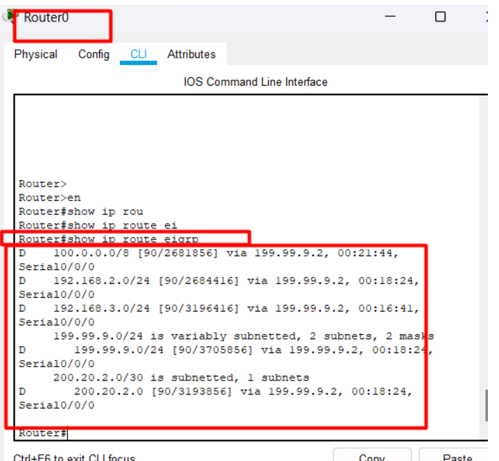


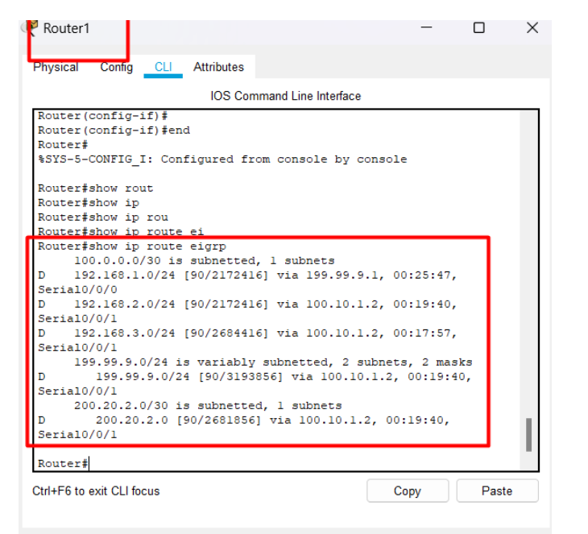


**Thưc hiện ping thông giữa các PC** 

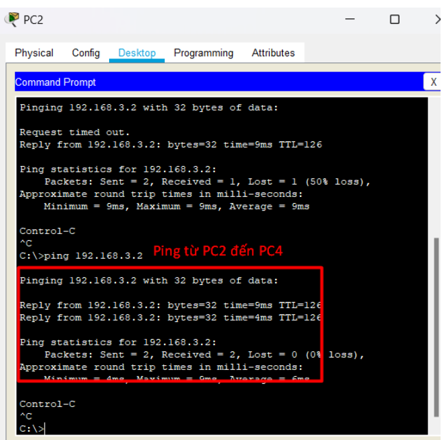


### 3. OSPF 

**Định nghĩa :** 

Là một giao thức định tuyến trong mạng máy tính, được sử dụng để tính toán đường đi ngắn nhất giữa các nút mạng. OSPF được thiết kế để hoạt động trên các mạng lớn, có tính ổn định và độ tin cậy cao. OSPF sử dụng thuật toán Dijkstra để tính toán đường đi ngắn nhất, và chiều các tài nguyên mạng như băng thông, độ trễ và khả năng đáp ứng của nút mạng. Giao thức OSPF được sử dụng rộng rãi trong các hệ thống mạng doanh nghiệp và các nhà cung cấp dịch vụ internet.	

**Các thuật ngữ sử dụng trong OSPF**

`Liên kết (Link)`: là một kênh truyền thông mạng

`Trạng thái liên kết (Link state)`: Là trạng thái của liên kết giữa hai bộ định tuyến.
`Cơ sở dữ liệu Topo (topo database)`: là danh sách thông tin về tất cả các bộ định tuyến khác trong liên mạng, cho biết tôpô của liên mạng.
`Vùng (Area)`: là tập hợp các mạng và bộ định tuyến có cùng số hiệu nhận dạng vùng.
`Giá (Cost)`: là giá trị được gán cho liên kết, giá trị này được tính toán dựa trên tốc độ của phương tiện sử dụng.
`Bảng định tuyến (Routing table)`: là một bảng chứa các tuyến tối ưu đến đích
`Cơ sở dữ liệu gần kề (Adjacencies database)`: danh sách hàng xóm mà bộ định tuyến đã thiết lập truyền thông hai chiều.
`DR (Designated Router) và BDR (Backup Designated Router):` đây là hai bộ định tuyến được các bộ định tuyến OSPF bầu ra. Bộ định tuyến chỉ định (DR) và bộ định tuyến dự phòng (BDR) được bầu làm điểm trung tâm để trao đổi thông tin định tuyến.


#### 3.1. Mô hình bài lab của OSPF :


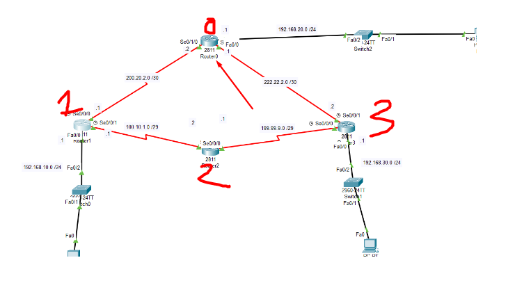


```
Yêu cầu thực hiện cấu hình ospf trên router 0 1 2 3 
Thực hiện show cấu hình
Thực hiện ping các PC 

```


**Cấu hình trên router0**

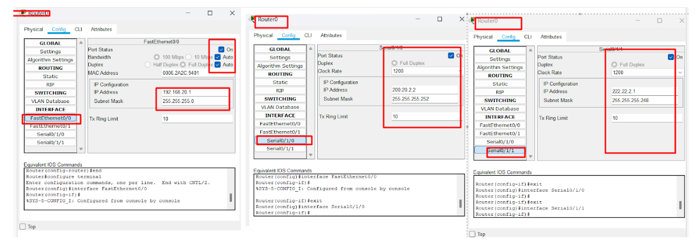

```
Router(config)#router ospf 1
Router(config-router)#network 192.168.20.0 0.0.0.255 area 0
Router(config-router)#network 200.20.2.0 0.0.0.3 area 0
Router(config-router)#network 222.22.2.0 0.0.0.3 area 0

```

**Cấu hình trên router1**


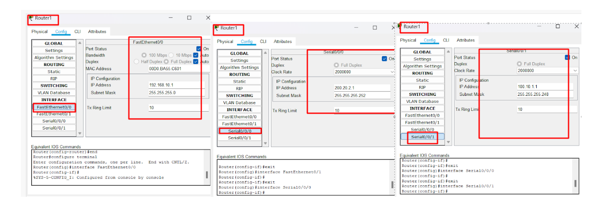


```
Router(config)#router ospf 1
Router(config-router)#network 200.20.2.0 0.0.0.3 area 0
Router(config-router)#network 192.168.10.0 0.0.0.255 area 0
Router(config-router)#network 100.10.1.0 0.0.0.7 area 0

```

**Cấu hình trên router2**

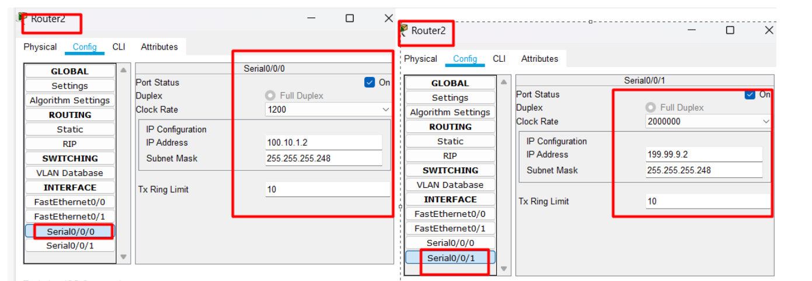


```
Router(config)#router ospf 1
Router(config-router)#r
Router(config-router)#rip a
Router(config-router)#ipienet
Router(config-router)#network 100.10.1.0 0.0.0.7 a
Router(config-router)#network 100.10.1.0 0.0.0.7 area 0
Router(config-router)#network 199.99.9.0 0.0.0.7 area 0

```

**Cấu hình trên router3**


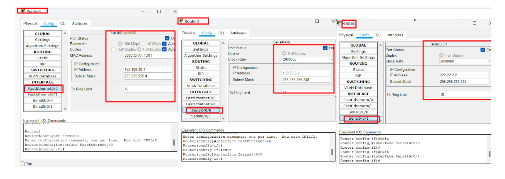


```
Router(config)#router ospf 1
Router(config-router)#network 222.22.2.0 0.0.0.3 a
Router(config-router)#network 222.22.2.0 0.0.0.3 area 0
Router(config-router)#network 222.22.2.0 0.0.0.3 area 0
00:18:00: %OSPF-5-ADJCHG: Process 1, Nbr 222.22.2.1 on Serial0/0/1 fr
Router(config-router)#network 199.99.9.0 0.0.0.7 area 0
Router(config-router)#network 192.168.30.0 0.0.0.255 area 0

```


**Thực hiện show cấu hình**


**Thực hiện ping các pc để xem kết nối chưa :**

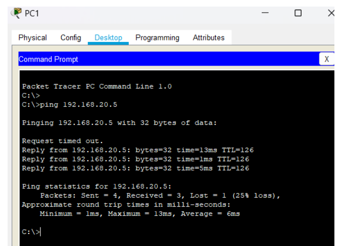


### 4. RIP
**RIP(Routing Information Protocol)**
- Giao thức định tuyến RIP ( Routing Information protocol ) Cho phép router trong 1 miền giao tiếp với nhau. Giá đường đi giữa hai thiết bị đầu cuối được xác định bằng số lượng các router trung gian trên đường đi đó. Độ dài tối đa của 1 tuyến đường là 15
- Truyền thông không tin cậy: Rip sử dụng giao thức udp để chuyển thông điệp Gửi quảng bá broadcast và multicast
- Thuật toán distance vector : rip sử dụng thuật toán distance vector. Các router hàng xóm trao đổi bảng định tuyến cho nhau 30s 1 lần trong các thông điệp rip, mỗi thông điệp chứa tối đa 25 địa chỉ đích tới.


**Cách thức hoạt động của RIP:**

- Hoạt động cơ bản: RIP hoạt động dựa trên cơ chế "đánh giá khoảng cách" (distance metric) để quyết định đường định tuyến tốt nhất đến một đích. Khoảng cách thường được tính dựa trên số lượng các "bước nhảy" (hops) tới đích.

- `RIP v1 và RIP v2`: Có hai phiên bản chính của RIP là RIP v1 và RIP v2. Phiên bản v1 ban đầu chỉ hỗ trợ định tuyến IPv4 và có hạn chế trong việc hỗ trợ subnetting và bảo mật. RIP v2 đã được cải tiến hơn với khả năng hỗ trợ subnetting, địa chỉ IPv6 và bảo mật.

- `Metric và giới hạn hop`: Trong RIP, metric thường được gọi là "hop count" (số bước nhảy) và được giới hạn tối đa là 15. Điều này có nghĩa là mạng được định tuyến bởi RIP không thể rộng lớn hơn 15 bước nhảy. Khi một đích cách xa hơn 15 bước nhảy, nó sẽ bị xem như không khả thi để đạt được.

- `Cập nhật định kỳ`: RIP thường gửi các bản cập nhật định tuyến theo định kỳ (thông thường là 30 giây). Các bản cập nhật này chứa thông tin về các mạng mà router RIP biết và khoảng cách tới chúng.

- `Loại bỏ vòng lặp`: RIP sử dụng cơ chế loại bỏ vòng lặp bằng cách giới hạn số lượng bước nhảy, tuy nhiên, đây không phải lúc nào cũng đảm bảo loại bỏ được tất cả vòng lặp trong mạng lớn hoặc phức tạp.

**Nhược điểm**


-` Khả năng hội tụ chậm`: Do cơ chế cập nhật định kỳ và giới hạn hop count, RIP có thể có tốc độ hội tụ (convergence) chậm trong các mạng lớn hoặc trong các tình huống thay đổi định tuyến nhanh.

`Bảo mật yếu`: Ban đầu, RIP không hỗ trợ bảo mật hiệu quả, cho phép tin tặc tấn công hoặc thay đổi thông tin định tuyến. RIP v2 đã cải thiện tình hình bảo mật bằng cách hỗ trợ mã hóa và chứng thực.

`Sử dụng trong mạng nhỏ`: RIP thường được sử dụng trong các mạng nhỏ, đơn giản và không yêu cầu tốc độ hội tụ nhanh.


**Mô hình bài lab của RIP**


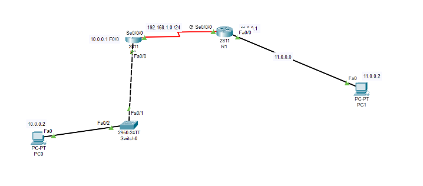


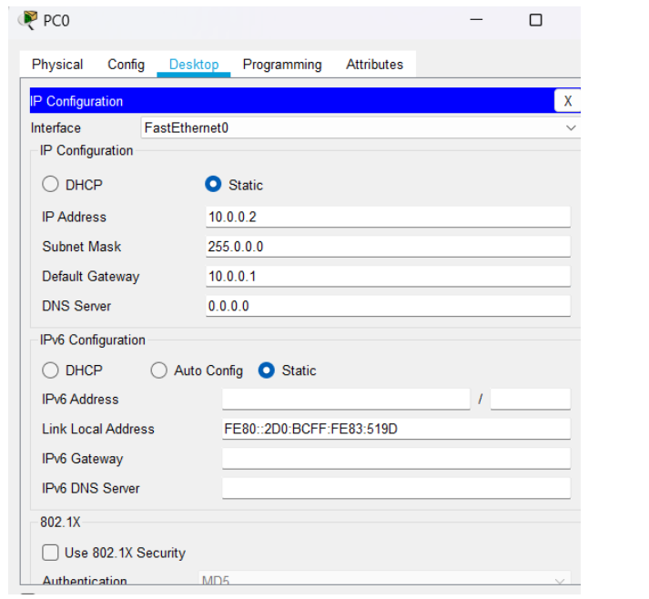


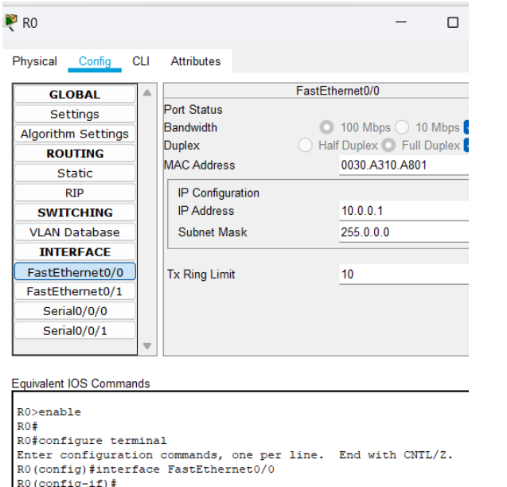


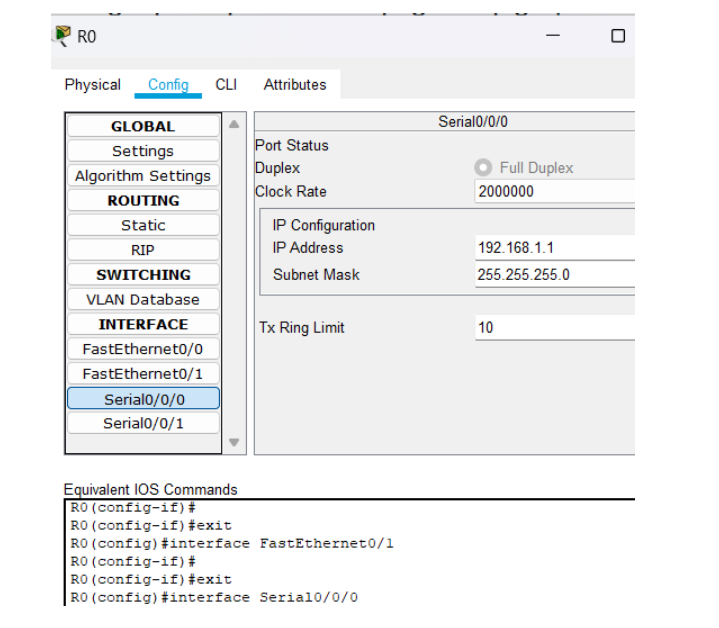

**Cấu hình trên R1 :** 


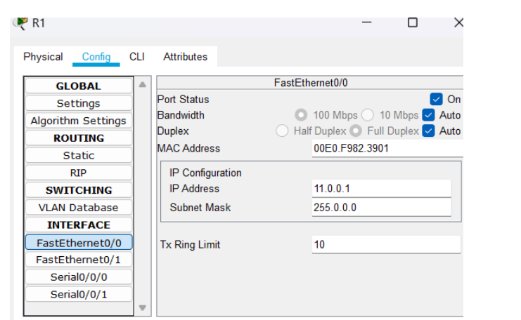


Ở router0 : 

```
R0(config)#router rip
R0(config-router)# net
R0(config-router)# network 192.168.1.0
R0(config-router)# network 10.0.0.0
R0(config-router)#ex
R0(config-router)#exit
R0(config)#ex

```

Ở R1:

```
R1#conf t
Enter configuration commands, one per line. End with CNTL/Z.
R1(config)#rout
R1(config)#router ri
R1(config)#router rip
R1(config-router)#net
R1(config-router)#network 11.0.0.0
R1(config-router)#network 192.168.1.0
R1(config-router)#ex
R1(config)#

```


**show rip:**

`R0#show ip route `


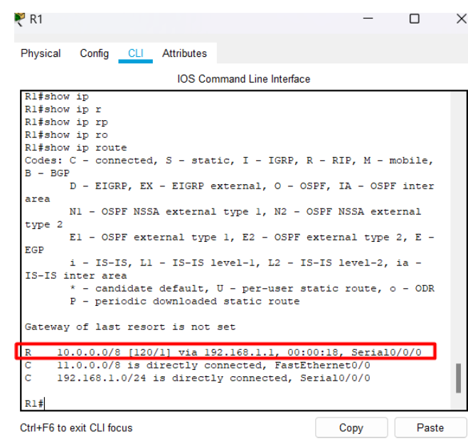


**B4 : thực hiện ping từ PC0 → PC1**


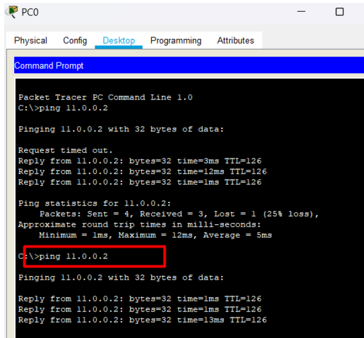


### 5. BGP
**Định nghĩa**
- BGP (Border Gateway Protocol) là một giao thức định tuyến chuyên dụng được sử dụng trong mạng lớn, đặc biệt là trong mạng Internet, để quản lý định tuyến giữa các tổ chức, nhà cung cấp dịch vụ Internet (ISP), và các mạng con.

**Bài toán đặt ra tại sao cần BGP** 

Kết nối và quản lý định tuyến giữa ba nhà mạng VT, FPT và VNPT để cho phép truyền thông hiệu quả giữa các mạng con của họ.


**Cách thức hoạt động:**
- BGP hoạt động dựa trên việc trao đổi thông tin về các dãy đường (path) giữa các BGP speaker thông qua các tin nhắn BGP. BGP quản lý bảng định tuyến (routing table) của mỗi router và quảng bá thông tin về các con đường giữa các AS (Autonomous System) - các mạng quản lý độc lập với nhau.

- Khi một BGP speaker nhận được thông tin về các đường định tuyến từ một BGP neighbor, nó thực hiện kiểm tra và chọn con đường tốt nhất dựa trên các tiêu chí như độ trải, số lượng AS trung gian, và các tiêu chí khác. Sau đó, thông tin về con đường được quảng bá tới các BGP neighbor khác.


**Đặc điểm của BGP**

- Mỗi tổ chức chạy BGP có một `AS` number duy nhất trên internet và 1 dải mạng public
- Giao thức hội tụ không nhanh (khi xảy ra đứt đường truyền thì tầm 1 phút để chuyển sang hướng khác)
- Có nhiều tiêu chí để chọn đường đi 
- Router chạy BGP cần cpu , ram khỏe 
- Khi xảy ra lỗi BGP thì ảnh hướng lớn


**Ưu điểm:**

- Phân tách AS và định tuyến linh hoạt: BGP cho phép các tổ chức và ISP phân tách định tuyến và quản lý độc lập hơn. Mỗi AS có thể quyết định cách định tuyến trong mạng của mình mà không ảnh hưởng đến các AS khác.

- Khả năng định tuyến đa dạng: BGP hỗ trợ định tuyến đa dạng với khả năng lựa chọn con đường dựa trên nhiều tiêu chí, đảm bảo tối ưu hóa đường định tuyến.

- Thiết lập kết nối độc lập: BGP cho phép các mạng thiết lập kết nối với nhau một cách độc lập, đảm bảo tính tin cậy và an toàn cho việc quản lý định tuyến.

**Nhược điểm:**

- `Phức tạp`: BGP là một giao thức phức tạp cần sự cấu hình kỹ lưỡng và hiểu biết sâu về mạng. Sự cấu hình không đúng cách có thể dẫn đến vấn đề về định tuyến và an toàn mạng.

- `Chậm hội tụ`: BGP có thể có tốc độ hội tụ (convergence) chậm hơn so với một số giao thức định tuyến khác, đặc biệt trong các mạng lớn hoặc phức tạp.

- `Bảo mật và an toàn`: Một số vấn đề liên quan đến bảo mật có thể xảy ra trong BGP, bao gồm các cuộc tấn công như prefix hijacking hoặc route leaking.


#### 5.1. Bài lab về BGP 

Mô hình 


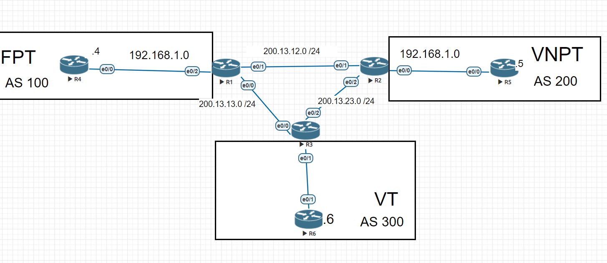


```
Yêu cầu bài lab
Thực hiện cấu hình đặt địa chỉ ip trên từng cổng của router 123456

Thực hiện cấu hình OSPF trên router 123456

Thực hiện cấu hình BGP trên router 123456
```

Thực hiện cấu hình trên R4: 


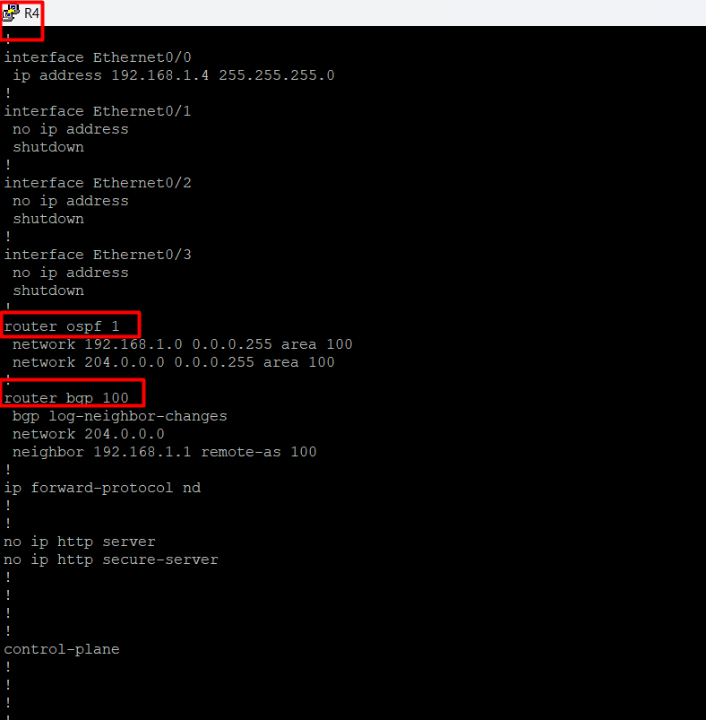


Thực hiện cấu hình trên R1: 
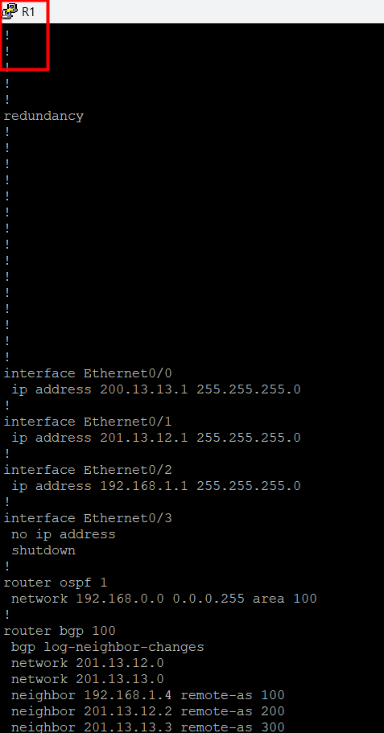


Thực hiện cấu hình trên các R còn lại tương tự vs 1 với 4 (1 gần giống 2 3) ( 4 gần giống 5 6): 

Thực hiện cấu hình trên R4:
```
router  ospf 100
network 192.168.1.0 0.0.0.255 area 100
network 204.0.0.0 0.0.0.255 area 100
ex
router bgp 100
network 192.168.1.0
network 204.0.0.0
nei 192.168.1.1 remote-as 100

```
Thực hiện cấu hình trên R1:
```
router  ospf 100
network 192.168.1.0 0.0.0.255 area 100
ex
router bgp 100
network 192.168.1.0
network 204.0.0.0
network 200.13.12.0
network 200.13.13.0
nei 200.13.12.2 remote-as 200
nei 200.13.12.3 remote-as 300
nei 192.168.1.4 remote-as 100
```


### 6. Ưu nhược điểm OSPF với EIGRP VỚI RIP

***OSPF***
**Ưu điểm:**

- Có khả năng định tuyến hiệu quả trong các mạng lớn và phân tán.Tính linh hoạt cao, cho phép thiết lập nhiều đường định tuyến để tránh sự cố với một đường duy nhất.
- Cung cấp bảo mật đáng tin cậy thông qua các tính năng xác thực và mã hóa.

**Nhược điểm:**

- Không hỗ trợ định tuyến theo dòng chảy.(Định tuyến theo dòng chảy là một phương pháp định tuyến mạnh mẽ hơn so với định tuyến truyền thống dựa trên bảng định tuyến. Khi dữ liệu được chuyển mạch qua Layer 3 switch, nó có thể được phân loại thành các dòng chảy dựa trên các thuộc tính như địa chỉ nguồn, địa chỉ đích, cổng nguồn và cổng đích.)
- Yêu cầu khối lượng lưu lượng truyền tải cao hơn so với RIP vì nó phải trao đổi thông tin định tuyến thường xuyên hơn.


***RIP:***
**Ưu điểm:**

- Rất dễ dàng triển khai và cấu hình.
- Có thể hoạt động tốt trong các mạng nhỏ và không phân tán.
- Yêu cầu ít băng thông hơn so với OSPF vì nó chỉ gửi thông tin định tuyến định kỳ.
**Nhược điểm:**

- Không hiệu quả trong các mạng lớn và phân tán.
- Không hỗ trợ định tuyến theo dòng chảy.
- Không cung cấp tính năng bảo mật đáng tin cậy.


***EIGRP:***
**Ưu điểm:**

- Có khả năng định tuyến hiệu quả trong các mạng lớn và phân tán.
- Tính linh hoạt cao, cho phép thiết lập nhiều đường định tuyến để tránh sự cố với một đường duy nhất.
- Cung cấp tính năng định tuyến theo dòng chảy, giúp tối ưu hóa đường định tuyến và giảm tắc nghẽn.
***Nhược điểm:***

- Cần tài nguyên CPU và bộ nhớ cao hơn so với các giao thức định tuyến khác.
- Không được hỗ trợ rộng rãi trên các thiết bị mạng của các nhà sản xuất khác nhau.


