- [1. Yêu cầu 1 :](#1-yêu-cầu-1-)
  - [1.1. Yêu cầu 2 :](#11-yêu-cầu-2-)
  - [1.2. Tạo policy trên Firewall thực hiện block service RDP từ PC 192.168.16.15 truy cập RDP đến PC 192.168.15.20.](#12-tạo-policy-trên-firewall-thực-hiện-block-service-rdp-từ-pc-1921681615-truy-cập-rdp-đến-pc-1921681520)
  - [1.3. Tạo policy trên Firewall thực hiện block service SMB từ PC 192.168.12.15 truy cập SMB đến PC 192.168.13.15.](#13-tạo-policy-trên-firewall-thực-hiện-block-service-smb-từ-pc-1921681215-truy-cập-smb-đến-pc-1921681315)
  - [1.4. Tạo policy trên Firewall thực hiện block service HTTP ,HTTPS từ PC 192.168.12.15 truy cập HTTPS đến PC 192.168.13.50.](#14-tạo-policy-trên-firewall-thực-hiện-block-service-http-https-từ-pc-1921681215-truy-cập-https-đến-pc-1921681350)
  - [Tạo policy trên Firewall thực hiện block service FTP từ PC 192.168.12.15 truy cập FTP đến PC 192.168.13.50.](#tạo-policy-trên-firewall-thực-hiện-block-service-ftp-từ-pc-1921681215-truy-cập-ftp-đến-pc-1921681350)


### 0.1. Mô hình 


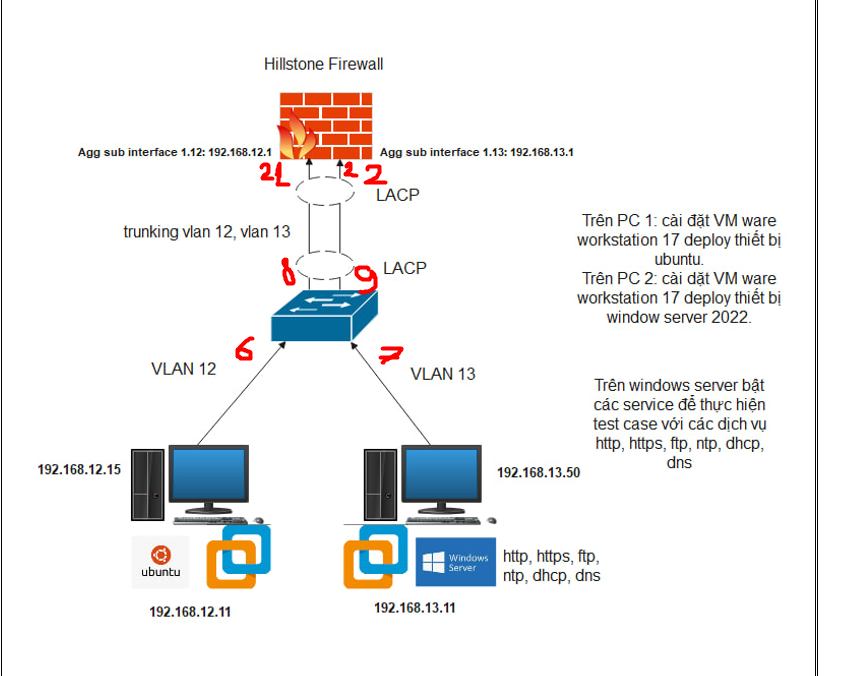
 


## 1. Yêu cầu 1 :

```

Cấu hình trên Switch Allied telesis, ruckus (LACP, tạo vlan 12 13,sw access , sw trunk)
Tạo sub interface  trên fw hillstone 

Thực hiện cắm dây vào đúng cổng trên sw và fw

```

B1: Thực hiện cấu hình trên FW 

- Thực hiện cắm dây console trên fw để truy cập vào đặt địa chỉ cho cổng mgt


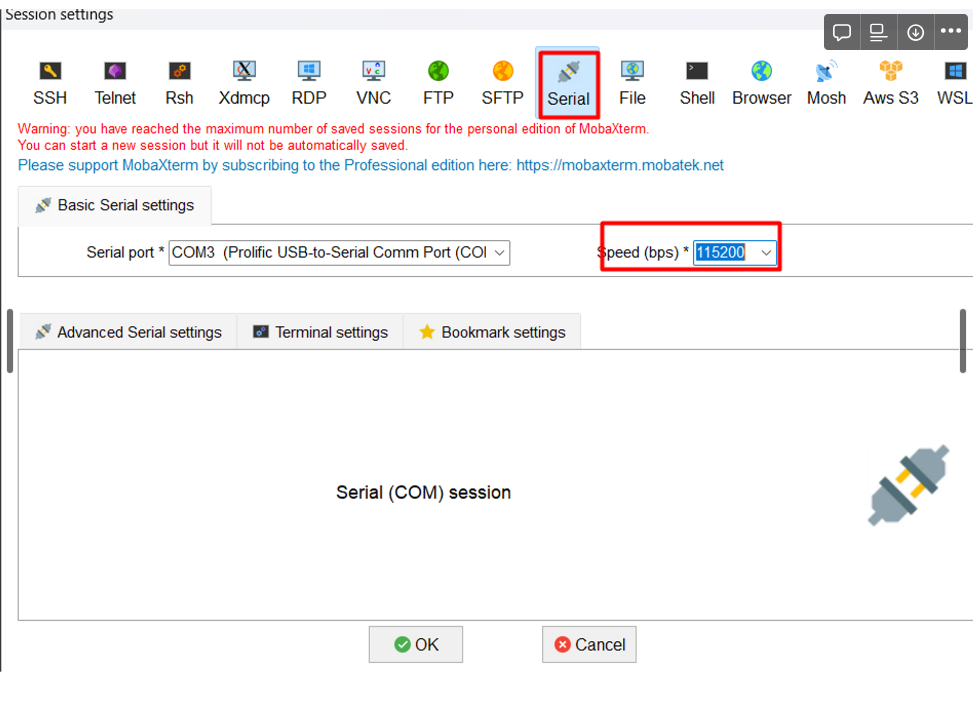


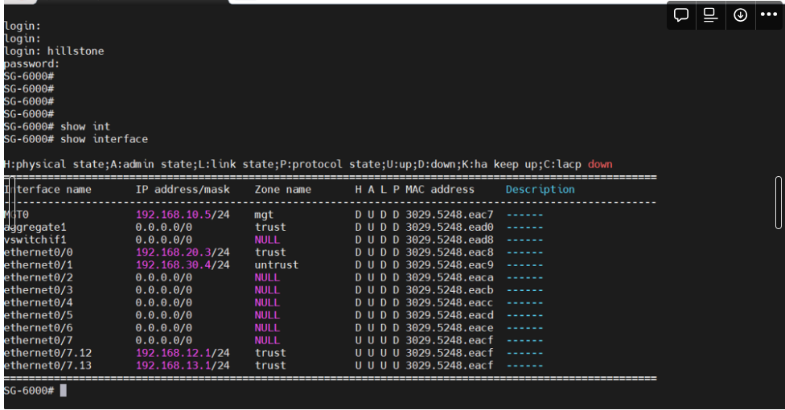


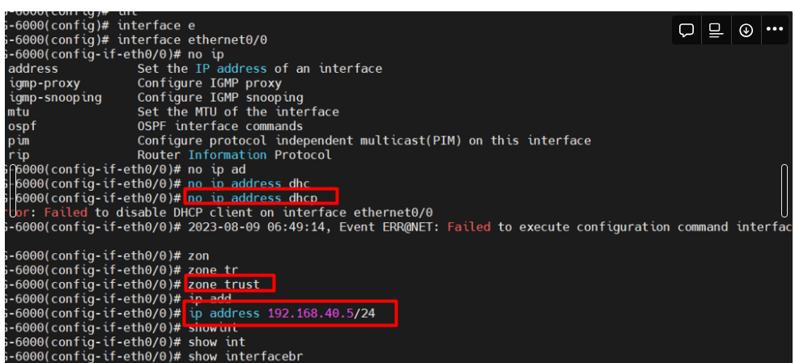


`Thực hiện đổi địa chỉ IPV4 trên máy tính cùng dải để vào Giao diện FW `

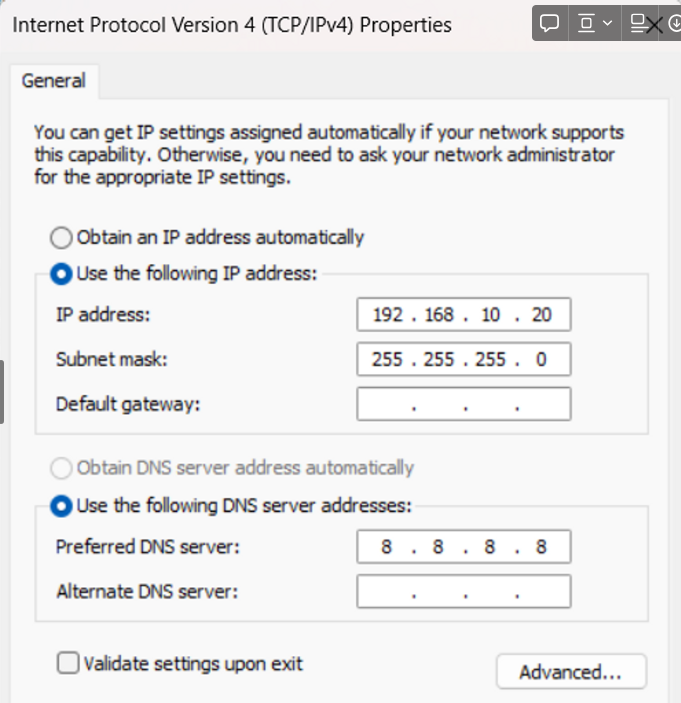


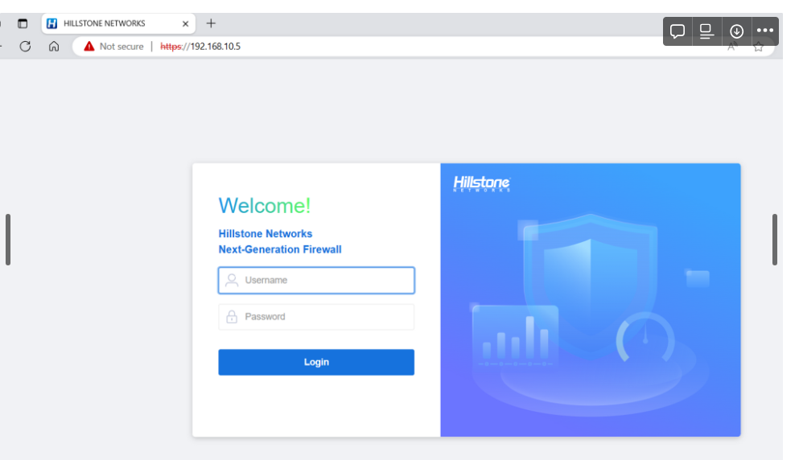


`Thực hiện tạo subinter face trên FW (đối với 1 cổng )`


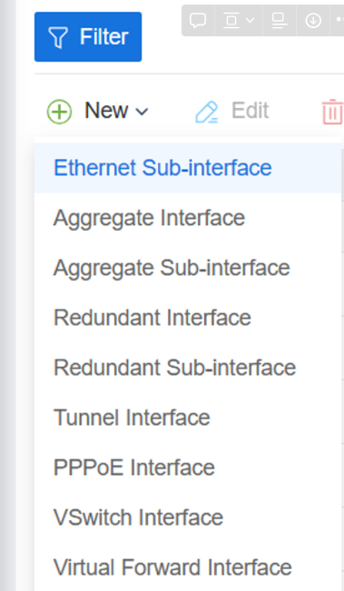


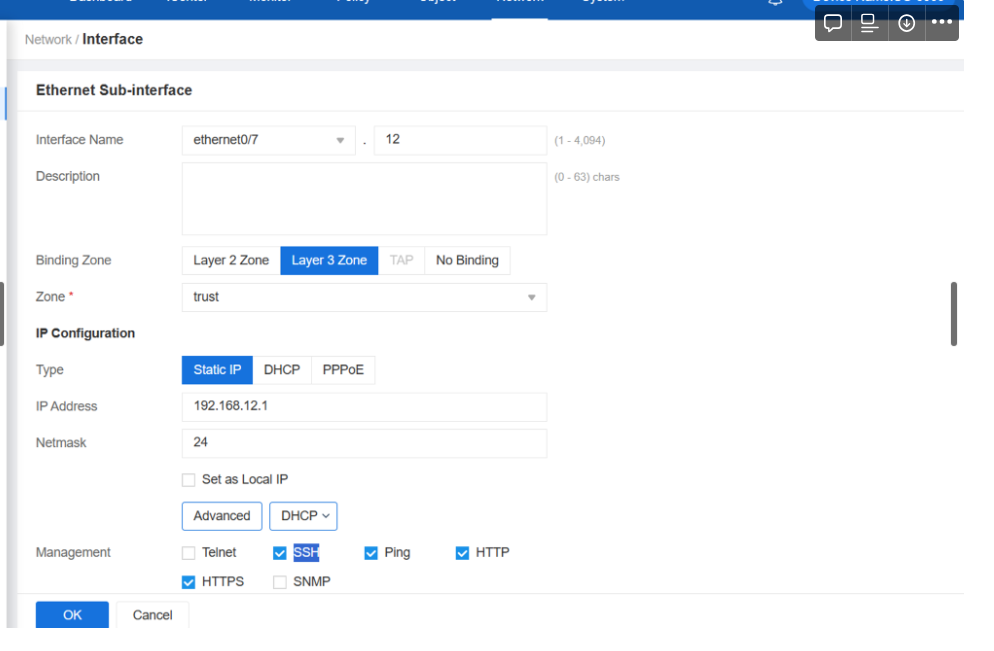


Còn thực hiện với 2 cổng  thì vào chế độ  


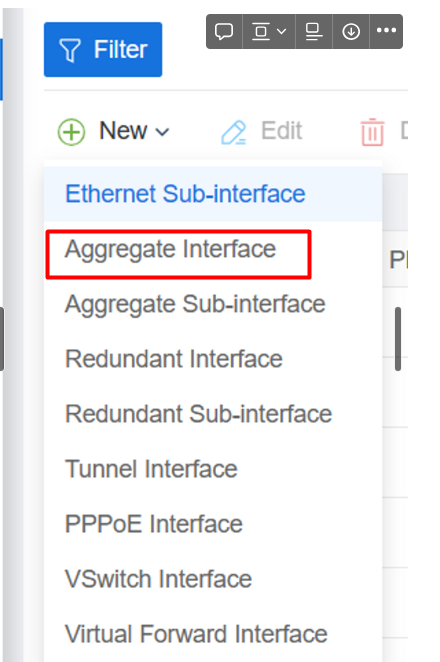


Rồi thực hiện tạo LACP


### 1.1. Yêu cầu 2 :

***Note : Trên Firewall sẽ thực hiện các chính sách policy lần lượt từ trên xuống dưới. nên policy deny cần ở trên so với policy any any.***

```
Tạo policy trên Firewall thực hiện block service RDP từ PC 192.168.12.15 truy cập RDP đến PC 192.168.13.50. 


Tạo policy trên Firewall thực hiện block service SMB từ PC 192.168.12.15 truy cập SMB đến PC 192.168.13.50.


Tạo policy trên Firewall thực hiện block service DNS từ PC 192.168.12.15 truy cập DNS đến PC 192.168.13.50. 

Tạo policy trên Firewall thực hiện block service HTTP ,HTTPS từ PC 192.168.12.15 truy cập HTTPS đến PC 192.168.13.50. 

Tạo policy trên Firewall thực hiện block service SMB từ PC 192.168.12.15 truy cập FTP đến PC 192.168.13.50. 

 
```

### 1.2. Tạo policy trên Firewall thực hiện block service RDP từ PC 192.168.16.15 truy cập RDP đến PC 192.168.15.20.


Yêu cầu : 
```
Thực hiện tắt firewall trên 2 máy pc 192.168.16.15  và 192.168.15.20 

Thực hiện bật chế độ RDP trên cả 2 máy

Kiểm tra kết nối RDP từ PC 192.168.16.15 truy cập RDP đến PC 192.168.15.20. 

Tạo policy deny RDP từ PC 192.168.16.15 truy cập RDP đến PC 192.168.15.20.. 

Kiểm tra kết nối RDP sau khi cấu hình policy từ PC 192.168.16.15 truy cập RDP đến PC 192.168.15.20.

```


Đầu tiên thực hiện kiểm tra kết nối  và cấu hình cho phép RDP 


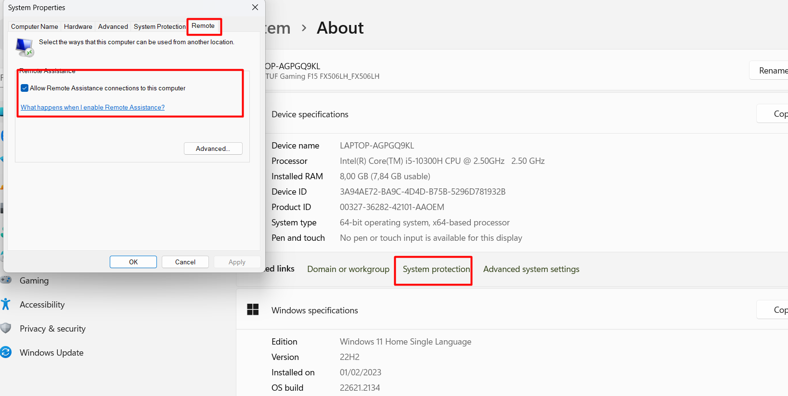


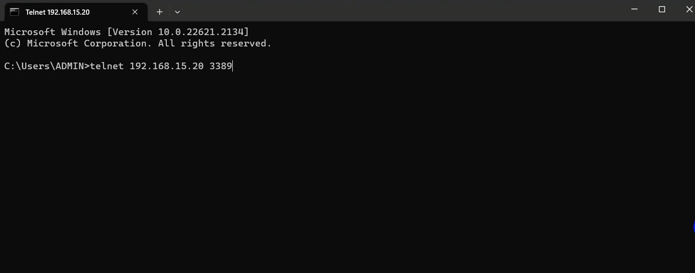


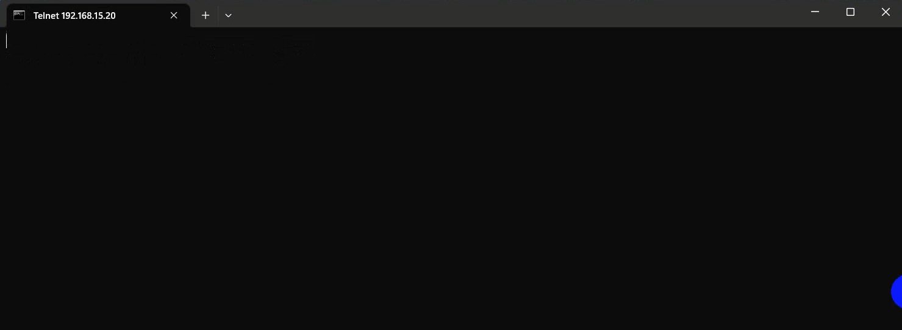


B1:  Cấu hình policy any any cho các hệ thống kết nối với nhau.


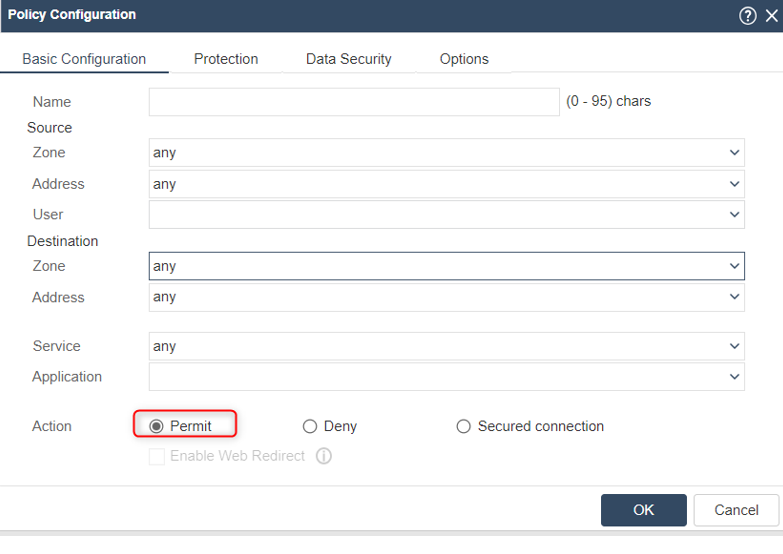


Cấu hình policy : 


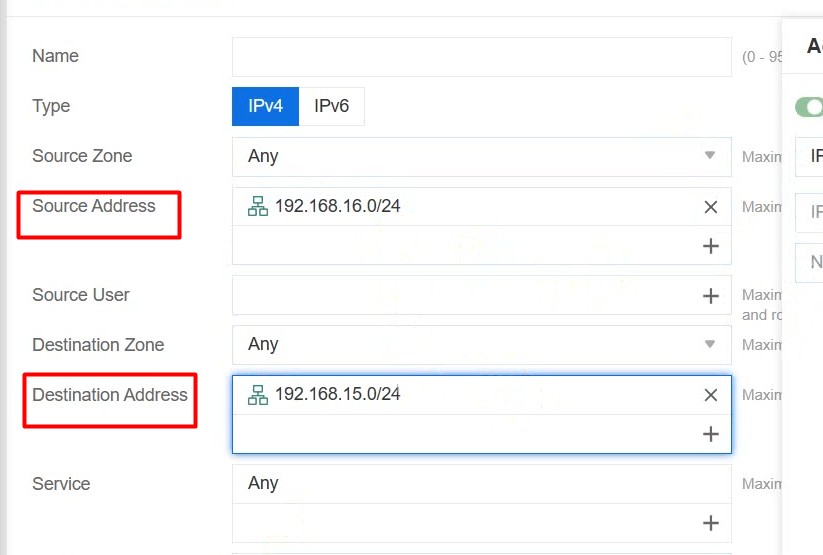


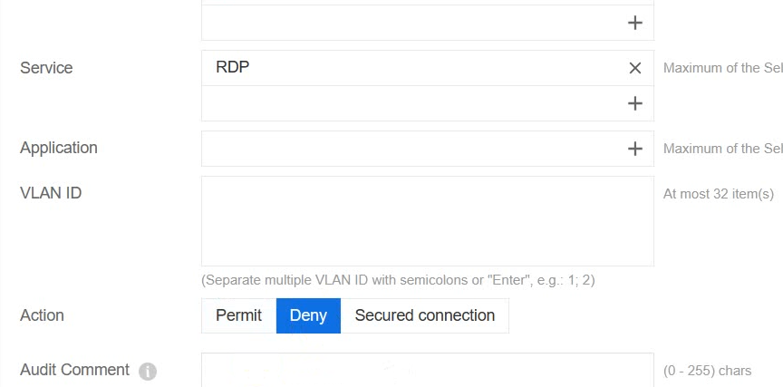


Thực hiện kiểm tra : 


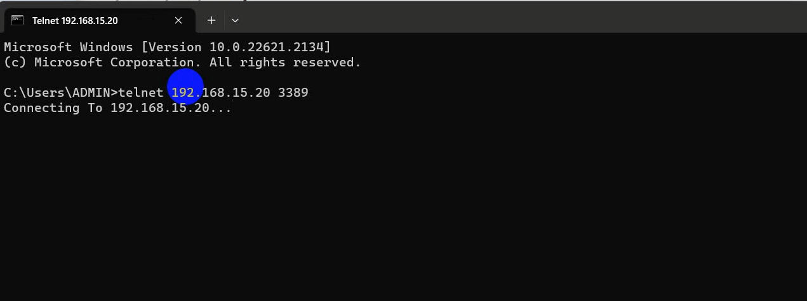


### 1.3. Tạo policy trên Firewall thực hiện block service SMB từ PC 192.168.12.15 truy cập SMB đến PC 192.168.13.15.


Thực hiện kiểm tra chia sẽ file băng SMB  bằng câu lệnh 

`\\192.168.13.15`


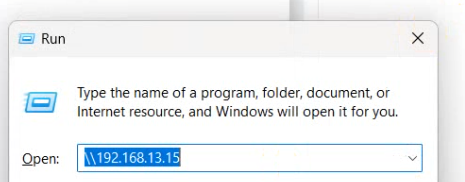


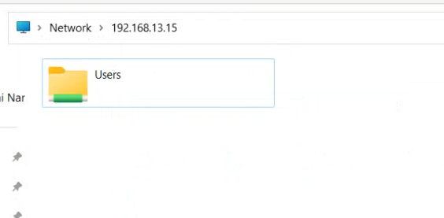


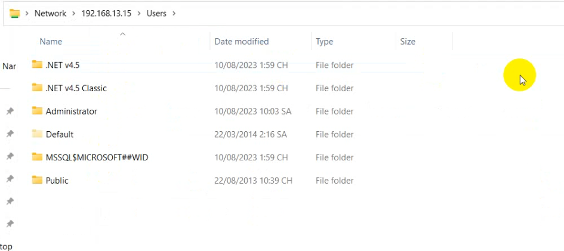


Thực hiện cấu hình chính sách policy : 


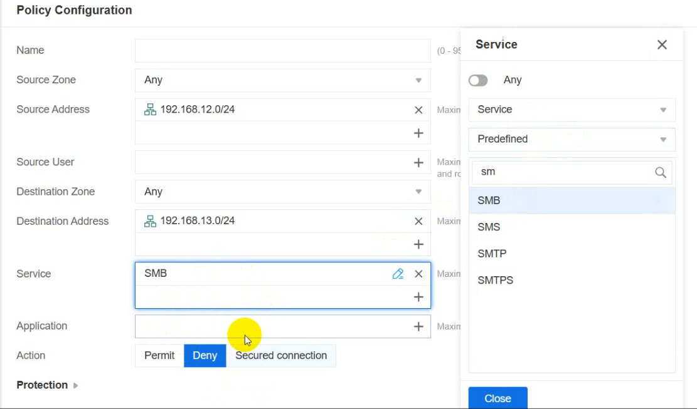


Sau khi thực hiện cấu hình chính sách thì cổng 445 sẽ bị đóng và không vào được 


### 1.4. Tạo policy trên Firewall thực hiện block service HTTP ,HTTPS từ PC 192.168.12.15 truy cập HTTPS đến PC 192.168.13.50.


Trước khi chưa thực hiện cấu hình chính sách policy : 


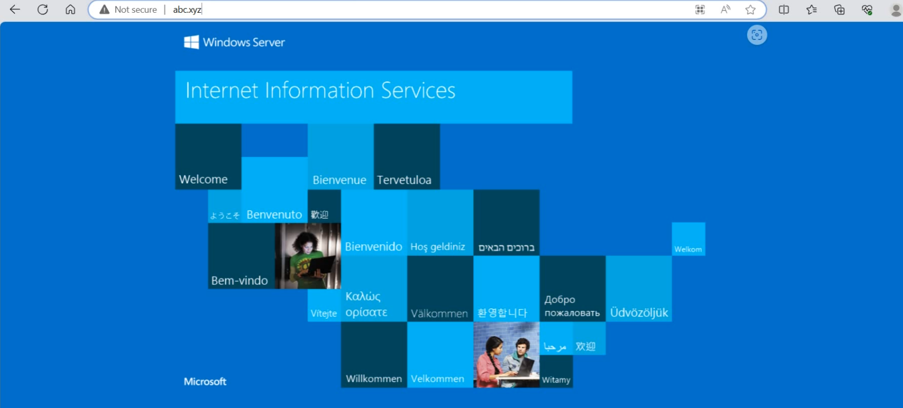


Thực hiện cấu hình chính sách policy : 


Sau khi thực hiện cấu hình chính sách: 


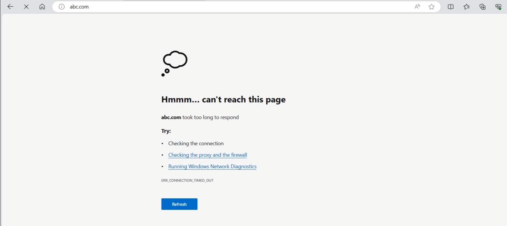


### Tạo policy trên Firewall thực hiện block service FTP từ PC 192.168.12.15 truy cập FTP đến PC 192.168.13.50. 

