- [1. Bài lab test deny dịch vụ trên Linux](#1-bài-lab-test-deny-dịch-vụ-trên-linux)
  - [2. Test dịch vụ http,httpd](#2-test-dịch-vụ-httphttpd)
  - [3. Cấu hình hình deny dịch vụ NTP](#3-cấu-hình-hình-deny-dịch-vụ-ntp)
  - [4. Cách cấu hình trên centos7](#4-cách-cấu-hình-trên-centos7)
  - [5. Thực hiện cấu hình chặn ssh trên linux](#5-thực-hiện-cấu-hình-chặn-ssh-trên-linux)


## 1. Bài lab test deny dịch vụ trên Linux


### 2. Test dịch vụ http,httpd


**Trước khi chưa block:** 


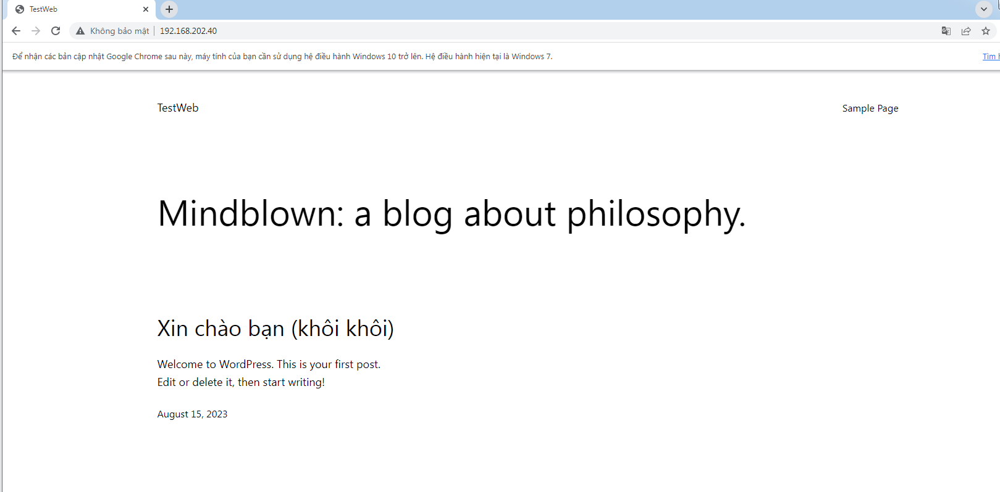


**Vào fw để cấu hình deny**


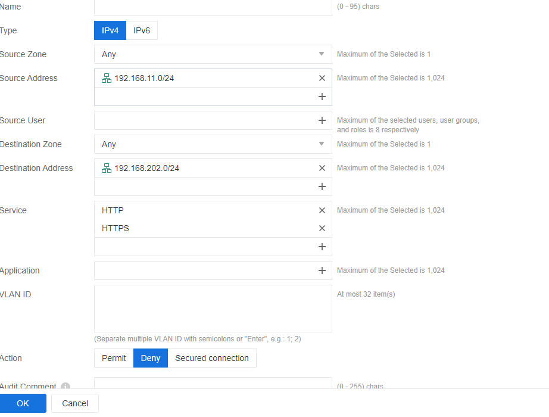


**Sau khi cấu hình deny**


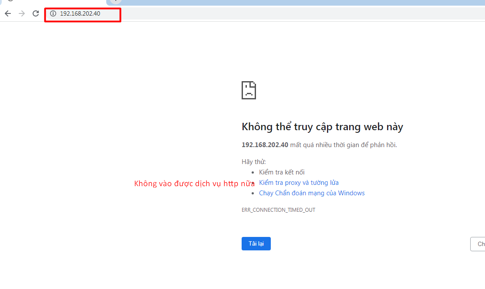


### 3. Cấu hình hình deny dịch vụ NTP 


### 4. Cách cấu hình trên centos7


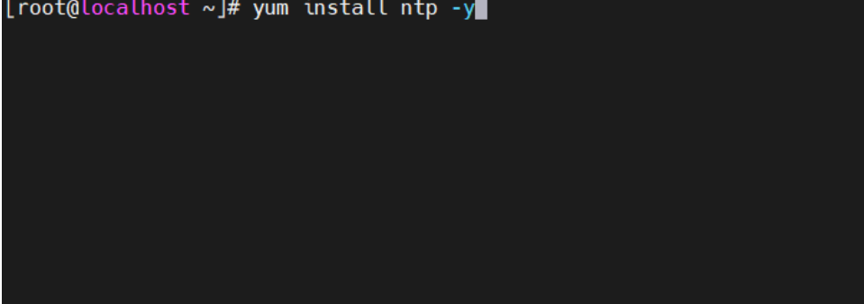


Sau khi cài đặt , truy cập chọn khu vực , chọn quốc gia để cài đặt

`https://www.ntppool.org/zone/vn`


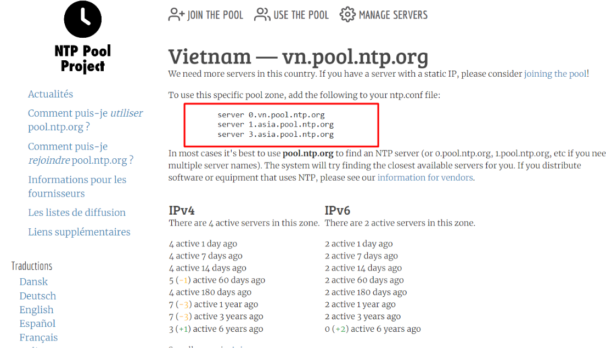


Sau đó , mở tệp cấu hình chính của ntp để chỉnh sửa , thay thế máy chủ công cộng mặc định bằng danh sách cung cấp quốc gia , khu vực

`vi /etc/ntp.conf`


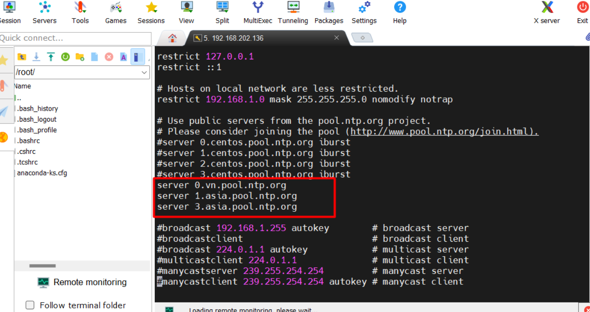


Cần cho phép các máy khách từ mạng của mình đồng bộ hóa thời gian với máy chủ này. Để thực hiện điều này, hãy thêm dòng sau vào tệp cấu hình NTP, nơi kiểm soát câu lệnh hạn chế , mạng nào được phép truy vấn và thời gian đồng bộ hóa – thay thế IP mạng tương ứng.


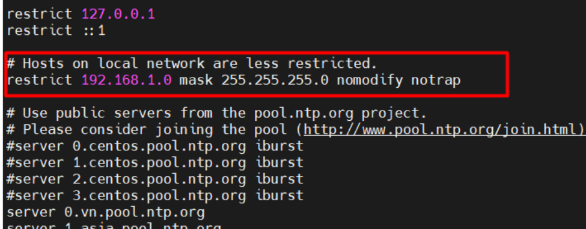


Nếu cần lưu cấu hình, để khắc phục sự cố thêm một tệp nhật ký sẽ ghi lại tất cả các sự cố của máy chủ

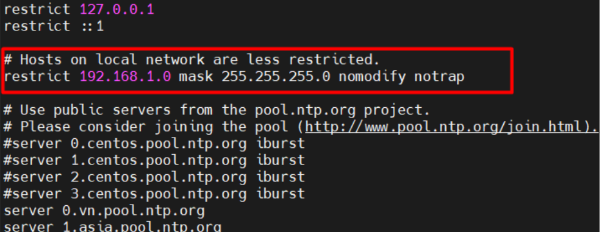


Đây là hoàn thiện sau khi cài đặt xong


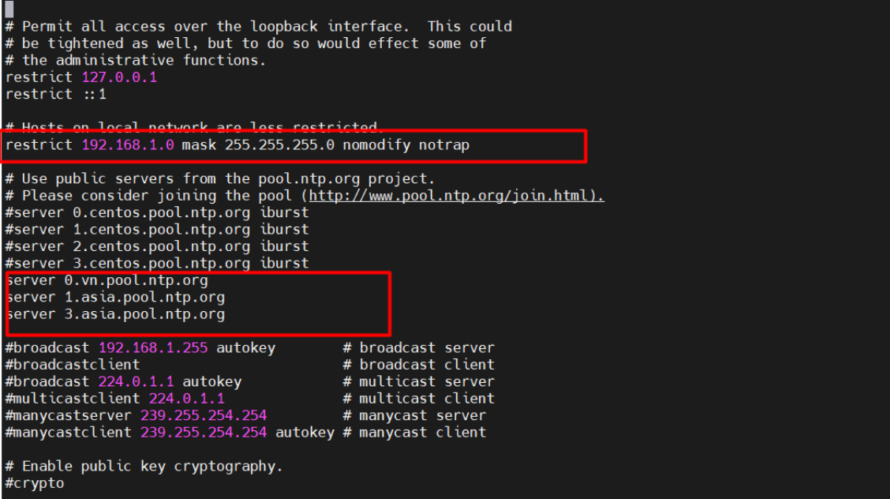


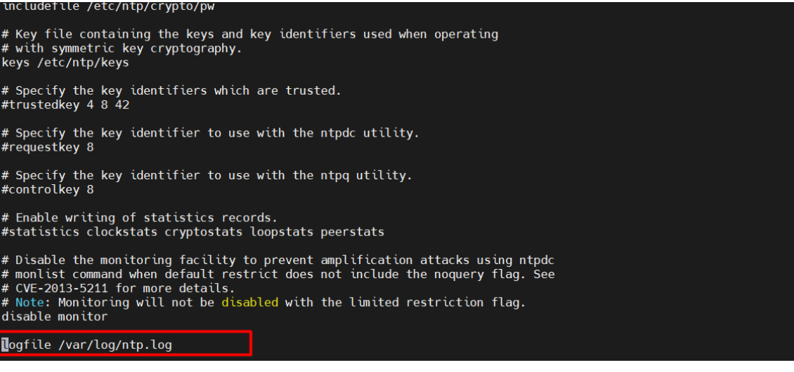


```
firewall-cmd --add-service=ntp --permanent
firewall-cmd --reload
```


Sau khi kích hoạt tường lửa xong, Khởi động máy chủ NTP và đảm bảo rằng nó đang hoạt động

`systemctl start ntpd`

`systemctl enable ntpd`

`systemctl status ntpd`


**Sau đó chạy các lệnh sau để xác minh trạng thái đồng bộ hóa NTP ngang hàng và thời gian hệ thống**
`ntpq -p`

`date -R`


**sau khi cấu hình ntp**

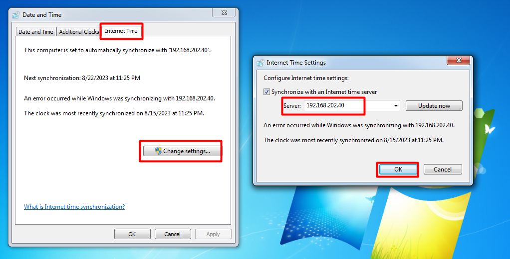


**Trước khi cấu hình ntp**


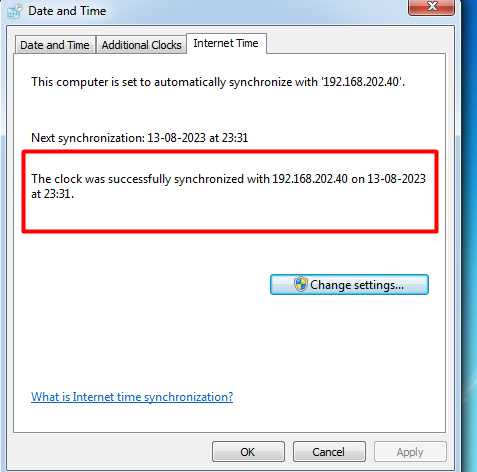


**Cấu hình chính sách**


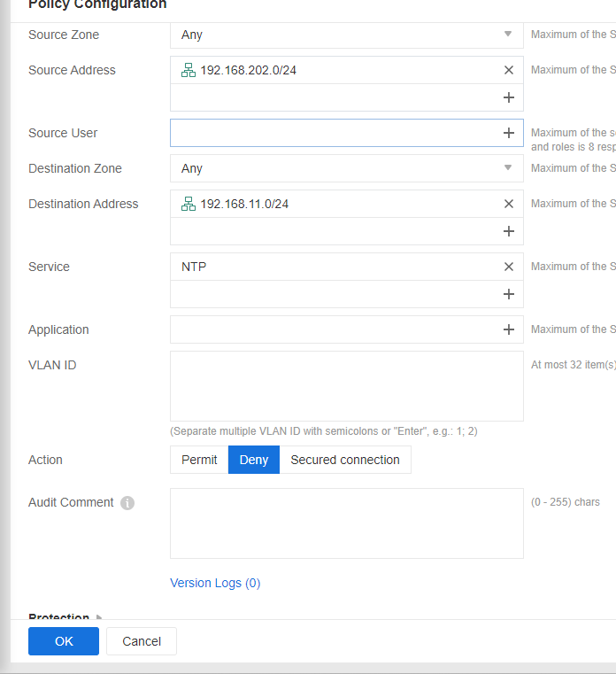


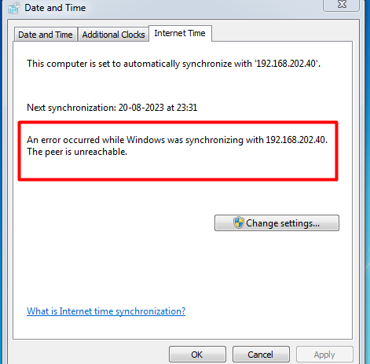


### 5. Thực hiện cấu hình chặn ssh trên linux

**Trước khi chưa cấu hình deny**


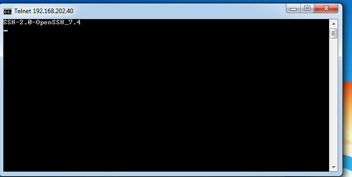


**Thực hiện cấu hình deny trên fw**


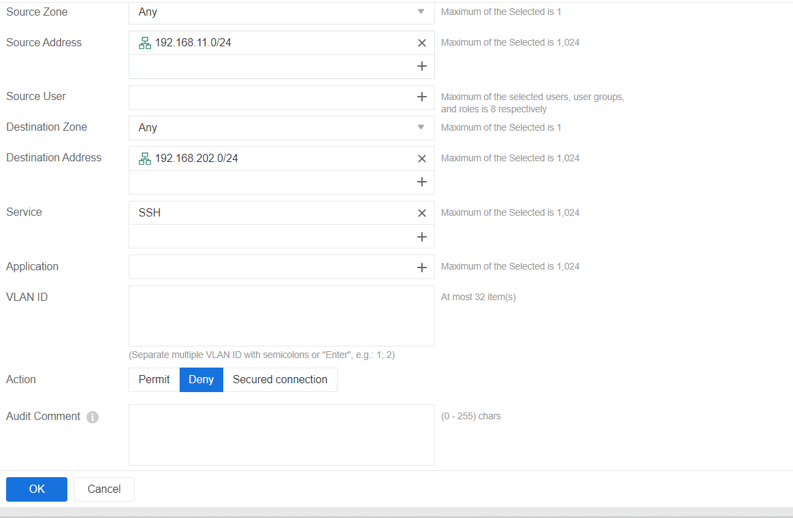'


**Sau khi thực hiện cấu hình deny**


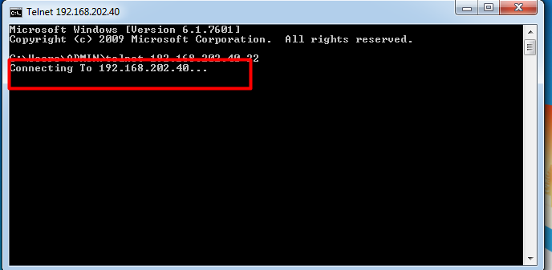


